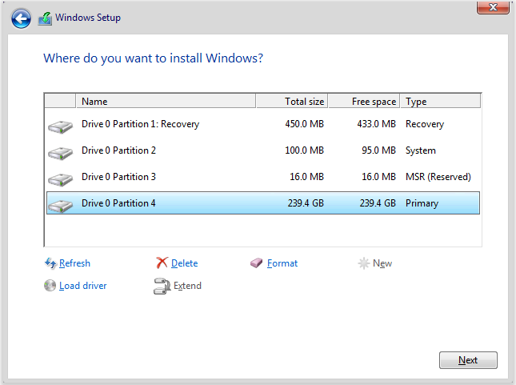

# Installing Windows 10

This article covers the steps of re-installing, or fresh installing Windows 10 from a USB.

## Prerequisites
* The disk that you are trying to Install Windows on must be a GPT partition style disk if you are on a UEFI system, otherwise it will not let you install. 
  * This can be worked around by formatting the disk and then converting it to GPT using Diskpart.

## Installing

1. Select the correct Language, Time and Currency, and Keyboard layout then press Next.

    

2. Click Install Now.

    

3. Enter your product key if you know it, otherwise click I don't have a product key.

    

4. Accept the agreement.

    

5. On the next screen, click Custom.

    

## Method 1

### Prerequisites
* The drive that you are installing Windows to requires enough space to move the contents of the drive to a folder called windows.old for this method.

> Re-installing and keeping your data.

1. On the next screen, you will see a list of partitions for each disk you have, you want to select the partition marked "Primary" on the disk that you have Windows installed on, and that has a similar amount of space as the drive you have Windows installed on (If Windows is installed on Disk 0, and it's maximum amount of space is 30GB, then you would select the partition on Drive 0 with 30GB of total space marked as "Primary").

After this, click Next.

Windows will now start re-installing on the partiton that you selected. It will move any data from that partition to a folder located at C:\windows.old if there is enough space.

## Method 2

> Clean re-installing, not keeping any data

1. On the next screen, you will see a list of partitions for each disk you have, you want to select the partition marked "Primary" on the disk that you have Windows installed on, and that has a similar amount of space as the drive you have Windows installed on. (If Windows is installed on Disk 0, and it's maximum amount of space is 30GB, then you would select the partition on Drive 0 with 30GB of total space marked as "Primary"). Now, you can choose to do one of two things, you can either click the "Format" button at the bottom with your Windows partition selected **THIS WILL ERASE ALL DATA ON THE SELECTED PARTITION** and then click Next, or you can delete all of the partitions on the Drive Windows is installed on and then select the unallocated space on that drive and press Next to let Windows redo it's partition setup, this is useful for brand new drives or if your partition setup is broken. **THIS DELETES ALL DATA ON THE DISK THAT WINDOWS IS INSTALLED ON**

