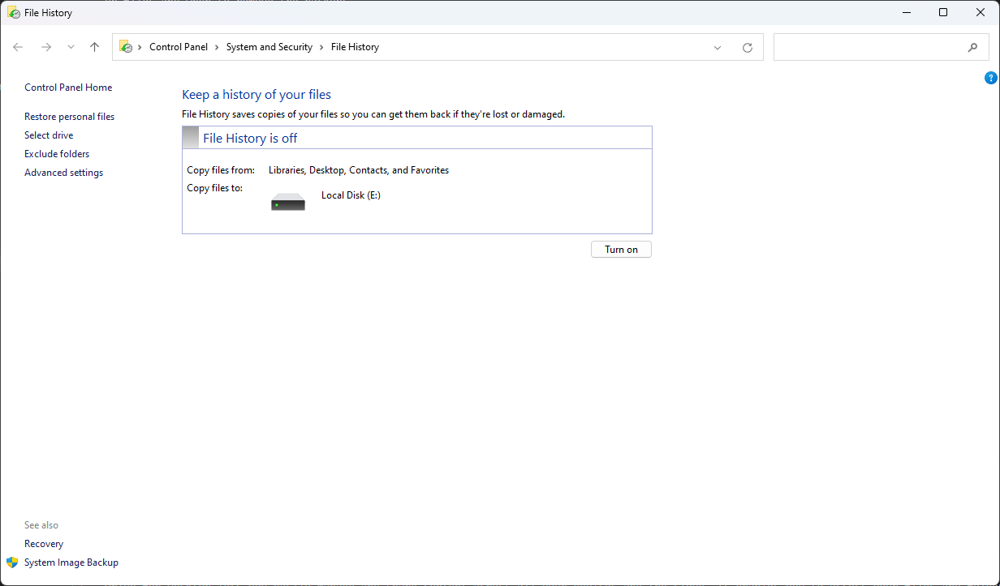
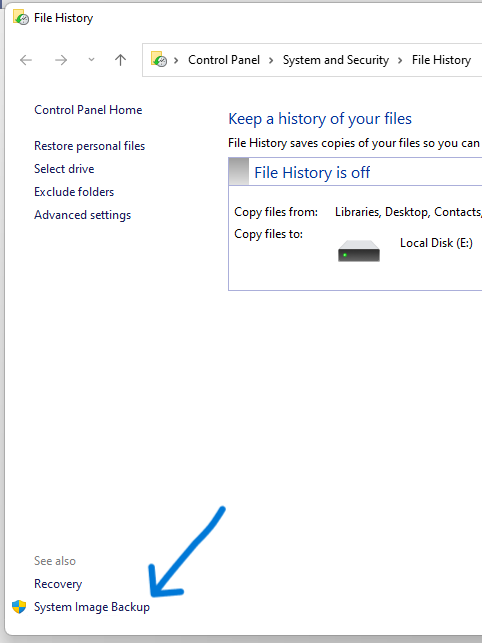
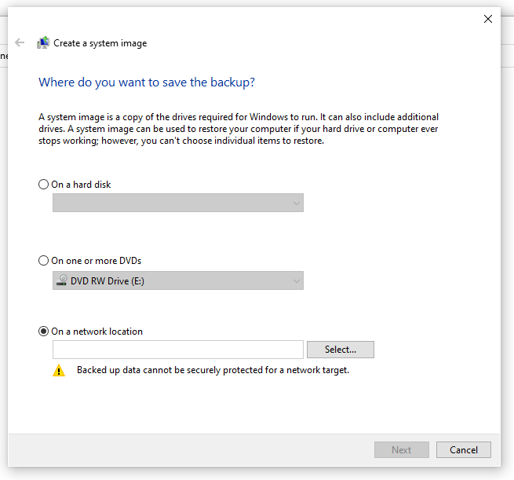
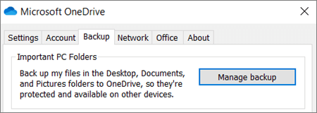
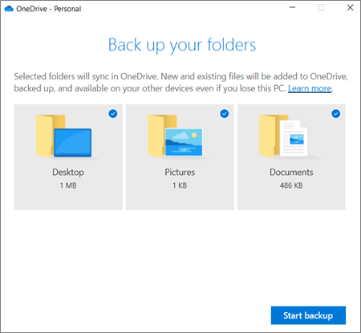
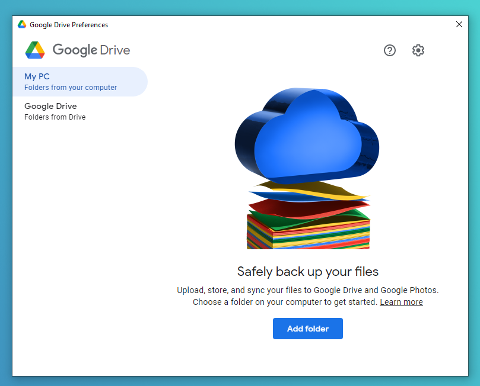
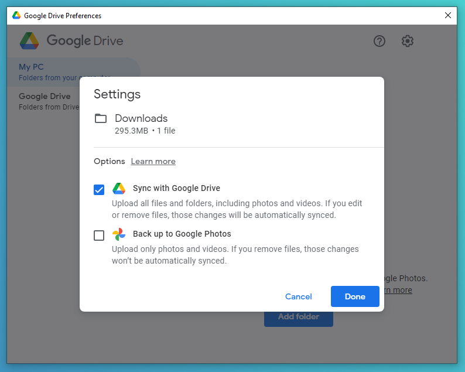

# Backing Up Data

Data loss is always possible. It could be caused by updates, software bugs, malware, drive failure, etc. Taking backups of your data is very important. This guide will go over a few ways to back up your data in case something happens to it.

## What do you need to back up?

This depends on preference, but it's a good idea to start with personal documents, photos, videos, and any other important files you might have. These backups can then be restored if you lose the files.

## The 3-2-1 Backup Rule

The "3-2-1" backup rule is a good guideline to follow when backing up your data. It helps ensure you always have a copy of your data,  even if something happens to a backup.

The 3-2-1 rule is as follows:

- Keep at least 3 copies of your data
- Use at least 2 different storage media
- Keep at least 1 copy off-site

For example, if you have photos on your computer you don't want to lose, you could create copies of them on a flash drive and cloud storage. Thus you have three copies (on your computer's hard drive, on a flash drive, and in the cloud), more than two different media types (a hard drive, flash drive, and cloud storage), and one off-site copy (the cloud storage).

## Backing Up Locally

### Using an external drive

If you have an external drive, you can use it to back up your files. If your drive came with backup software, you could use that to back up your files&mdash;but even just copying them to the drive is enough in most cases.

### Using File History

File History is a tool that can automatically back up your files as they are changed. You can keep track of each file's revisions by using the "Previous Versions" tab in a file's properties window, or by right-clicking a file and selecting "Restore previous versions." You can also choose the frequency at which files are backed up, and for how long backups should be kept.

#### Setting up File History

On Windows 10:

1. Open Settings
2. Go to Update & Security > Backup
3. Choose a drive to add to File History as a backup drive

On Windows 10 or 11:

1. Open Control Panel
2. Go to System and Security > File History
3. Choose a drive to add to File History as a backup drive

### Using System Image Backup

System Image Backup is another tool you can use to back up your system. A system image is an image, or copy, of the current state of the operating system, stored in a single file. You can use system images to revert the system to a previous state. Note that with System Image Backup, you cannot restore individual files&mdash;you can only roll back the entire system to the state it was in when the image was created.

#### Setting up System Image Backup

1. Access the File History page of Control Panel with the steps above, then choose "System Image Backup" in the sidebar, or go to Control Panel > System and Security > Backup and Restore (Windows 7):

    
    
    

2. Click on "Create a system image":  

    

3. Follow the prompts to set up System Image Backup:  

    

## Backing Up to a Cloud Service

You can also back up your data to a cloud service, like OneDrive or Google Drive. This solution might be a better idea if you do not have, or are worried about losing, a backup drive.

Note that the speed of your backups will depend on your internet speed, especially if the data you are backing up is large. You may also need to keep in mind your storage quota, as many cloud services limit the amount of data you can store. Most will offer a paid subscription for additional storage.

### OneDrive

OneDrive can back up your desktop, documents, and pictures so that they are available on other devices or can be restored in the event of data loss. You can also configure OneDrive to automatically back up other files of your choosing.

If you do not already have OneDrive installed, you can download it [here](https://www.microsoft.com/en-us/microsoft-365/onedrive/download). Once downloaded, install it and sign in with your Microsoft account.

#### Setting up OneDrive

1. Click the OneDrive icon in your system tray (this is the area of your taskbar by the clock) to open its menu. If you do not see the OneDrive icon, you may need to click the 'Show hidden icons' button:  
    
2. Click the gear icon (Help & Settings), then Settings to open OneDrive's settings menu
3. Click the "Backup" tab (may also be called "Sync and backup" in newer versions of Windows or OneDrive) and select "Manage backup", then select the folders you'd like to back up:

    
    
    

4. Click the "Start backup" button to start backing up your selected folders. After this completes, OneDrive will continue to automatically back up files in your chosen folders as they are modified, or new files as they are added.

By default, you can find your backed up files in your user folder (`C:\Users\[your user name here]\OneDrive`) or at [onedrive.live.com](https://onedrive.live.com).

### Google Drive

Google Drive is another cloud service that can back up your files. Like OneDrive, Google Drive can also back up your desktop, documents, and pictures, as well as other files of your choosing.

#### Setting up Google Drive

If you do not already have Google Drive installed, you can [download it here](https://www.google.com/drive/download). Once downloaded, install it and sign in with your Google account.

1. Click the Google Drive icon in your system tray (this is the area of your taskbar by the clock) to open its menu. If you do not see the Google Drive icon, you may need to click the 'Show hidden icons' button:  

    

2. Click the gear icon, then Preferences to open Google Drive's settings menu:

    

3. In the "My Computer" tab, select "Add folder" to choose a folder to sync with Google Drive:  

    

By default, you can find your backed up files in the Google Drive Streaming folder (`C:\Users\[your user name here]\Google Drive Streaming`) or at [drive.google.com](https://drive.google.com).
