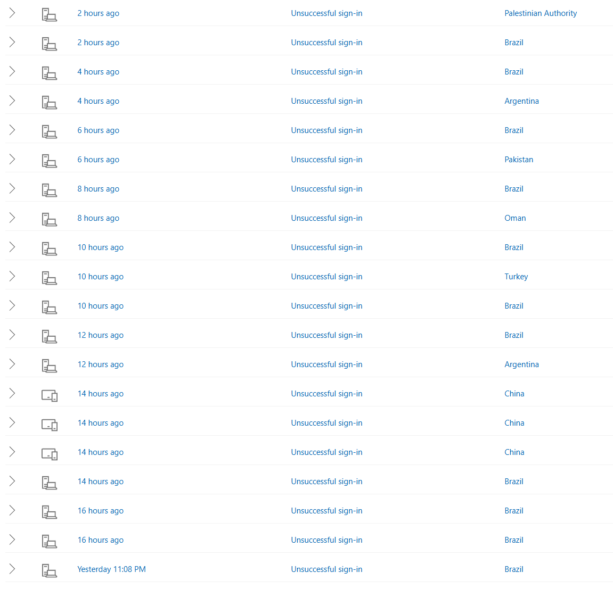
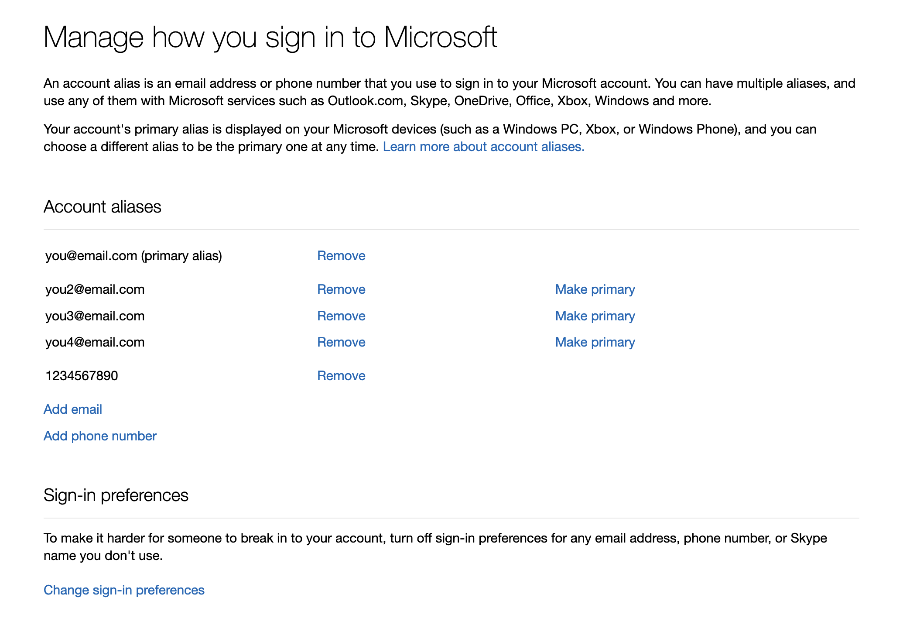
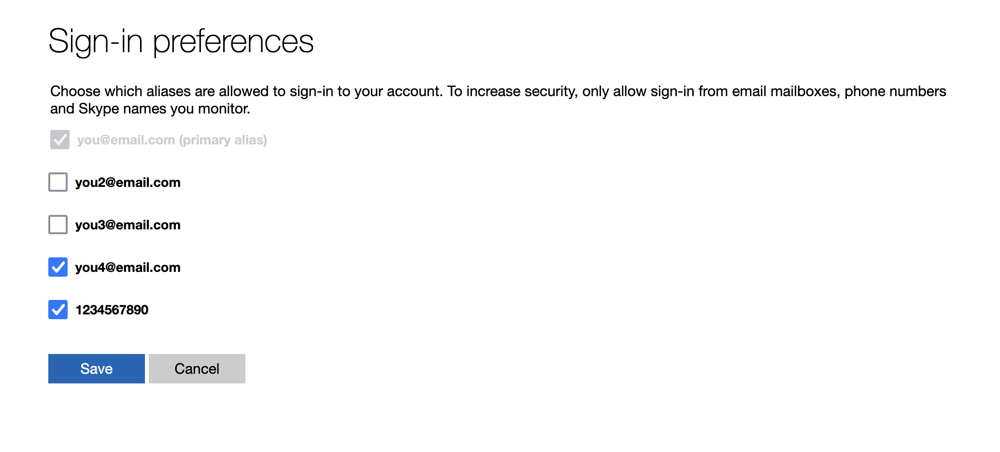
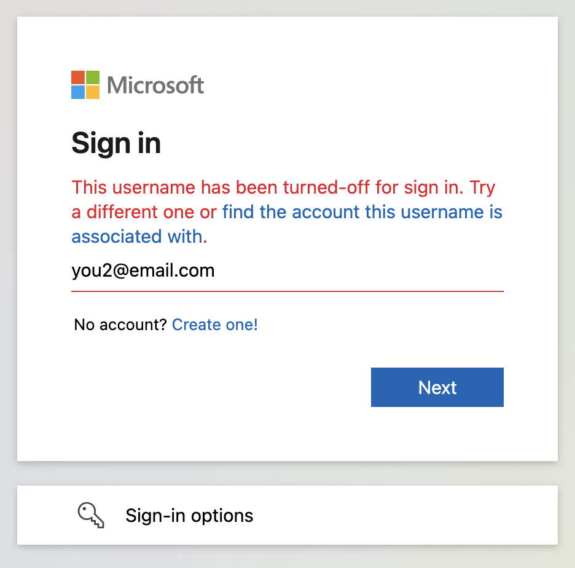

# Changing Microsoft Account Sign-in Aliases

This article discusses the process of changing the aliases (email addresses or phone numbers) that can be used to sign in to your Microsoft account. This can be useful if you are seeing lots of unsuccessful sign-in attempts on your account and would like to stop them from appearing.

You can find the sign-in attempts for your account at [https://account.live.com/activity](https://account.live.com/activity); if you are one of many people who has constant unsuccessful sign-in attempts, you might see something like this:

::: tip Note
Seeing a lot of unsuccessful sign-in attempts does not mean your account is in danger or is going to be hacked. If you use a strong password and [two-step verification](https://support.microsoft.com/account-billing/how-to-use-two-step-verification-with-your-microsoft-account-c7910146-672f-01e9-50a0-93b4585e7eb4), your account is well-protected and unsuccessful sign-in attempts are not worth worrying about.

However, if you are still worried, you can change the aliases on your Microsoft account that are allowed to be used for sign-in.
:::

## Add or remove an alias from your Microsoft account

Before you change which aliases are allowed to be used for sign-in, you should look over the list of aliases on your account. You can find this at [https://account.live.com/names/manage](https://account.live.com/names/manage). On ths page you can see all of your Microsoft account aliases, add or remove aliases, and change your account's primary alias.

## Change which account aliases can be used for sign-in

If you want to disallow some of your Microsoft account's aliases from being used to sign in to your account, you can do so at [https://account.live.com/signinpreferences](https://account.live.com/signinpreferences). You should see something like this:

If you want to keep the list of sign-in attempts for your account clean as mentioned at the start of this article, you can create a new email address, add that as an alias (see [the section above](#add-or-remove-an-alias-from-your-microsoft-account)), then **uncheck** every email address on this page except for the one you just added. Then only the new email address will be allowed to be used for sign-in.

## What happens when an alias is not allowed to be used for sign-in?

When you try to sign in with an alias that is unchecked on the [Sign-in preferences](https://account.live.com/signinpreferences) page, the sign-in will be blocked, like this:

Sign-in attempts for disallowed aliases do not appear at [https://account.live.com/activity](https://account.live.com/activity).
