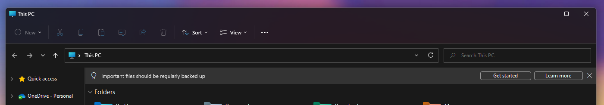

# Common Windows Misconceptions

This article covers many of the misconceptions people may have with Windows and attempts to explain them. Seeing as this is a long article with a lot of required information that could not be condensed or cut out, it is recommended to link directly to individual sections.

This does not cover all of the misconceptions - more sections will be added here as necessary.

## RAM utilization

Possibly the most common one when it comes to Windows. Windows does not do memory management like any other OS. It preloads files and libraries that it thinks the user utilizes most into memory when no other program needs that memory, so it can be quickly accessed by the user  - this can lead to seemingly high idle memory utilization, and the user being alarmed. However, what the user doesn't know is that Windows will reallocate that memory holding preloaded data to other programs or games if they so need it. Windows will not keep that memory allocated forever as that would lead to bad consequences such as system lock-ups or crashes within minutes. No sane OS forgets to reallocate memory.

In other words: let's say we have `stuff.dll`, a massive 1 GB library of shared code. Windows knows that it commonly loads this file into memory and a lot of programs use it. If there's plenty of unused memory available, Windows will quietly load `stuff.dll` into memory and mark it as standby. If a program comes along and needs to use `stuff.dll`, instead of loading it from disk (which is a lot slower than the RAM bus), Windows directs it to the copy already in memory so it can skip loading it. It'll then be marked as in-use. After that program is done with it, it'll go back to being standby again. If a different program comes along and needs that space (say a game or a video editor being tasked to render), Windows will freely allow it to overwrite `stuff.dll` as well as anything else in standby memory.

Try loading up a memory intensive game, and taking a look at your total system memory utilization before and after launching the game. Let's say you are at 10 GB of total utilization before launching it, and the game is taking up about 6 GB. You'll see the total memory utilization only slightly creep up, possibly to 12 or 13 GB, not to 16 GB as you would expect. This is because Windows unloads stuff you don't need anymore to make room for the game's resources.

RAM utilization is also dependent on your RAM capacity - the more RAM you have, the more Windows uses to store frequently used code into standby memory. This is why some people with more memory notice higher utilization while some others with less memory notice significantly decreased utilization. Windows adapts based on how much memory you have. The conclusion from this section is that **there is nothing to be concerned about if you notice high idle RAM utilization.**

## "Bloatware" and resource usage

It is commonly thought that Windows is 'bloated' by default and all those pre-installed apps it comes with take up a significant amount of system resources that could be used for other things. This can also apply to system services which people often disable hoping it brings an improvement.

The improvement is not real, if marginal at best. Uninstalling the pre-installed apps, disabling system services, and messing with the registry will 99% of the time **not** bring you an improvement in performance. Windows does not load up all of those apps in the memory at the same time, only when you use them. Services take up a very insignificant amount of memory and CPU resources, even on a low end machine. And Windows does not access the registry sequentially, meaning that deleting registry keys using dubious third party cleaners such as CCleaner will not bring about an improvement as Windows accesses that key directly&mdash;it is not akin to disk fragmentation, and no improvement will be gained from similarly dubious registry tweaks.

Attempting to 'debloat' Windows will most of the time bring about problems instead of improvements - it has been tested time and time again and the results show that the default state of Windows will not harm performance. Unless you have an OEM machine with actual OEM bloatware ([that can and will harm performance](https://www.youtube.com/watch?v=5N7aYtkzKJc)) installed on it, then a clean installation of Windows is recommended. But **attempting to debloat an already clean installation will give you more trouble than it's worth**.

Besides, if you are concerned about these things affecting your gaming performance, Windows already has its own 'Game Mode' built in that works quite well at suppressing its background tasks while you play. It's also enabled by default, so you don't need to do anything more.

### OEM Bloatware

While it is recommended to perform a clean install of Windows as the best way to get rid of bloatware, some devices and motherboard manufacturers will automatically re-install these immediately after you finish setup. This practice has seen some controversy, notably the [Lenovo SuperFish vulnerability in 2014](https://support.lenovo.com/us/en/product_security/ps500035-superfish-vulnerability) and [again in 2015](https://www.howtogeek.com/226308/the-windows-platform-binary-table-why-crapware-can-come-back-after-a-clean-install/).

The good news is that these can usually be disabled, with some tradeoffs such as no automatic driver installation or, if any, RGB LED control.

A list of brands with OEM bloatware and how you can disable them is compiled below. That being said, BIOS updates may change these settings, so it is a good idea to double-check occasionally.

* ASUS / ROG
  * Armoury Crate: https://www.asus.com/support/faq/1043788/
  * On some models, this will be *ASUS GRID install service* in BIOS
* MSI: *MSI Driver Utility Installer* in BIOS
* ASRock: *Auto Driver Installer* in BIOS
* Gigabyte: *Gigabyte Utilities Downloader Configuration* in BIOS
  * On some models, this will be *APP Center Download & Install*

Starting with Windows 8, Microsoft introduced [Windows Platform Binary Table (WPBT)](https://download.microsoft.com/download/8/A/2/8A2FB72D-9B96-4E2D-A559-4A27CF905A80/windows-platform-binary-table.docx), which allows manufacturers to embed drivers and other software they deem "critical" for operation and security (such as anti-theft and tracking) into a computer's firmware. The pre-loaded software will always persist through Windows installations and will always be enabled unless the manufacturer provides a way to disable it.

## Forced updates

Windows does not *usually* force you to update. It only does so if you are almost reaching (or have reached) the end-of-life date for the current feature update you're on (for example Windows 10, version 1809). At that point, your machine's security is compromised by running an unsupported build, and there may be other issues that can arise the longer you stay on an unsupported build, such as Store apps no longer downloading due to an unsupported version, the system no longer trusting its own code signing which can results in system apps becoming unstable, etc. This also applies to expired Dev channel builds - Windows forces you to update there for a reason.

The reason Windows 10 and later's update agent seems so 'pushy' is most likely due to users on Windows 7 or 8 in the past completely disabling automatic updates and never updating their systems. This possibly led Microsoft to make the updates as pushy as they are, in order to ensure people remain on a stable & secure version of Windows and that they don't compromise the security of their own machine. Furthermore, devices that are regularly kept up-to-date are generally more stable.

## Windows updates requiring a restart

Windows restarts after a cumulative update because they contain direct changes to the kernel. Think of it as most 'core' packages on Linux - those also require you to restart your system. Windows needs to restart often for updates while Linux doesn't - but that's because WU mostly provides kernel updates, while Linux package managers additionally provide updates for software that do not need a restart; they don't always include critical core package updates, leading to this misconception.

Forced restarts aren't usually a thing (especially if you are responsible and keep your OS updated yourself), and if it *has* happened to you, there is the option to set up your active hours in order to keep Windows from restarting when you're using your device - however, there is no reason why it *shouldn't* update overnight or when you're away.

## Advertisements in the OS

This one is a result of the media taking things out of proportion, sensationalizing an incident where Microsoft accidentally included "ads" into the File Explorer, which were quickly revoked, and claiming that Windows comes with a bunch of upsold apps installed by default (Netflix, TikTok, etc.) While it is true that Windows *does* include those apps in the Start menu, they are mere **shortcuts** and the apps are **not installed** by default until you click on them. You can simply unpin them and they will not come back even after a feature update. Additionally, understand that there *are* people out there who make use of those apps.

As for the "ads" in the File Explorer, they were not ads. They were either reminders for important tasks such as backing up:

Or they were suggestions for other Microsoft products, such as Microsoft Editor, that come at no additional cost (although it has more features if you have a 365 subscription). Again, some people might find those apps useful. An actual ad would be other companies paying Microsoft to put advertisements to *their* products in the OS, which deserves tons of criticism - but them recommending their own products in their own OS doesn't. If you are a power user who does not make any use of the suggested apps, the option to simply dismiss the small banner is there, and you can even turn off suggestions altogether should these "ads" ever make it into Windows.

Microsoft does suggest Xbox Game Pass and Office in the OOBE - but consider who the main user base of Windows is. Not power users, not in the slightest. The main user base of Windows are regular users who either want to get work done or play games, or both. Suggesting them either of these products can be beneficial to their experience. If they are not interested, it does not take much for them to skip the suggestions.

## The Feedback Hub is useless

It is not - if you provide proper, constructive feedback. Most of it is littered with nonsensical feedback from the frustrated vocal minority. If you take the time to write a detailed description of your issue/suggestion, recording steps, and attaching screenshots, there is a much higher chance that your feedback will be seen and tended to. Contributing *properly* in the Feedback Hub is the only way to make your voice heard and to get potential bugs on Microsoft's radar. Most users who have issues do not bother to write a proper feedback post and just say something along the lines of "Microsoft, I am having [blank] issue, please fix this". That does not help anybody and your post is likely to be ignored.
