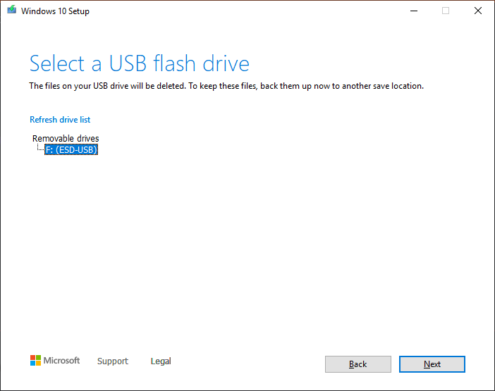
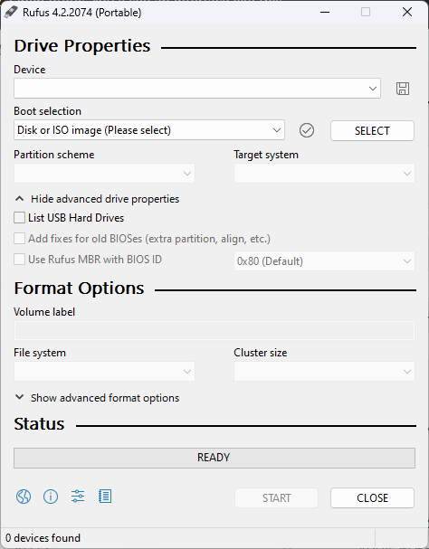
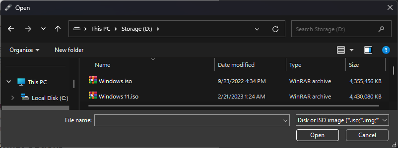
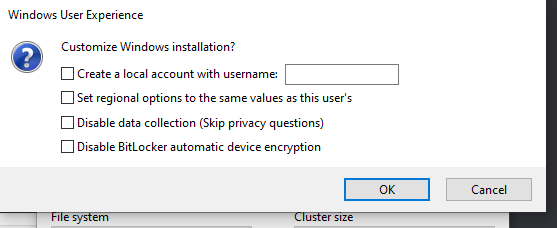

# Downloading Windows

This article is a guide that helps you download Windows and create an installation media, for re-installing.

## Method 1: The Media Creation Tool

::: tip Note
At least 8 GB of space on the `C:` drive is required to run the tool.
:::

### Downloading the tool

1. For Windows 10, go to [https://www.microsoft.com/software-download/windows10](https://www.microsoft.com/software-download/windows10)
    
   For Windows 11, go to [https://www.microsoft.com/software-download/windows11](https://www.microsoft.com/software-download/windows11)

2. Click the **Download Tool Now** button.

   

3. After the tool has been downloaded, run it.

### Using the tool

1. The first thing you will see is this screen, click Accept.

   

2. The next screen you see will be this, wait for the installer to complete preparation.

   

::: tip Note
On the Windows 11 Media Creation Tool, the below option won't be displayed and you will be asked to either save an ISO file or use a USB drive directly. If you are using Media Creation Tool to do an in-place upgrade, follow the instructions in Method 2, then go to the [Troubleshooting](troubleshooting#in-place-upgrades) page for further guidance.
:::

3. This is where you select what you want to do.

   - If you want to **repair the Windows installation on this computer** click **Upgrade this PC now** and follow the instructions in the [Troubleshooting](troubleshooting#in-place-upgrades) page.

   - If you **want to reinstall Windows on another computer** click **Create installation media** and follow the instructions below.

    

### Creating installation media

You need a **blank** USB with at least **8 GB of space** for the following steps.

1. Select the correct Architecture, Edition and Language of Windows, or use the recommended settings.

   ::: tip Note
   If you're planning on installing Windows on another PC and don't know what to select for the architecture, then choose both x86 and x64.
   :::

   

2. Select **USB Flash Drive**.

   

3. Select the USB that you have inserted. ***ANY DATA ON THE USB WILL BE ERASED***

   

4. Wait for Windows to finish downloading.

   

After this, you will see a screen saying that the flash drive is ready. Click finish, eject the USB, take it out and insert it into the computer that is not working.

## Method 2: Downloading the ISO

1. Select the correct Architecture, Edition and Language of Windows, or use the recommended settings.

   ::: tip Note
   If you're planning on installing Windows on another PC and don't know what to select for the architecture, then choose both x86 and x64.
   :::

   

2. On the Media Creation Tool, select **ISO file**.

   

3. Select a path to save to.

After that, Windows will start downloading the ISO file.

### Using the ISO with Rufus

This step is optional, but in case you want more customizability than Media Creation Tool you could use Rufus to flash the Windows ISO to your USB drive.

1. Download Rufus from [rufus.ie](https://rufus.ie)

::: tip
You can choose the portable or the non-portable version, it doesn't matter much.
:::

2. Open Rufus. You'll see an interface like this.

  

3. Select your USB drive from the **Device** dropdown.

::: tip Note
If your USB drive doesn't appear, select **Show advanced drive properties** then check **List USB Hard Drives**.
:::

4. Use the Select button to locate your ISO file which you downloaded before.

  

5. Choose the appropriate partition scheme and target system for the PC you'll use it on. If you are unsure, you can use the target system as **BIOS or UEFI**, and the partition scheme as **MBR**.

6. Select the Start button to start flashing Windows on the USB drive, then use whatever customization option you want if it asks you. If you are unsure, uncheck all of them and select OK.

  

::: danger
Before starting, make sure to back up any important data on the USB drive if there's any. This operation will **erase all of the data on the USB drive**.
:::

## How to re-install Windows

For more guidance regarding re-installing Windows, see [Installing Windows](installing-windows).
