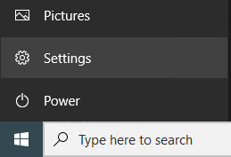
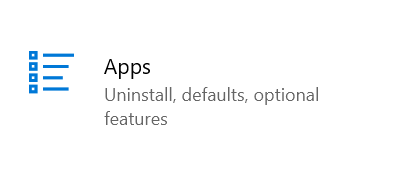
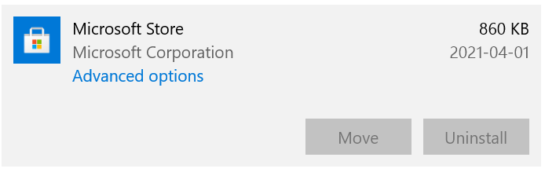
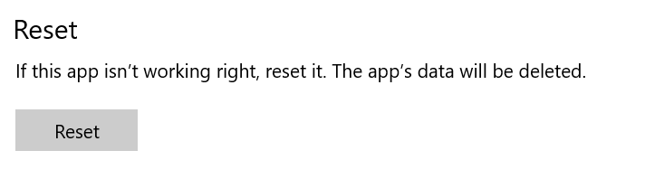
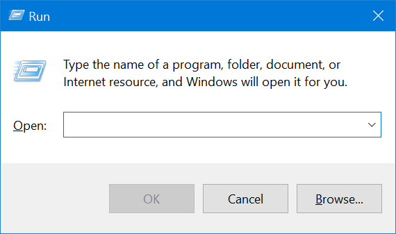
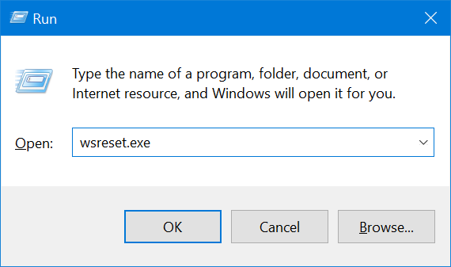
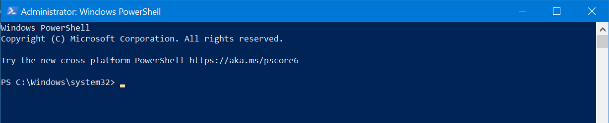
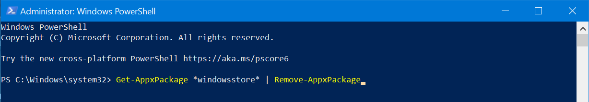
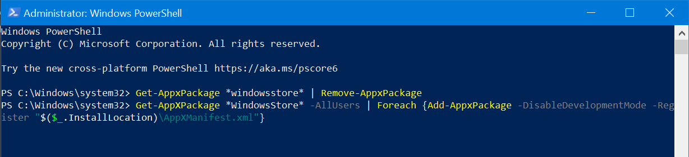
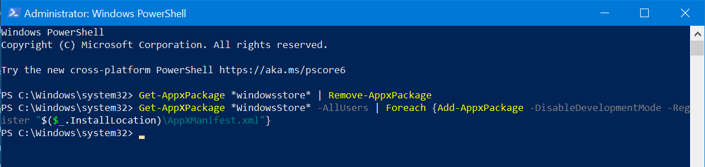

# Fixing Problems with the Microsoft Store

The Microsoft Store is used to download applications. It may sometimes stop working correctly; this article covers the process of repairing and, if necessary, reinstalling it.

## Method 1: Clearing the Microsoft Store cache

There are two ways to clear the Microsoft Store cache.

### Clearing the Microsoft Store cache in Settings

1. Open the Settings app. You can do this by searching for it in the Start menu, pressing <kbd>Win</kbd> + <kbd>I</kbd>, or clicking the Settings button found above the Power button in Start.

    

2. Click *Apps*.

    

3. Find *Microsoft Store*, click it, and click *Advanced options*.

    

    ::: tip Note
    If you don't see *Microsoft Store* here, you will have to reinstall it completely. Skip to [Method 2](#method-2-reinstalling-the-microsoft-store).
    :::

4. Scroll down and click the *Reset* button. Then wait for a check mark to appear. Once you see the check mark, you're done; if the Microsoft Store still doesn't work, try the next option below.

    

### Clearing the Microsoft Store cache with `wsreset`

::: tip Note
The `wsreset` function is outdated and may not function correctly in the latest versions of Windows 10 or Windows 11. If you try `wsreset` and it does not work, consider [reinstalling the Microsoft Store](#method-2-reinstalling-the-microsoft-store).
:::

1. Open the Run dialog. You can do this by searching for it in the Start menu, or by pressing <kbd>Win</kbd> + <kbd>R</kbd>.

    

2. Type `wsreset.exe`, then press <kbd>Enter</kbd> or click *OK*.

    

3. A black Command Prompt window will appear briefly; once it closes, restart your PC and the Microsoft Store might work again. If it still doesn't work, try Method 2 below.

## Method 2: Reinstalling the Microsoft Store

1. Run PowerShell as administrator by either right-clicking the Start button or pressing <kbd>Win</kbd> + <kbd>X</kbd> and clicking "PowerShell (Admin)". You can also use Search; if using Search, make sure to right-click Windows PowerShell and select *Run as Administrator*. You may be shown a User Account Control prompt ("Do you want to allow this program to make changes to your device?"); click Yes or enter an administrator's username and password to continue.

    Once PowerShell is open, it should look like the image below:

    

2. Type or paste `Get-AppxPackage *windowsstore* | Remove-AppxPackage` and press <kbd>Enter</kbd>.

    ::: tip Note
    This command will completely remove the Microsoft Store from your PC. The command in the next step will reinstall it.
    :::

    

3. After the last command finishes, type or paste `Get-AppXPackage *WindowsStore* -AllUsers | Foreach {Add-AppxPackage -DisableDevelopmentMode -Register "$($_.InstallLocation)\AppXManifest.xml"}` and press <kbd>Enter</kbd>.

    

4. After completing these steps, PowerShell should look like the image below. If it looks different or displays any errors, make sure you typed the commands correctly.

    

If PowerShell looks like the image above, restart your PC to ensure any changes are applied, then try opening the Microsoft Store again. If you are still having issues, try [repairing Windows](https://msft.chat/wiki/using-the-media-creation-tool.html#method-1-repairing-an-existing-installation).
