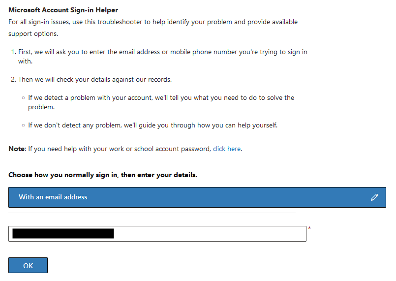
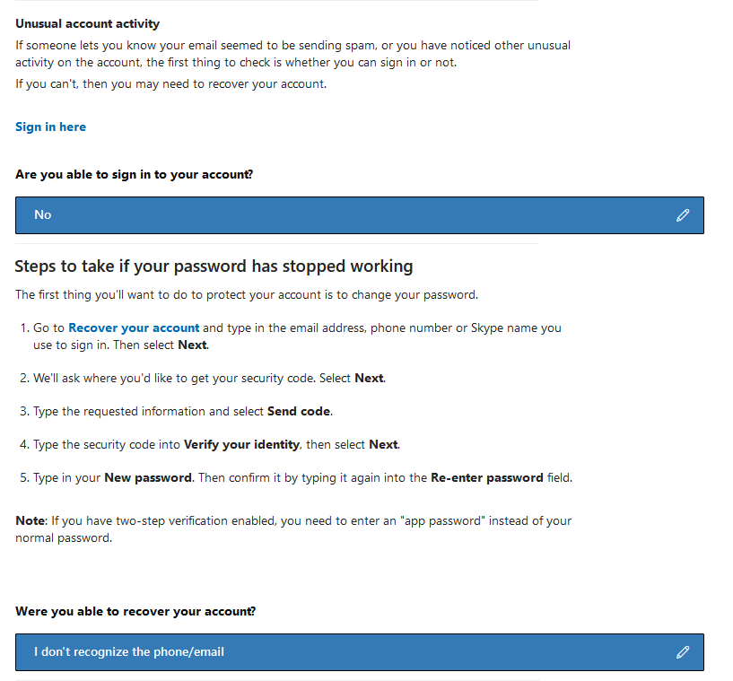
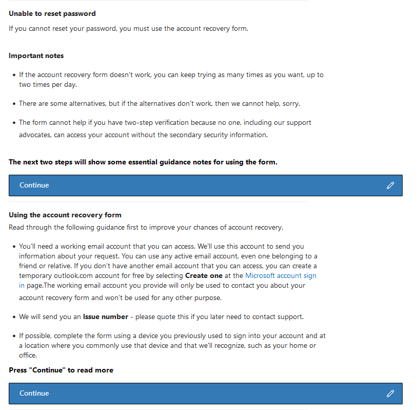
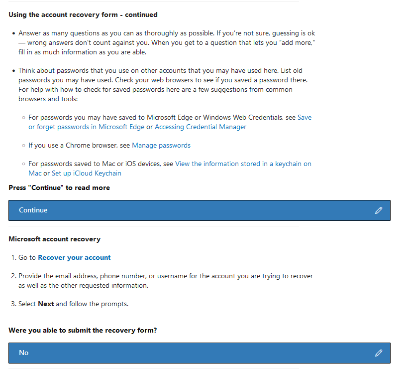
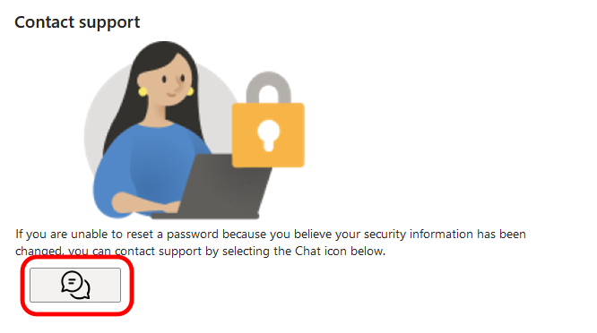
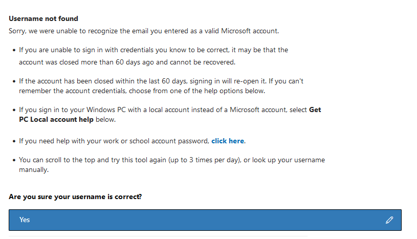
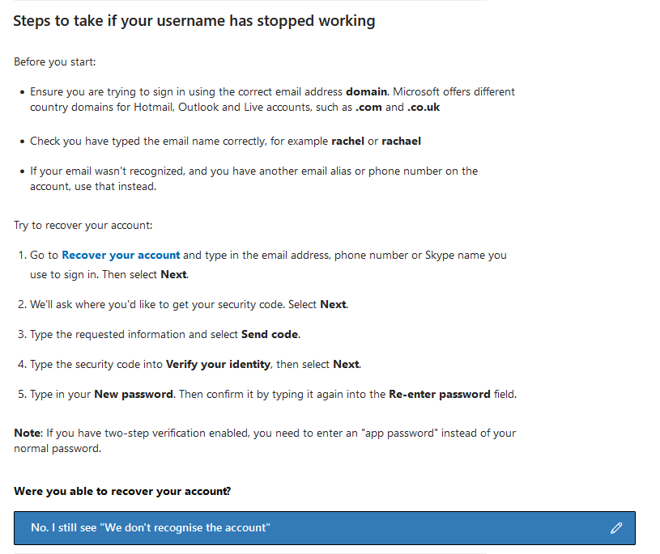
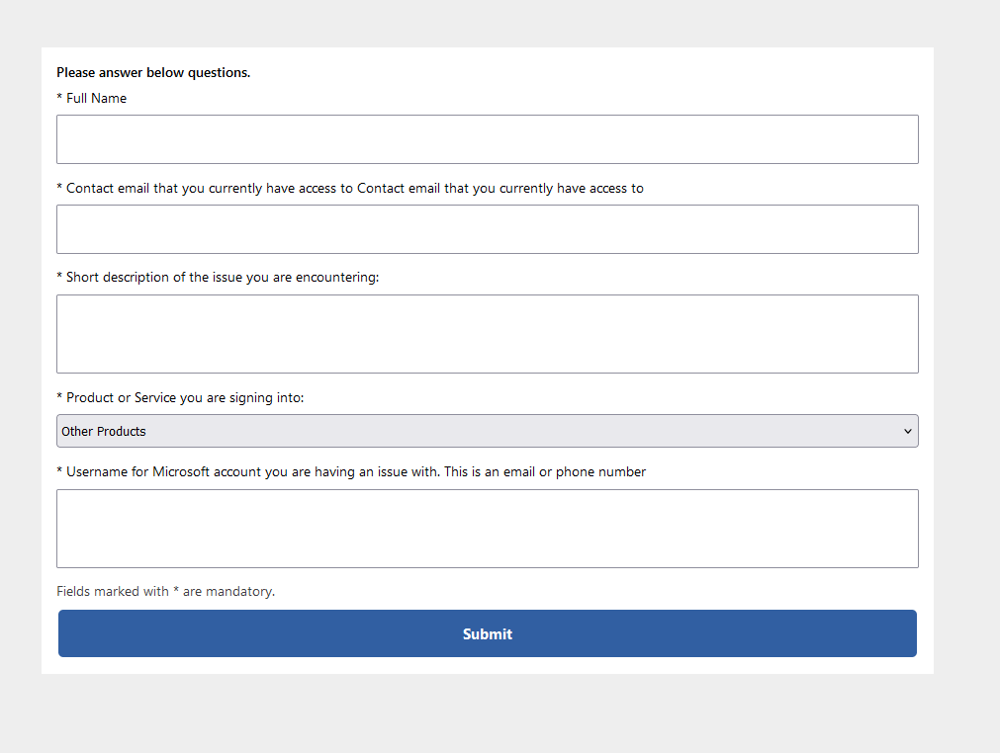

# Getting Live Support for Hacked Accounts

This article covers how to get live chat support in case your account gets hacked.
Please keep in mind that this guide only covers the most common paths to get to support, it is possible that these steps may not work for you entirely.

::: tip Note
We can not help you recover hacked accounts in the Discord server, as we do not have access to account information.
:::

The correct form to use for hacked accounts [can be found here](https://support.microsoft.com/en-us/home/contact?linkquery=I%20think%20my%20Microsoft%20account%20has%20been%20hacked).
Keep in mind that this is not a 100% guarantee to get your account back, having a lot of proof of ownership like receipts is very helpful.

## Filling in the form

1. At the option 'Choose how you normally sign in, then enter your details.', select 'With an email address'.
2. Fill in the email address you normally sign in with and press 'OK'.

    

3. After it has done some tests, press 'continue'.

    ::: warning IMPORTANT
    Even if it says "No problems found", continue anyway. This does not matter!
    :::

    ::: tip Note
    If it gives an error like "The account does not exist" or similar, click 'continue' anyway.
    If it gives the error "Username not found", proceed to [this section](#username-not-found).
    :::

4. At the option 'Please select an option', select 'Account hacked'.
5. At the option 'Please select the reason why you think your account has been hacked.', select 'Unusual account activity'.

    

6. At the option 'Are you able to sign in to your account?', select 'No'.
7. At the option 'Were you able to recover your account?', select 'I don't recognize the phone/email'.

    ::: warning IMPORTANT
    Do not click on the link 'Recover your account'. This will not give you live support!
    :::

    

8. Click 'Continue' until it is at the 'Microsoft account recovery' step.
9. At the option 'Were you able to submit the recovery form?', select 'No'.

    ::: warning IMPORTANT
    Do not click on the link 'Recover your account'. This will not give you live support!
    :::

    
    

10. Press the chat button to start a live chat with Microsoft support.

    

11. Follow the steps provided in [this section](#live-form-chat).

### Username not found

If you get the error 'Username not found' proceed with this guide:

1. At the option 'Are you sure your username is correct?', click 'Yes'.

    

2. At the option 'Were you able to recover your account?', click 'No. I still see "We don't recognize the account".

    ::: warning IMPORTANT
    Do not click on the link 'Recover your account'. This will not give you live support!
    :::

    

3. Press the chat button to start a live chat with Microsoft support.

    

4. Follow the steps provided in [this section](#live-form-chat).

## Live form chat

After filling in the form and clicking 'submit', you will be sent to a different page with a small form.
It should be pretty straight forward but let's go through it nontheless

The 'Short description of the issue you are encountering' and 'Product or Service you are signing into' can be a bit confusing.
But you can basically just write that you got hacked. As for the product or service, any will do as a hacked account relates to most of these things.

After filling the form in, press 'Submit' and you will start a live chat. This can take a while, so be patient.