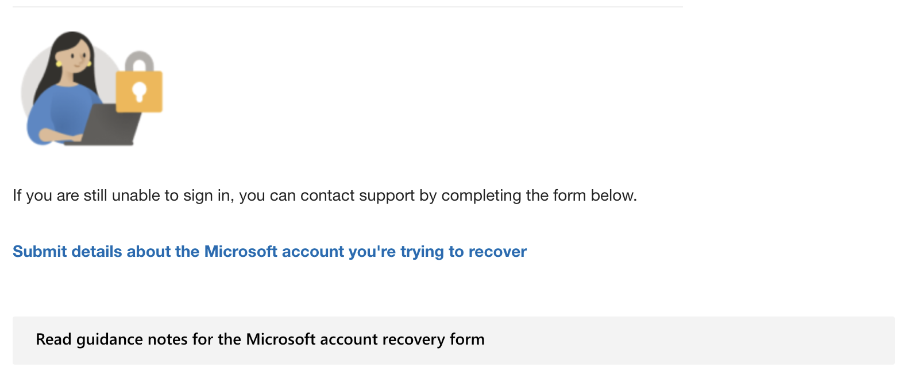
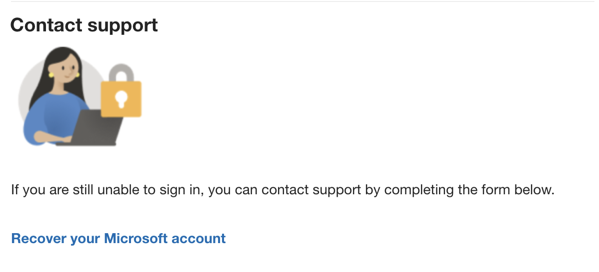

# Getting Support for Hacked Accounts

This article covers how to get support in case your account gets hacked.
Please keep in mind that this guide only covers the most common paths to get to support, it is possible that these steps may not work for you entirely.

::: tip Note
We cannot help you recover hacked accounts in the Discord server, as we do not have access to account information.
:::

The correct form to use for hacked accounts [can be found here](https://support.microsoft.com/en-us/home/contact?linkquery=I%20think%20my%20Microsoft%20account%20has%20been%20hacked).
Keep in mind that this is not a 100% guarantee to get your account back, having a lot of proof of ownership like receipts is very helpful.

## Filling in the form

1. At the option 'Choose how you normally sign in, then enter your details.', select 'With an email address'.
2. Fill in the email address you normally sign in with and press 'OK'.

    

3. After it has done some tests, press 'continue'.

    ::: warning IMPORTANT
    Even if it says "No problems found", continue anyway. This does not matter!
    :::

    ::: tip Note
    If it gives an error like "The account does not exist" or similar, click 'continue' anyway.
    If it gives the error "Username not found", proceed to [this section](#username-not-found).
    :::

4. At the option 'Please select an option', select 'Account hacked'.
5. At the option 'Please select the reason why you think your account has been hacked.', select 'Unusual account activity'.

    

6. At the option 'Are you able to sign in to your account?', select 'No'.
7. At the option 'Were you able to recover your account?', select 'I don't recognize the phone/email'.

    ::: warning IMPORTANT
    Do not click on the link 'Recover your account'. This will not give you live support!
    :::

    

8. Click 'Continue' until it is at the 'Microsoft account recovery' step.
9. At the option 'Were you able to submit the recovery form?', select 'No'.

    ::: warning IMPORTANT
    Do not click on the link 'Recover your account'. This will not give you live support!
    :::

    
    

10. Click 'Submit details about the Microsoft account you're trying to recover' to access the recovery form.

    

11. Follow the steps provided in [this section](#recovery-form).

### Username not found

If you get the error 'Username not found' proceed with this guide:

1. At the option 'Are you sure your username is correct?', click 'Yes'.

    

2. At the option 'Were you able to recover your account?', click 'No. I still see "We don't recognize the account".

    ::: warning IMPORTANT
    Do not click on the link 'Recover your account'. This will not give you live support!
    :::

    

3. Click 'Recover your Microsoft account' to access the recovery form.

    

4. Follow the steps provided in [this section](#recovery-form).

## Recovery form

Fill in the details on the "Recover your Microsoft account" form, then press Submit. When asked to enter a date, use the United States date format (mm/dd/yyyy), even if you are not located in the US.

::: tip Note
Even if you do not use Xbox, this is the correct form to use! If you do not use Xbox, you can leave the box for "Gamertag (Xbox profile name associated with your account)" blank.
:::

Enter as much information as you can. If you do not know something, you can leave it blank, but entering more details will improve your chances of recovering your account.

::: warning IMPORTANT
Where it asks for "Microsoft account you're trying to recover," enter the email address you previously used to sign in to your Microsoft account! Do not enter an email that does not belong to you.

If the email address on your account was changed to an email you do not recognize, you can enter that email where it asks for "Alternate emails or phone numbers associated with the account."

Where it asks for "Preferred contact email (not linked to the account)," enter a different email that you still have access to! This is how Microsoft will contact you to help you recover your account.
:::

If you do not know what to enter for one of the boxes, like "Device," you can find more information at https://aka.ms/recovermsa.
