# Installing and Updating Drivers

In this guide, you will learn how to download or update drivers on your computer.

::: warning
It is highly recommended to avoid using third-party software to update or install your drivers.
:::

## Identifying Your Hardware

The first step in installing drivers is to correctly identify the hardware you need drivers for. This information can be found in your computer's manual or by using the Device Manager. You can access the device manager by right clicking the Windows start button or by pressing <kbd>Win</kbd> + <kbd>X</kbd> and selecting Device Manager. In the Device Manager, look for the device you need drivers for, and expand its entry to see its model number.

You can also use the System Information tool to find hardware information; open System Information, navigate to the “Hardware” section and find the device for which you require drivers.

## Method 1: Using Windows Update

You can usually find drivers for your devices in Windows Update, instead of having to manually download the file.

1. Open Settings via the start menu or by pressing <kbd>Win</kbd> + <kbd>I</kbd>.

2. Go to Update & Security (on Windows 10) or Windows Update (on Windows 11).

3. Click on “Check for Updates” or "Download & Install Updates".

Windows Update might say that you are up-to-date, even if optional updates are available. You can check for more optional updates in the 'Optional updates' section of Windows Update settings.

### On Windows 11:

1. Click "Advanced options".

   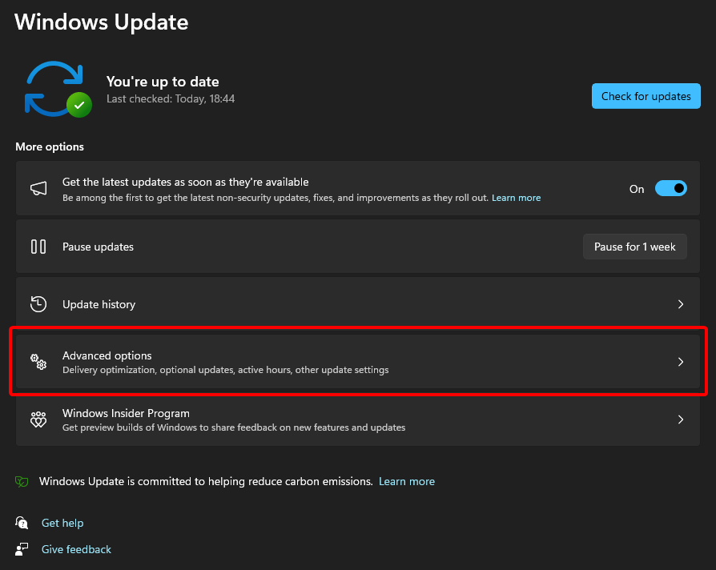

2. Click "Optional updates".

   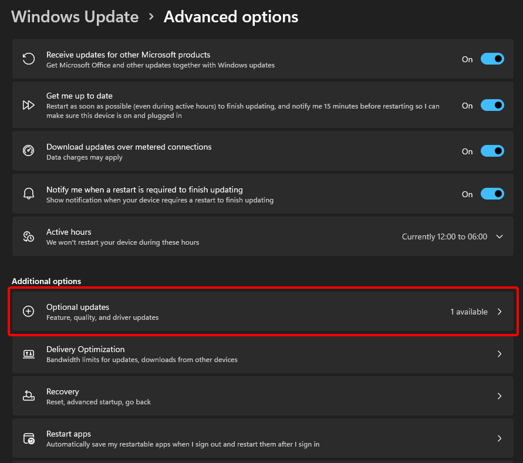

3. Click "Driver updates" to show the list of available driver updates if there are any.

   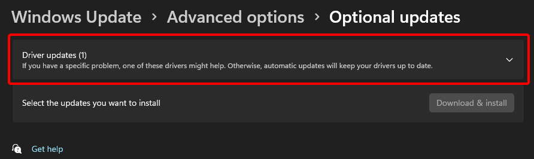

4. Select any optional updates you wish to install, then click "Download & install".

   

### On Windows 10:

1. Open the Settings app. You can do this by searching for it in the Start menu, pressing <kbd>Win</kbd> + <kbd>I</kbd>, or pressing the Settings icon above the power button.

   

2. Select "Update & Security".

   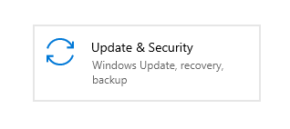

3. If there are updates available, click "Download". Otherwise, click "Check for Updates".

   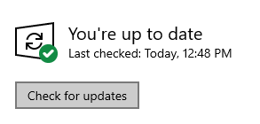

4. Windows should begin looking for any drivers or updates available for your device, including graphics drivers if any are available.

   

## Method 2: Using your OEM's website

::: tip Note
"OEM" here refers to the manufacturer of an entire device, like a laptop or pre-built desktop. If you are using a custom-built computer, you should follow [Method 3](#method-3-using-your-manufacturer-s-website) instead.
:::

It is highly recommended to download or update your drivers through your manufacturer's website, as that will guarantee proper functionality, provided you've installed the correct drivers. This is especially a good idea for your Graphics Card (GPU) Drivers.

All you need to do is:

1. On the search engine of your choice (Google, Bing, DuckDuckGo, etc…), search for "{device manufacturer} drivers".
2. Visit the manufacturer's website and enter the model of your device, then follow the instructions on the page.
3. When you select the product, you may be shown with 2 options:

- Download the driver downloader (recommended).
- Download this specific driver only and install it manually.

### Well-known manufacturers' websites

- [Dell](https://www.dell.com/support/home/en-us?app=drivers)

- [HP](https://support.hp.com/us-en/drivers)

- [Lenovo](https://pcsupport.lenovo.com/us/en)

- [ASUS](https://www.asus.com/support/download-center)

- [Intel](https://downloadcenter.intel.com/)

- [NVIDIA](https://www.nvidia.com/Download/index.aspx)

- [AMD](https://www.amd.com/en/support)

::: tip Note
You may also want to use Display Driver Uninstaller (DDU) for this if you're using an NVIDIA or Intel GPU. If that's the case, there is an excellent guide on that [here](https://www.wagnardsoft.com/content/ddu-guide-tutorial). If you're using an AMD GPU, then the Radeon installer's built-in "factory reset" (under Additional Options) function is preferred over DDU.
:::

## Method 3: Using your manufacturer's website

::: tip Note
"Manufacturer" here refers to the manufacturer of an individual piece of hardware. If you are using a laptop or a pre-built desktop, you should probably download drivers from your OEM's website instead. See [Method 2](#method-2-using-your-oem-s-website).
:::

For each piece of hardware in your computer that you wish to get drivers for:

1. On the search engine of your choice (Google, Bing, DuckDuckGo, etc…), search for "{hardware manufacturer} drivers".

2. Search for the model number of the piece of hardware you want to upgrade/install drivers for.

3. When you select the product, you may have two options:

    - Download the driver downloader (recommended).
    - Download this specific driver only and install it manually.

## Method 4: Device Manager

::: warning Warning
This method may not work effectively on older versions of Windows, if this is the case then don't follow this method.
:::

1. Open Device Manager by either searching for it in Start or pressing <kbd>Win</kbd> + <kbd>X</kbd> and tapping <kbd>M</kbd> afterwards.

   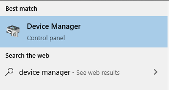

2. Find the category of your device (for example, "Display adapters"). You'll be presented with a list of devices installed in your system.

   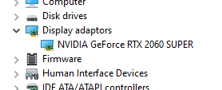

3. Right-click the device you wish to reinstall. Then, select "Uninstall device".

   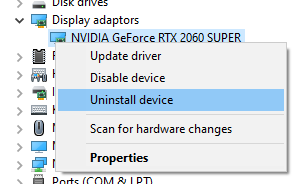

4. Select "Delete the driver software for this device" then click "Uninstall". Note that your screen may flicker after clicking this button.

   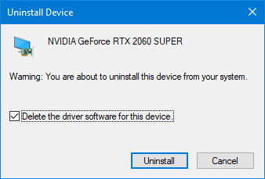

5. Go to "Action", then select "Scan for hardware changes".

   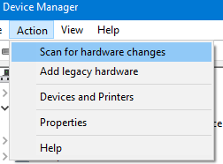

6. Go back to the unrecognised devices category or go to the same device category and find the target you are trying to reinstall. If you find it in unrecognised devices, right-click and install it. Or if it's already reinstalled automatically, you're done. (In GPU, note that it may now be called "Microsoft Basic Display Adapter". Right-click it and select "Update driver").

   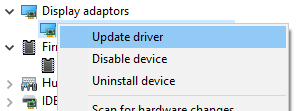

## Troubleshooting 🔧

### If you can access Windows

<br>

#### Verifying Driver Signatures

Verifying driver signatures ensures you are installing secure, untampered and correct drivers issued by your hardware manufacturer.

1. Press <kbd>Win</kbd> + <kbd>R</kbd>, then type in `sigverif` and press <kbd>Enter</kbd>.

2. A window will pop up. Press the `Start` button to verify driver signatures.

#### Updating Drivers with Device Manager

1. Press <kbd>Win</kbd> + <kbd>X</kbd> and then clicking the "Device Manager" option. You can also search for it in the Start Menu.

   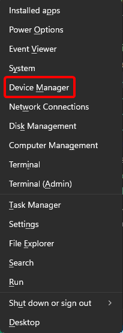

2. In Device Manager, find the device that is causing problems (you might have to expand a category), right-click on it, and click "Properties".

   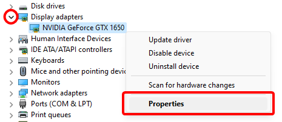

3. Go to the "Driver" tab at the top of the window, and then click "Roll Back Driver".

   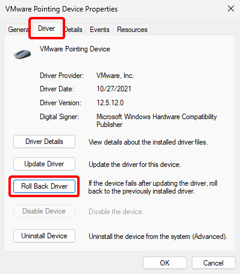

4. Windows will ask you why you're rolling back to an earlier driver. Select a reason, and click "Yes". If you want to, you can leave a detailed response in the "Tell Us More" field, at the bottom of the window.

   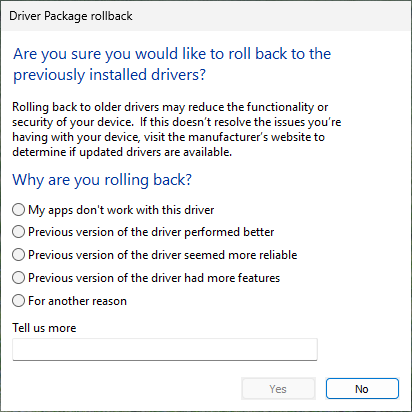

5. Windows will then restore your driver to the earlier version, which could take up to 5-10 minutes.

   

### Safe Mode

Safe mode is a diagnostic tool, which loads Windows with only the essential drivers. This allows you to access Windows even if the problematic driver is causing issues during normal boot.

1. Enter Safe Mode:

   **On Windows 10 or 11:**

   1. Open the Start menu, click on the power button, and hold <kbd>Shift</kbd> while clicking Restart. This will take you to the Windows Recovery Environment.

   2. Click on "Troubleshoot"

      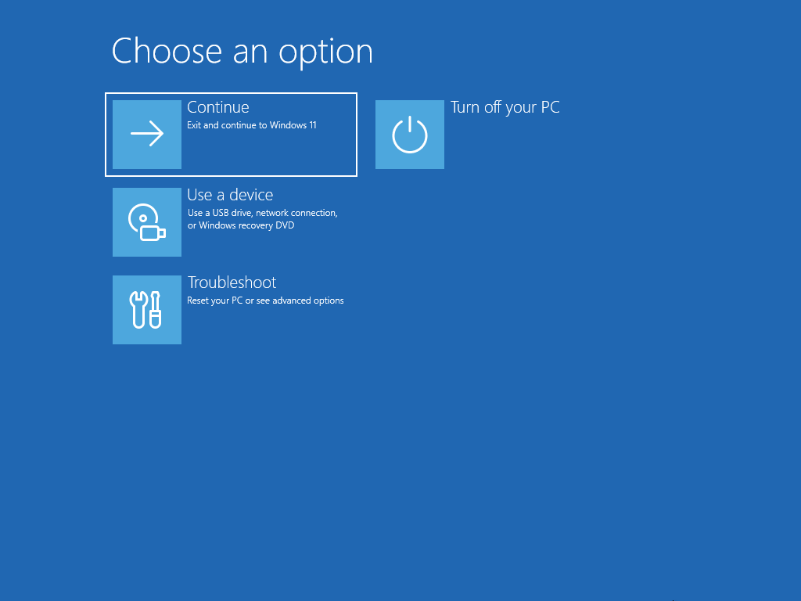

   3. Then, select "Advanced options"

      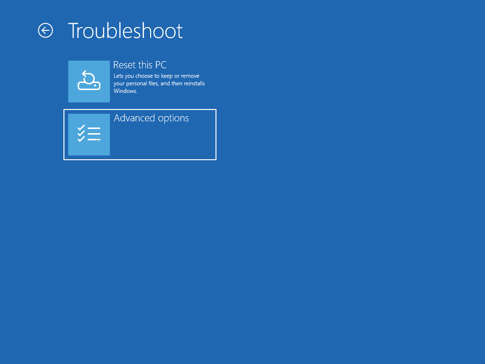

   4. Finally, click "Startup Settings" and then "Restart".

      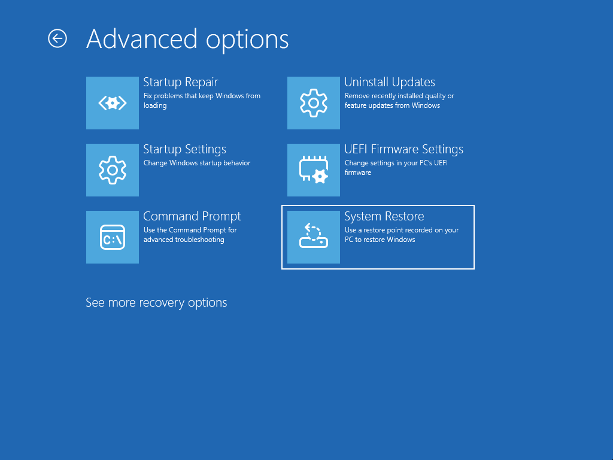

   After your computer restarts, press <kbd>4</kbd> to boot into Safe Mode, or <kbd>5</kbd> to boot into Safe Mode with internet access.

   **On earlier versions of Windows:**

   - Restart your computer and repeatedly press F8 before the Windows logo appears.
   - At the Advanced Boot Options menu, select “Safe Mode” to boot into Safe Mode, or “Safe Mode with Networking” to boot into Safe Mode with internet access.

2. Uninstall the Driver in Safe Mode:

   Once in safe mode, you can uninstall the problematic driver:

   1. Open the Device Manager (search for it in the Start Menu).

   2. Expand the category for the device with the recently installed driver.

      

   3. In Device Manager, find the device that is causing problems (you might have to expand a category), right-click on it, and click "Properties".

      

   4. Go to the "Driver" tab at the top of the window, and then click "Roll Back Driver".

      

   5. Windows will ask you why you're rolling back to an earlier driver. Select a reason, and click "Yes". If you want to, you can leave a detailed response in the "Tell Us More" field, at the bottom of the window.

      

   6. Windows will then restore your driver to the earlier version, which could take up to 5-10 minutes.

      

3. Alternate method (Safe Mode with Command Prompt)

   If you can't access the normal safe mode, you may try to access Safe Mode with Command Prompt and execute the following commands in Command Prompt (replace `not_working_driver` with the driver that isn't working):

   ```text
   DISM /Image:C:\ /Get-Drivers
   DISM /Image:C:\ /Remove-Driver /Driver:not_working_driver.inf
   ```

   You should see something like this:  

   ```text
   Found 1 driver package(s) to remove.
   Removing 1 of 1 – not_working_driver.inf: The driver package was successfully removed.
   The operation completed successfully.
   ```

### System Restore

   1. At startup options, click Troubleshoot.

      

   2. Then, click on "Advanced Options"

      

   3. Click on "System Restore" and follow the instructions

      

### Startup Repair

1. Select "Troubleshoot"

   

2. Select "Advanced options"

   

3. Select "Startup Repair"

   

### Reinstall Windows

If none of the solutions above work, you may need to reinstall Windows. This will erase all your data and applications, so make sure you have a backup. You can learn how to back up your data [here](/wiki/backup.html).

You can learn how to download and reinstall Windows [here](downloading-windows).
