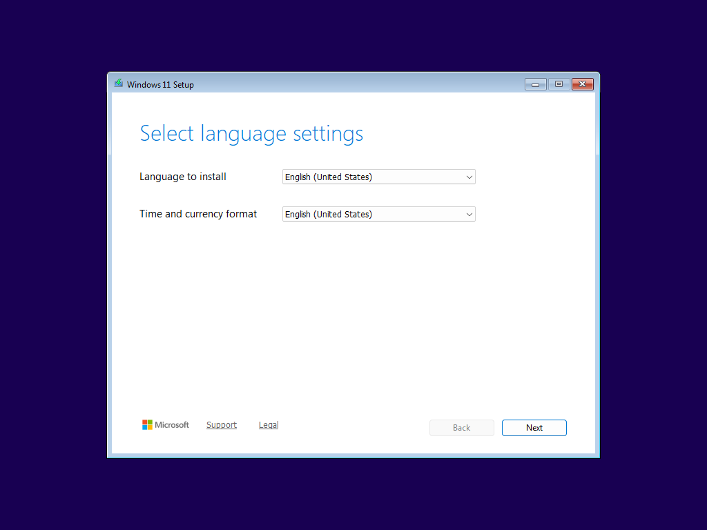
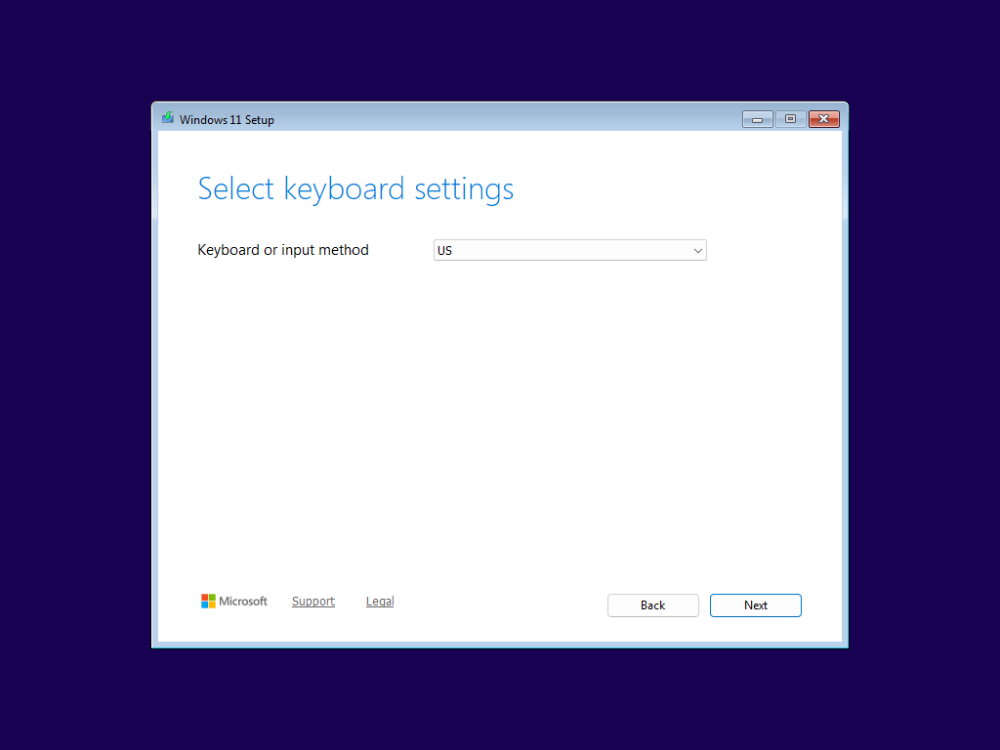
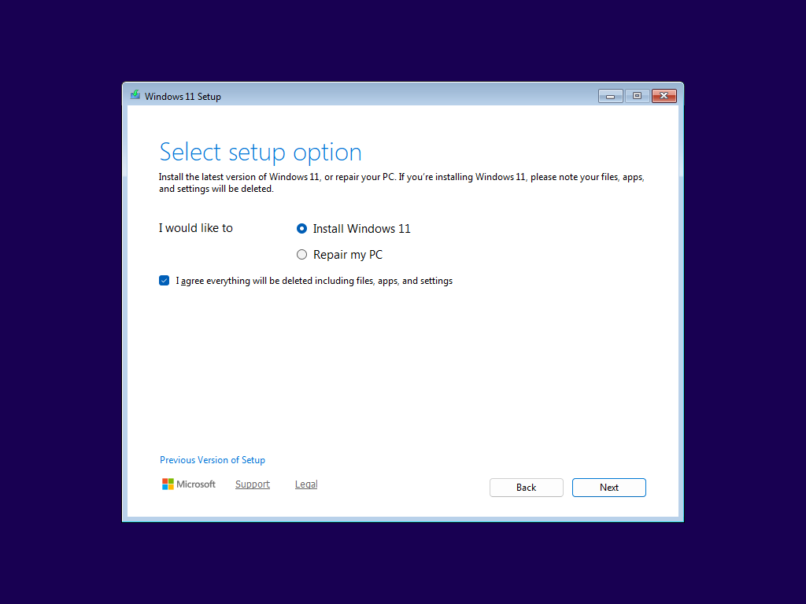
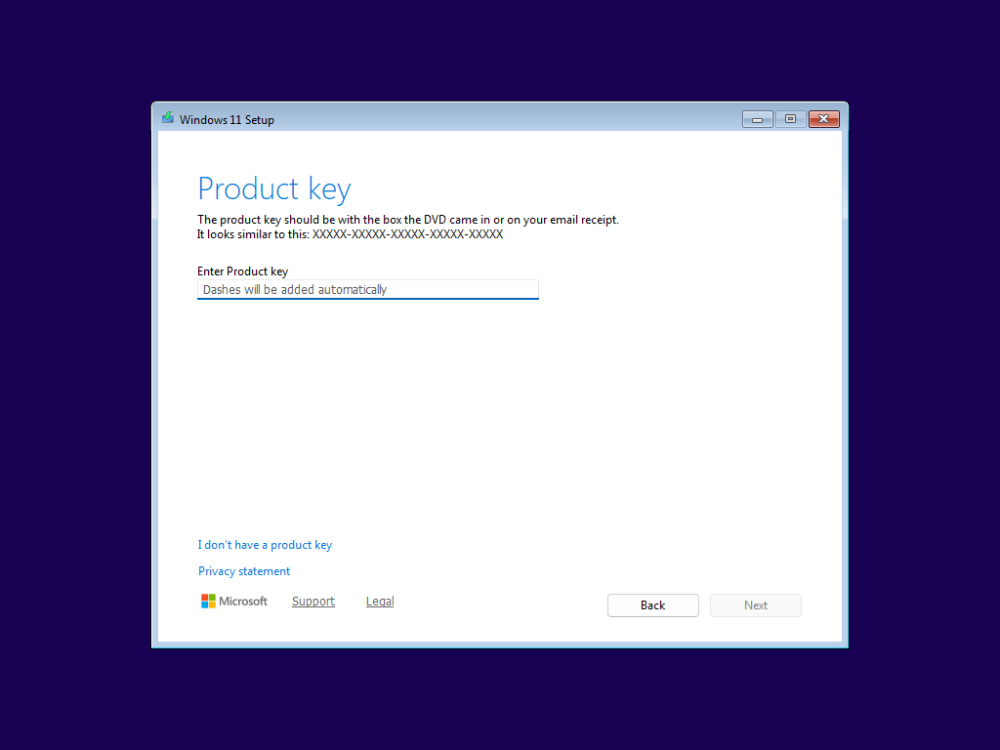
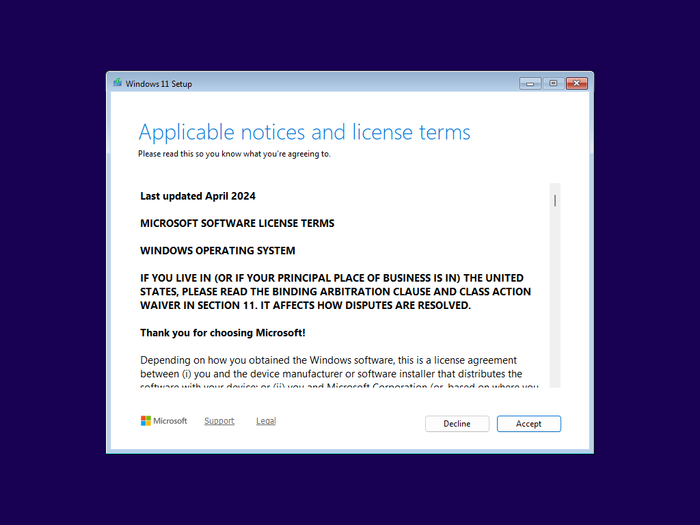
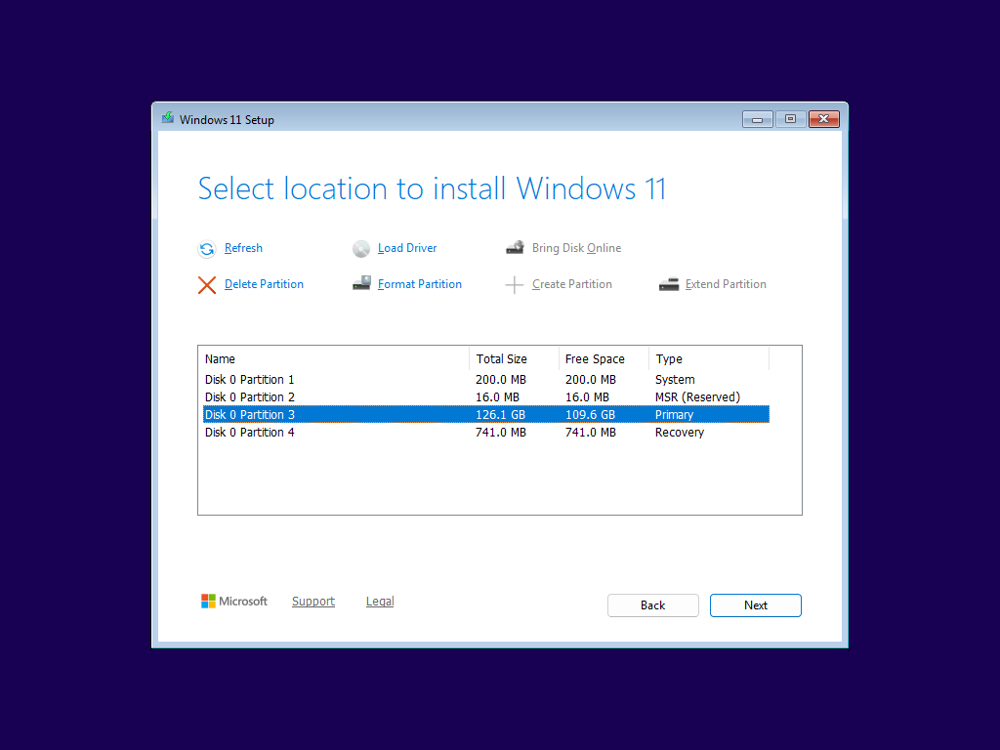
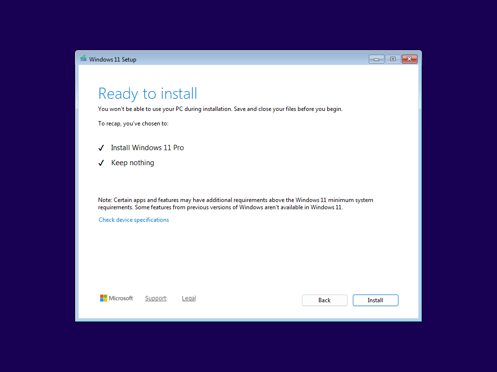
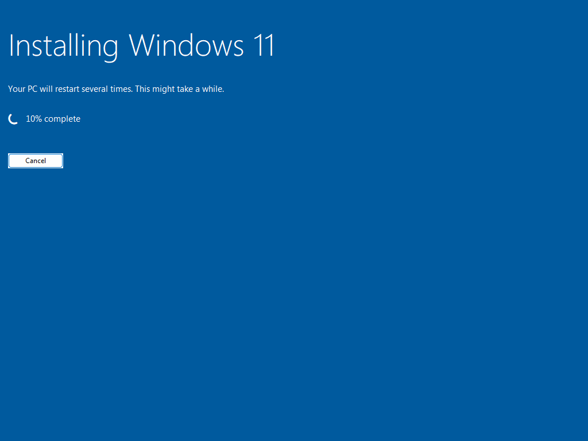
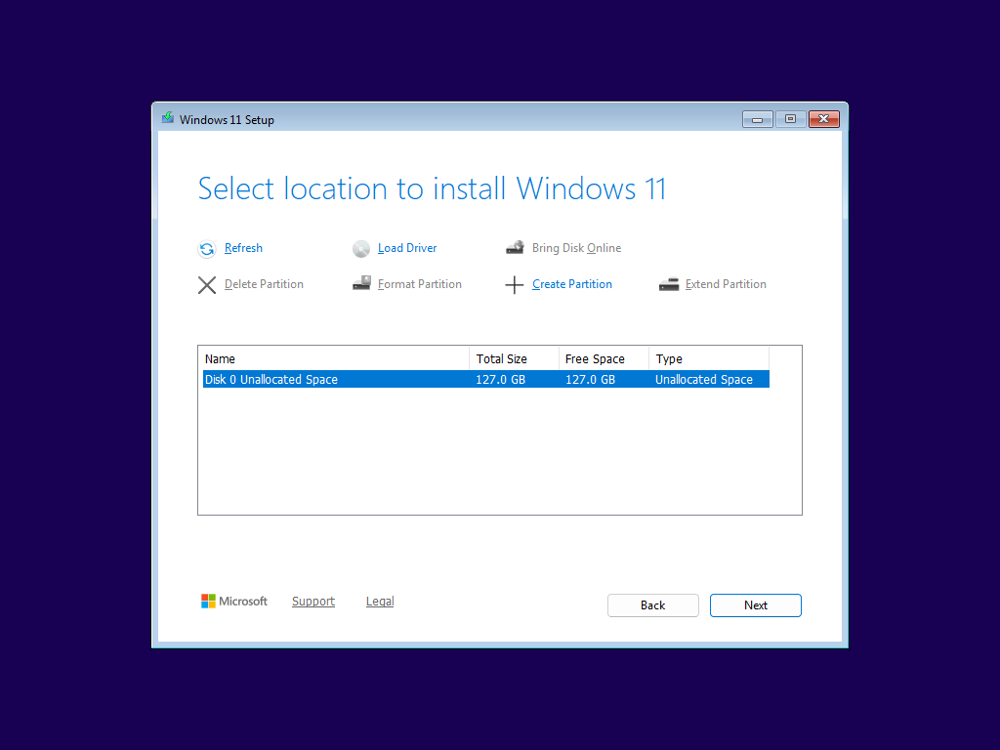

# Installing Windows

This article covers the steps of installing (or reinstalling) Windows 11 from a USB.

## Booting with USB

Turn on the computer and repeatedly press the boot menu key. Usually the boot menu key is one of <kbd>F10</kbd>, <kbd>F12</kbd>, <kbd>ESC</kbd>, or <kbd>F2</kbd>. This depends on the manufacturer of your device. You can find the boot menu key for your device by searching online.

Once the boot menu is open, move the cursor using the arrow keys to the name of the USB you have inserted, then press Enter.

## Installing

1. Select the correct regional settings, then press Next.

   
   

2. Select "Install Windows 11", and check the box to confirm that data will be deleted.

   ::: tip Note
   If you follow [Method 1](#method-1-re-installing-and-keeping-your-data), your data will not be deleted but will instead be moved to `C:\Windows.old`.
   You will need to check the box to continue anyway.
   :::

   

3. Enter your product key if you know it, or click "I don't have a product key". Note that this screen may not always come up, based on the computer.

   ::: tip Note
   If you click "I don't have a product key", you may be prompted with a screen to select the Windows edition to install. Select the edition you have a key or digital license for, or the edition of Windows that was previously installed.
   :::

   

4. Accept the agreement.

   

## Method 1: Re-installing and keeping your data

::: tip Note
The drive that you are installing Windows to requires enough space to move the contents of the drive to a folder called `Windows.old` for this method.
:::

1. On the next screen, you will see a list of partitions for each disk you have. You want to select the partition marked "Primary" on the disk that you have Windows installed on, and that has a similar amount of space as the drive you have Windows installed on. In this example, Windows is installed on a 128 GB SSD, so we select the partition with approximately 128 GB of storage. Leave the other partitions untouched. Then, click Next.

   

2. Windows Setup is now ready to install Windows. Review your choices, then press Install to begin installation.

   ::: tip Note
   Even if Windows Setup says that you've chosen to "Keep nothing", your data will be moved to `C:\Windows.old` if you did not delete partitions in the previous step and have enough space.
   :::

   

3. Windows will now start reinstalling on the partition that you selected. It will move any data from that partition to a folder located at `C:\Windows.old` if there is enough space.

   

## Method 2: Clean install without keeping data

1. On the next screen, you will see a list of partitions for each disk you have. Now, you can choose to do one of two things:

   - Click the "Format" button at the bottom with your current Windows partition selected. ***THIS WILL ERASE ALL DATA ON THE SELECTED PARTITION***

   - Delete all of the partitions on the drive you want to install Windows on, then select the unallocated space on that drive to let Windows redo its partition setup. This is useful for brand new drives or if your partition setup is broken. ***THIS DELETES ALL DATA ON THE DISK***

   Then, click Next.

     

2. Windows Setup is now ready to install Windows. Review your choices, then press Install to begin installation.

   

3. Windows will now start installing on the partition that you selected.

   