# Useful tips and "hacks" for Windows

## Get more options when right-clicking

When right-clicking on a file or folder, you can hold <kbd>Shift</kbd> to get more options, such as "Copy as path", which lets you copy the full path to the file or folder.

## Enable the legacy context menu

The context menu is the pop-up menu that appears when you right-click on a file or folder.

In Windows 11, the new context menu was introduced which has fewer options and some of them are replaced with icons. At the bottom, there is an option to "Show more options" which will show the legacy menu.


However, if you prefer the legacy menu, and you don't want to click "Show more options" every time, you can modify a registry key to disable the new context menu. To do that, open PowerShell and run the following command

```powershell
reg.exe add "HKCU\Software\Classes\CLSID\{86ca1aa0-34aa-4e8b-a509-50c905bae2a2}\InprocServer32" /f /ve
```


Then, open the Task Manager, and search for _Windows Explorer_, then right-click on the process and click Restart. If you right-click a file or folder, you should now see the legacy context menu.

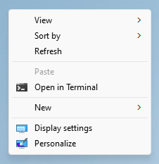

::: tip Note
When holding down <kbd>Shift</kbd> when right-clicking, the legacy context menu will always appear (and with the extra options as described in the previous tip), even without modifying this registry key.
:::

## Windows Master Control Panel shortcut

The Windows Master Control Panel shortcut, often referred to as "God Mode", is a shortcut to access all control panel settings in one place.

To create the shortcut, create a folder and name it `allSettings.{ED7BA470-8E54-465E-825C-99712043E01C}`

The text in front of the dot has no effect. You may change it to whatever you want, but the shortcut will appear to have no name.

You can now open the folder to find all control panel settings.

## Make Windows search faster

There are a few ways you can make Windows Search faster and make it search for your apps and files instantly.

### Disabling Bing Search on Windows 11/10

By default, when you search for anything on your device, it gets searched on Bing, most of the time unintentionally, and you want an on-device result instead. This can slow down performance especially with excessive keystrokes. To disable this behavior you can follow the steps below:

::: danger
The steps below involve modifying the registry. Before making changes to the registry, you should always back up the current state of the folder you are modifying. You can do this by right-clicking on the folder you are making the changes to in the Registry Editor, then clicking "**Export**" and saving the file somewhere safe. In case something goes wrong, you can restore the backup by selecting **File > Import** in the Registry Editor.
:::

1. Search for "Registry Editor" in the Start menu.

   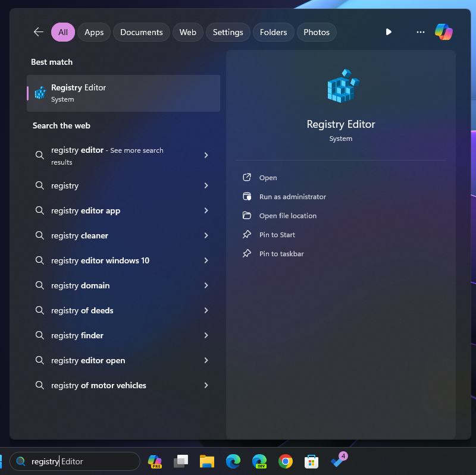

2. Paste the below path in the Registry Editor address bar.

   ```
   Computer\HKEY_CURRENT_USER\Software\Policies\Microsoft\Windows\Explorer
   ```

   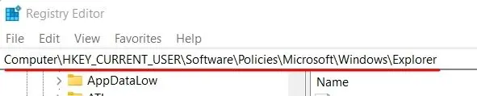

3. Right click on "Explorer", and choose New > **DWORD (32 bit)** value.

   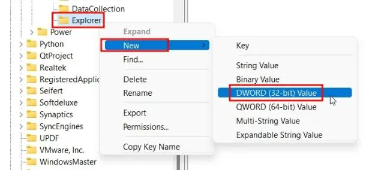

4. Set the value name to `DisableSearchBoxSuggestions`.

   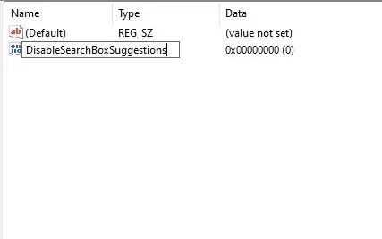

5. Double-click on it and change the “Value data” to `1` and click on “OK”.

   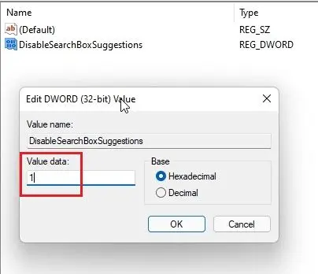

6. Restart the computer, and try searching for something. Online search suggestions will be disabled.

   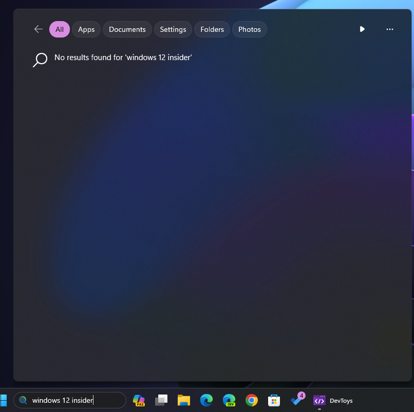

### Enabling indexing

You can make the Windows Search way faster by enabling Indexing, which indexes the locations you select. In simple words, it essentially creates a list of all files, so that when you search for a file, Windows searches in that list instead.

Although indexing is enabled by default, it only indexes important folders, such as the Desktop or the user's Documents. However, it can be configured to index all drives and folders on the computer.

First, search for "Indexing Options" in the Start menu.

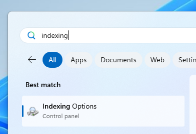

Then, in the window that appears, click "Modify".

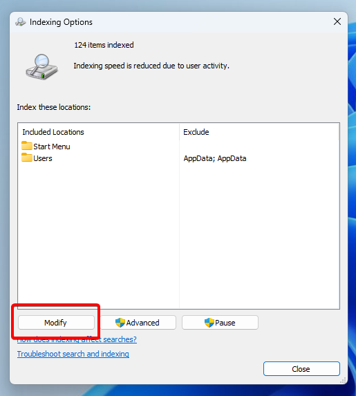

Then, click "Show All Locations".

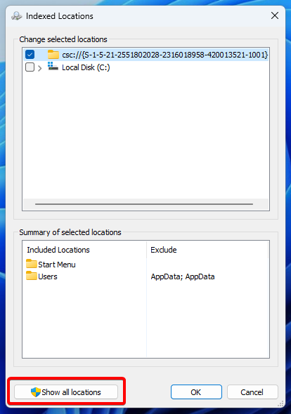

Now, check all the locations that you want Windows to index. Finally, click Ok to confirm.

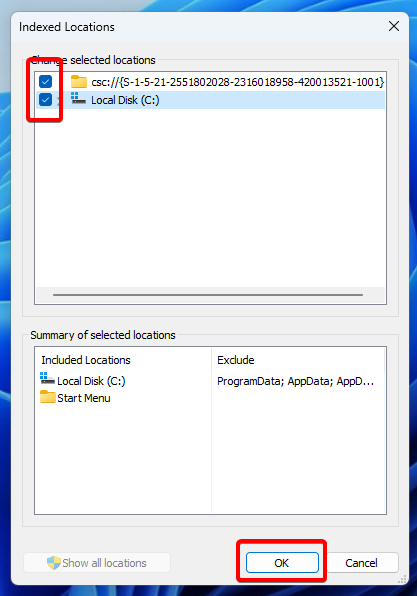

Your files will now be indexed.

::: tip Note
Indexing can take a long time depending on how many files it has to go through, and it may consume some system resources while indexing is in-progress. Indexing will pause however if it detects that you are using your computer. The indexing process only needs to run once.
:::

## Restart GPU drivers

If your screen glitches sometimes, or your graphics are lagging, try restarting your GPU drivers using the shortcut <kbd>Win</kbd> + <kbd>Ctrl</kbd> + <kbd>Shift</kbd> + <kbd>B</kbd>. You will hear a beep sound, and your screen will go black for a few seconds.

You can always try a restart if that doesn't fix it.

## View more columns in the Details view in File Explorer

In the details view in File Explorer, you can show more columns in addition to the default ones, such as Focal Length for images, or Rating for media files.

To do that, right-click on the columns in the Details view, and then choose More. You can then enable the columns you want to see by checking them.

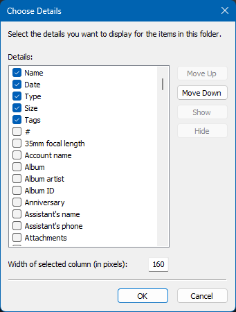

## Voice typing

Voice Typing is a feature built-into Windows that allows you to "type"
without actually typing, but by speaking into your microphone instead.

To use Voice Typing, press <kbd>Win</kbd> + <kbd>H</kbd>, and a small window will appear.


If it does not turn on automatically, simply click on the microphone button. Now, you can speak into your microphone to enter text, instead of typing!

## Keep calculator always on top

You can keep the calculator window always on top, so that it stays pinned on your screen while you interact with other windows.

To do that, press the icon next to "Standard" that looks like a box with an arrow. Calculator will now stay on top of all windows.

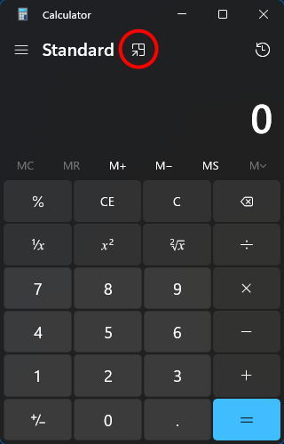

## Additional clocks

By default, the clock on the right side of the taskbar shows the local time. But you can add two additional clocks that show the time in a chosen time zone.

To do that, right-click on the clock on the taskbar, and click "Adjust date and time".
Then, scroll down to the bottom of the page, and click "Additional Clocks".

In the window that appears, you can check one or both clocks, select their time zone, and add a name.

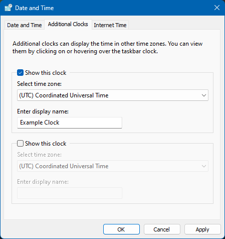

Click OK to save the settings you changed.

If you hover over the taskbar clock, you should now see your additional clocks.

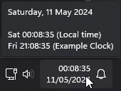

## Clipboard history

You can view your clipboard history, which is a list of the last 25 objects that you've copied.

To do that, press <kbd>Win</kbd> + <kbd>V</kbd>, and a small window will appear. If it's the first time you are using the Clipboard History feature, you will see a button that says "Turn On"
as it's disabled by default.

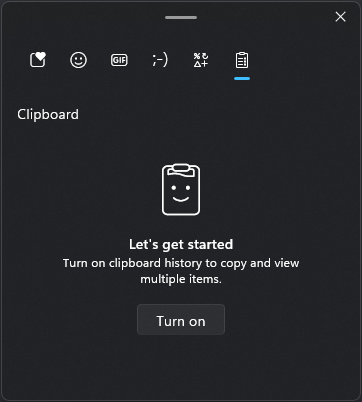

After clicking on it, everything you copy will be logged there. You can then "go back in history" and paste something you copied earlier.

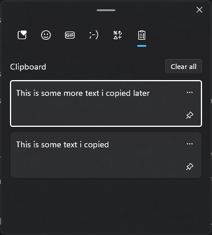

You can click "Clear all" to empty the list. You can also click the pin icon next to an entry to keep it pinned forever<sup>1</sup>.

You can also click the three dots next to an entry for more options.

At the top of the window, you can also enter Emojis, GIFs, Analog Emojis, and other symbols.

### Window snap menu

You can snap a window to the left, right or any corner of your screen by simply dragging the window and placing it on the edge of the screen.

However, in Windows 11, there is also a new feature that allows you to snap windows from a small popup menu.

To use it, hover over the maximize button of the window you want to snap, and the menu will appear. You can then choose where you want to snap
the window, or even select one of the recommended window groups, which will snap all windows.

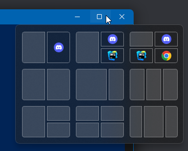

## Always show on-screen keyboard icon

The on-screen keyboard allows you to use your mouse to type. While it is not very practical for every day use, it can be very useful for troubleshooting,
for example, in case you don't have a physical keyboard attached to the computer.

To pin the icon, right-click on the taskbar and choose "Taskbar settings".
Then, under the "System tray icons" category, you will find the option "Touch keyboard".

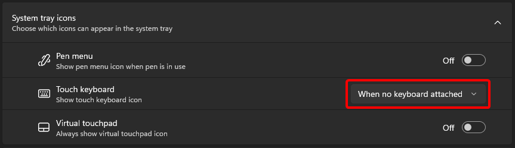

You can select "When no keyboard attached", which will only show the icon when a physical keyboard is not plugged in, or "Always" which will always keep the icon pinned
on the taskbar.

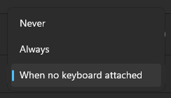

You will then find the keyboard icon on the tray area of the taskbar.

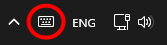
<br><br>
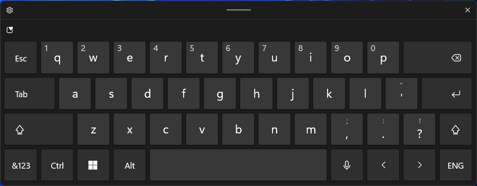

## Speed up File Explorer for big folders

For most users, upgrading to an SSD is sufficient for speeding up disk operations like browsing files. Still, even fast SSDs can halt to a crawl when browsing specific folders that contain a lot of files. If you are tired with these slowdowns, here's a simple trick to make browsing files faster for big folders.

File Explorer in modern Windows versions has a system that tries to detect file types in each folder you open to optimize specific options, like default view. This mechanism can cause significant performance issues regardless of your storage type or its speed. Therefore, forcing Windows to "consider" each folder as one containing miscellaneous items should make things a lot faster.

::: danger
The steps below involve modifying the registry. Before making changes to the registry, you should always back up the current state of the folder you are modifying. You can do this by right-clicking on the folder you are making the changes to in the Registry Editor, then clicking "**Export**" and saving the file somewhere safe. In case something goes wrong, you can restore the backup by selecting **File > Import** in the Registry Editor.
:::

1. Search for "Registry Editor" in the Start menu.

   

2. Paste the below path in the Registry Editor address bar.

   ```
   Computer\HKEY_CURRENT_USER\Software\Classes\Local Settings\Software\Microsoft\Windows\Shell\Bags\AllFolders\Shell
   ```

   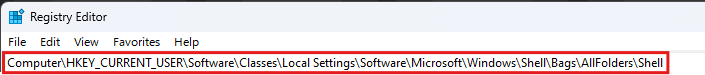

3. Right click on "Shell", and choose New > **String** value.

   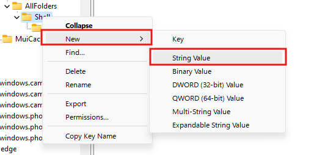

4. Set the value name to `FolderType`.

   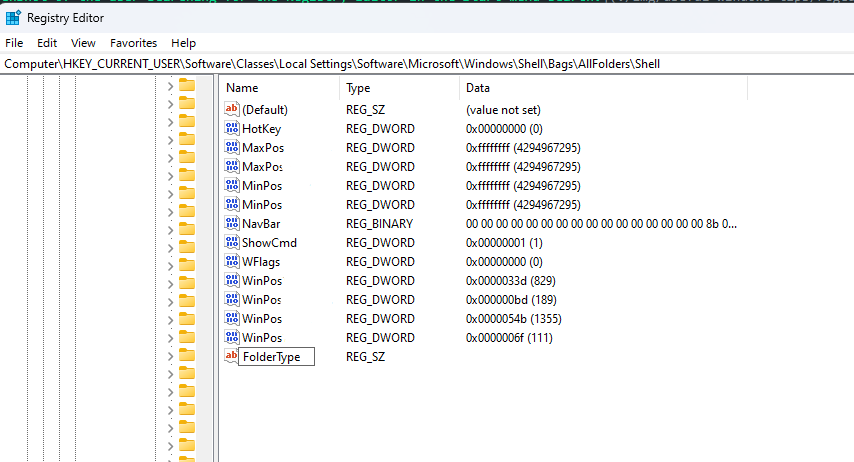

5. Double-click on it and set the “Value data” to `NotSpecified` and click on “OK”.

   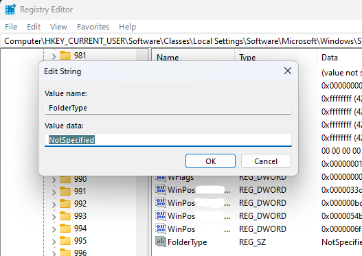

6. Restart the computer, after that browsing most folders with heavy metadata should be instant.

## Disable Fast Startup

This is a feature present since Windows 8 to assist with systems using hard disk drives (HDDs) as boot drives, effectively putting the system in a hibernation state when the computer is shut down. When it is turned back on, content from the hibernation file is reloaded into system RAM to speed up booting - hard disk drives are better at loading a single big file sequentially instead of multiple small files.

But on systems booting off solid state drives (SSDs), this feature provides little to no benefit while also putting the system into an unclean hibernation state, potentially causing issues. It is recommended to disable the feature on these PCs using the method below.

1. Open Control Panel. (Tip: Press <kbd>Win</kbd> + <kbd>R</kbd> and type `control` to quickly open it.)

2. Head to Power Options. From there, click "Choose what the power button does". Click "Change settings that are currently unavailable", uncheck Turn on Fast Startup, then click Save Changes.

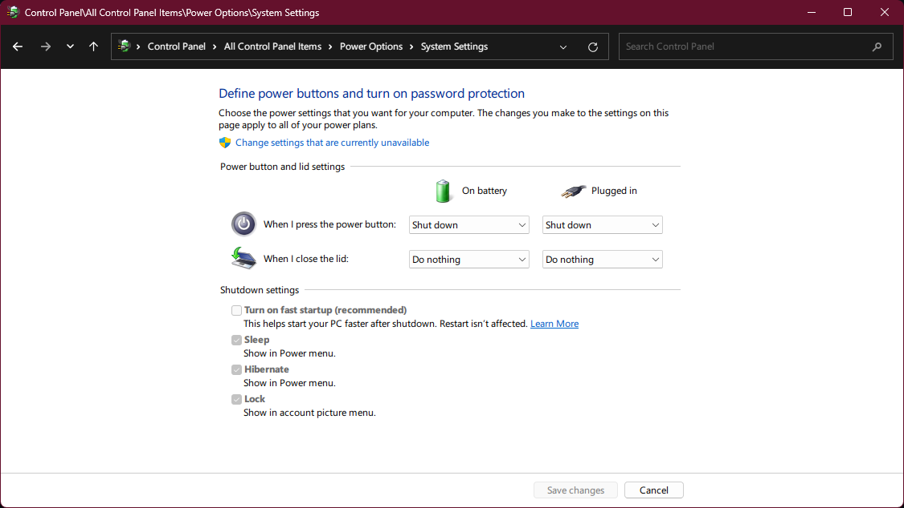

## Reducing disk space usage

Every so often you'd find yourself in a pinch when the C drive runs low on space and goes red. Fortunately, Windows packs some tools to make more space, which are easily user-accessible granted you have administrator privileges.

1. The good old GUI utility, Disk Cleanup. Do remember to click "Clean up system files", since these temporary files can grow large enough and turn into a burden.

   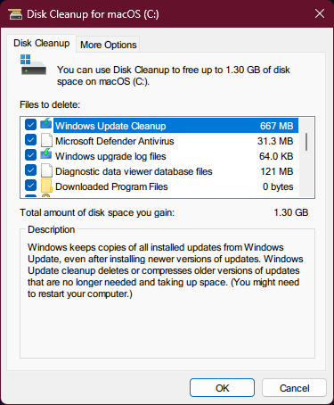

2. Reducing hiberfile size. The hibernation file is responsible for hibernation and Fast Startup, and it scales with the total system memory, but you can significantly reduce its size while still keeping its features.

   In an admin command prompt<sup>2</sup>, type `powercfg /h /size 40` to reduce the hiberfile size to 40% of its original size, which is the minimum required for hibernation support.

   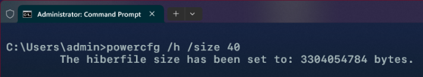

   If you do not wish to use hibernation, but still want to use Fast Startup (e.g. you have an HDD as your boot drive) then use `powercfg /h /type reduced` instead, which will set the hiberfile size to 20% of its original size (see the difference). Note that this disables hibernation.

   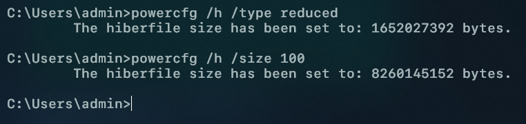

   If you don't need Fast Startup either, use `powercfg /h off` to completely disable hibernation, fast startup, and delete the hibernation file.
   
3. Compact OS (applicable to Windows 10 and above)

   Compact OS is a neat feature, which compresses Windows system files. Its predecessor, called WIMBoot, was introduced in Windows 8, as Microsoft's first attempt at reducing the Windows image footprint, but proved to be problematic in the case of system updates and recovery. It was superseded by Compact OS in Windows 10. Compact OS can be used with both legacy BIOS and UEFI systems.

   In an admin command prompt, use `compact /compactos:always` to enable Compact OS. If you ever need to get out of the compact state, just use `compact /compactos:never` to uncompress your system files.

   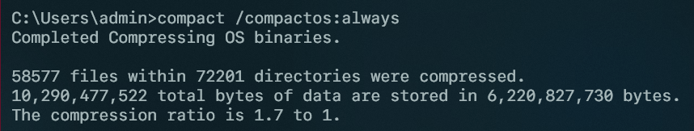

4. Cleaning up the WinSxS folder

   The WinSxS is a crucial folder : it is the Windows component store. Sometimes this folder can grow very large and some might want to delete it - but this is highly advised against, since this may render your Windows installation entirely unusable. But while it is not deletable, you can still reduce its size using a simple command (requires administrator permission):

   `dism /online /cleanup-image /startcomponentcleanup /resetbase`

   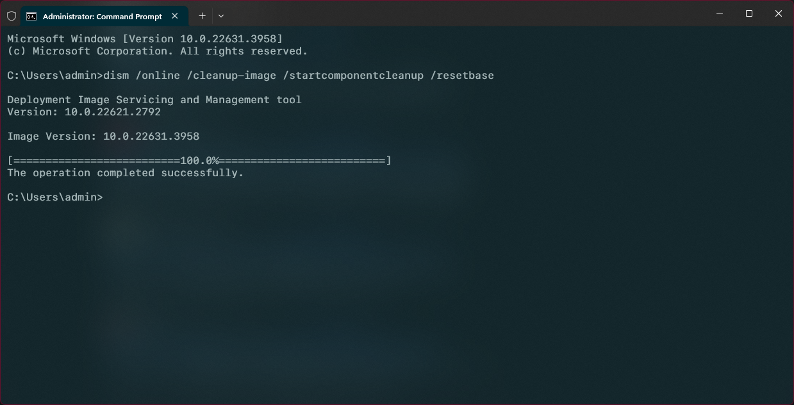

   ::: warning

   The `/resetbase` switch renders every previously installed Windows update permanently unremovable, so it is not recommended to use this switch when you are troubleshooting your computer, of which a recent update may be the underlying cause.

   :::

## Enable text suggestions

The text suggestions feature on Windows enhances typing efficiency by offering predictive text as you type. It suggests words based on the initial letters inputted, allowing for quick selection and insertion into your text. This feature is particularly useful for completing challenging words and maintaining workflow without interruptions.

To enable it:

1. Open Settings app

2. Click on **Time & Language** then click on **Typing**

   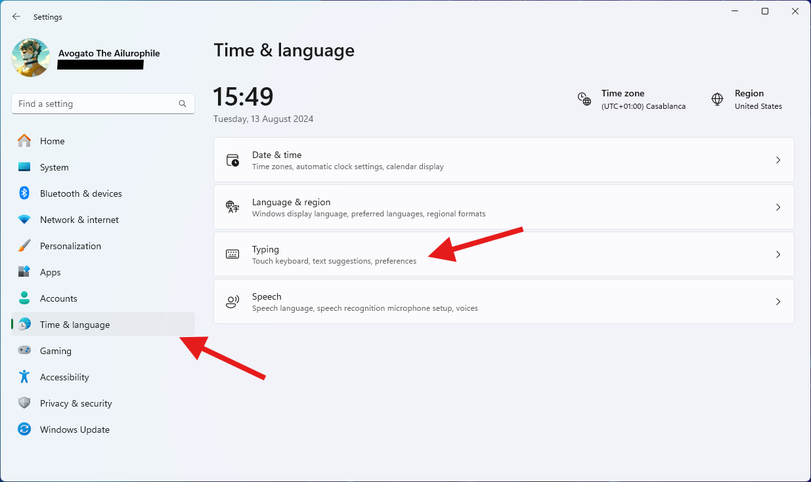

3. Enable text suggestions as shown in the following screenshot

   

Here's a demo on how text suggestion works.  

   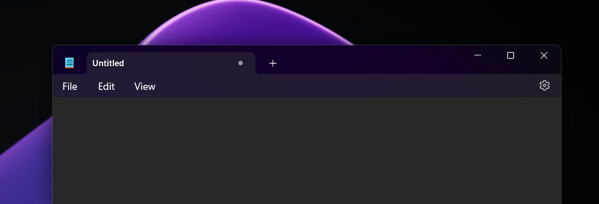

To choose the preferred suggested word, you can select with arrow key then navigate with left/right arrow keys.

::: tip Note
If you have multiple language packs installed, you can also enable Multilingual text suggestions.

   
:::

## Scrolling Over the Volume Icon

On Windows 11, you can control your speakers' volume using your mouse wheel as demonstrated below.

   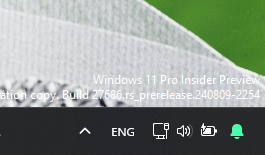

## Live Caption

Windows 11 can generate live captions for any audio on your device.

You can enable it from Quick Settings.

   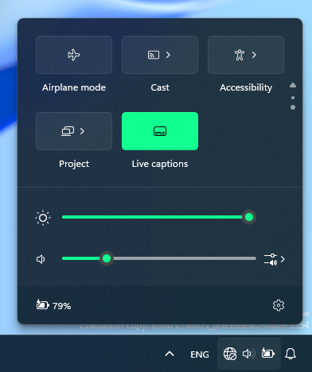

Or open Start Menu and type "Live Captions".

   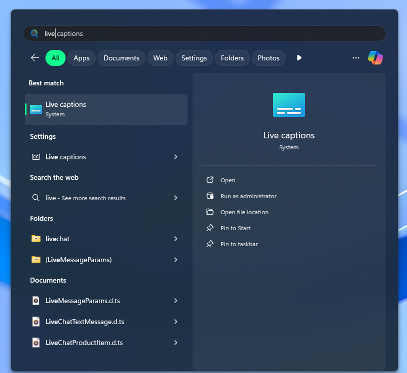

You can customize the Live Captions window with the available options.

   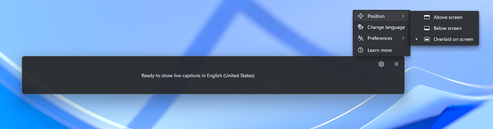

## Enable "End Task" button in the taskbar on Windows 11

Enabling the “End Task” feature in the Taskbar on Windows 11 allows users to quickly close unresponsive applications without needing to open the Task Manager.

To activate this feature, navigate to Settings > System > For Developers.

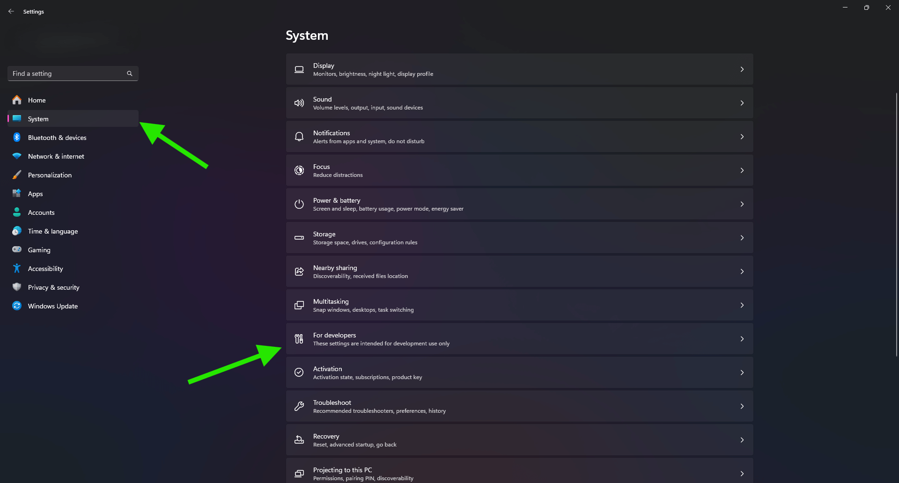

And toggle on the “End Task” option.


Once enabled, you can simply right-click on an app’s icon in the Taskbar and select “End Task” to terminate it immediately.

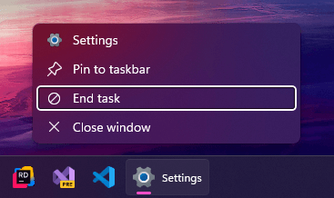

This feature streamlines the process of managing unresponsive apps, making it more convenient and efficient for users.

## Disable startup items

Startup apps have their uses. They start along with Windows, which means as soon as you log in you can get straight to work without having to wait for your apps to load their files. But in cases where your system resources are limited, these preloaded files may slow your computer down, depending on the amount of resources and the amount of startup apps. There are several methods to disable them:

1. Settings

   Press <kbd>Win</kbd> + <kbd>I</kbd> to open Settings, click on Apps, then Startup. Flip the switch for apps you don't want to preload on boot.

   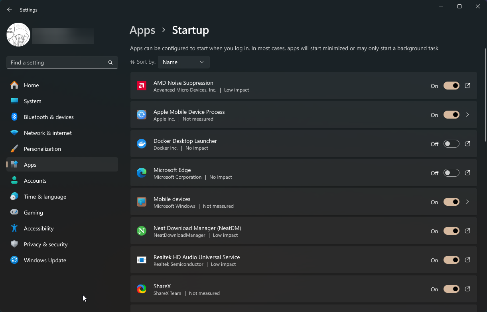

2. Task Manager

   If the app you want to disable does not appear in Settings, then it may appear in Task Manager. Either right click on your taskbar or quickly press <kbd>Ctrl</kbd> + <kbd>Shift</kbd> + <kbd>Esc</kbd> to open Task Manager, click on Startup apps, then select the app you want to disable and hit the Disable button on the upper right corner.

   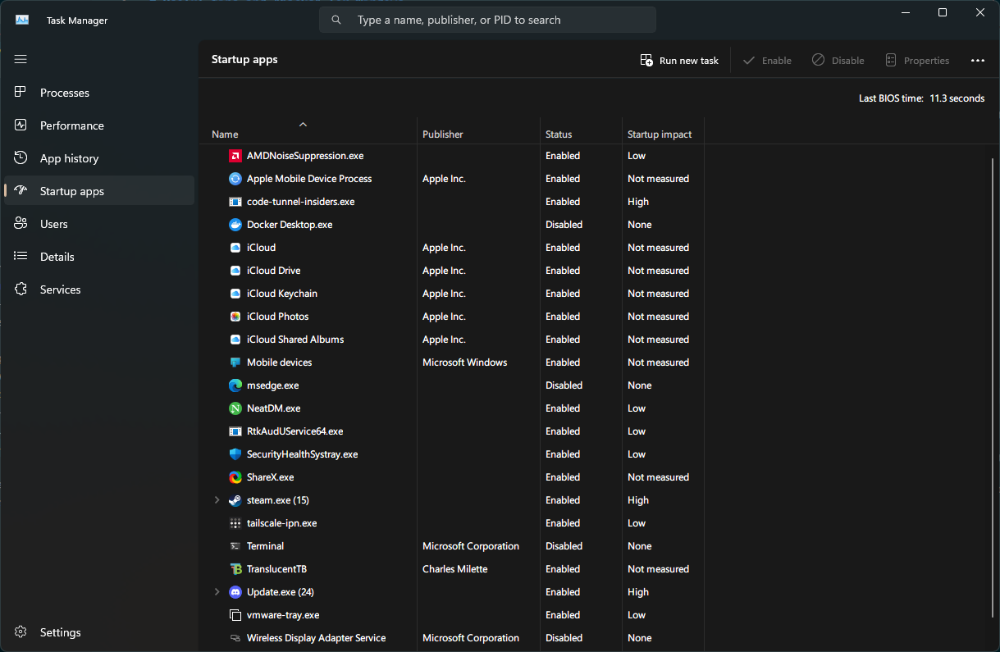

3. Autoruns

   :::warning Disclaimer

   This is for advanced users. Only proceed if you know what you are doing.

   :::

   If the app still won't appear, Autoruns is your last ditch option. Download it [here](https://download.sysinternals.com/files/Autoruns.zip), extract the archive and run either `autoruns.exe`, `autoruns64.exe` or `autoruns64a.exe` depending on your CPU architecture (x86, x64 or ARM64 respectively). Also ignore the c files, they're for command line use. Accept the license agreement, and you will see all startup items with checkboxes at the start of each line. Uncheck or delete entries as needed. Note that deleting a service in Autoruns may disable it in Services, in which case set it to Manual or Automatic (Delayed Start) accordingly if you want to re-enable it.

   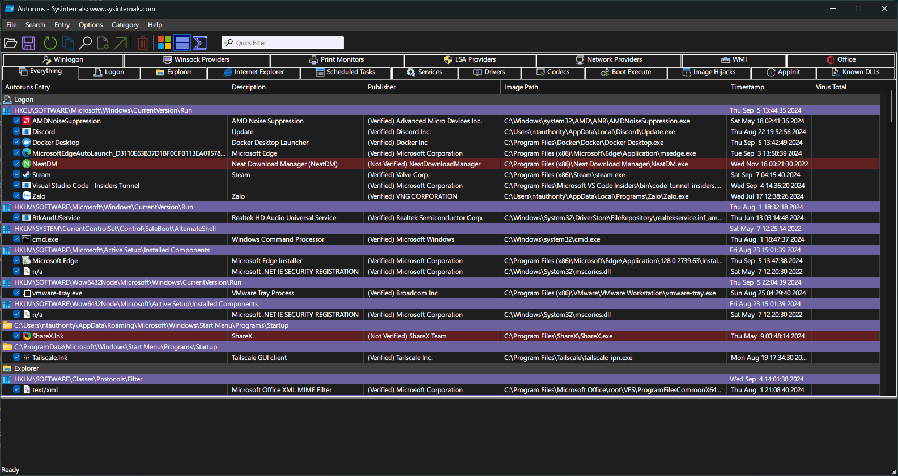

   :::warning Caution

   It is not recommended to start Autoruns as administrator, as you risk disabling critical system services for Windows to function properly. Only run as administrator if you know that a rogue app is slowing your computer down and you cannot disable it in normal mode.

   :::

## Disable Sticky Keys

Sticky Keys is an accessibility feature in Windows 11 designed to assist users who have difficulty pressing multiple keys simultaneously. When enabled, it allows modifier keys like <kbd>Shift</kbd>, <kbd>Ctrl</kbd>, and <kbd>Alt</kbd> to remain active until another key is pressed. While useful for some, it can be annoying if activated unintentionally.

To disable it:

1. Open Windows Start Menu then type Sticky Keys.

	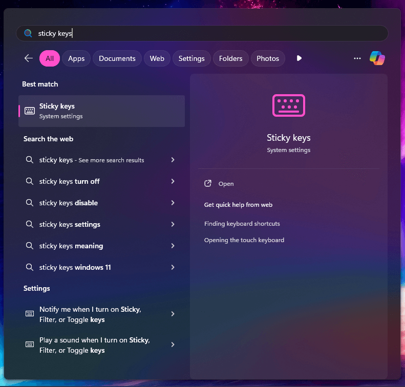

2. Disable Sticky Keys

	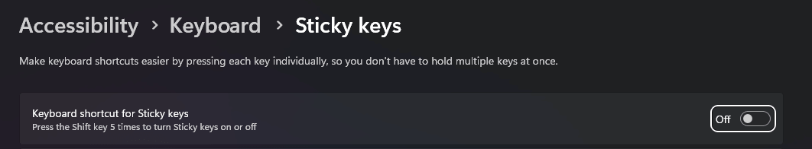

## View File Extension

Viewing file extensions in Windows File Explorer offers several benefits. It enhances security by helping you identify potentially harmful files disguised with misleading icons or names.

To view the file extensions:

1. Open File Explorer with <kbd>Win</kbd> + <kbd>E</kbd>.

2. In top bar, navigate to **View** > **Show**.

3. Click on **File name extensions**.

   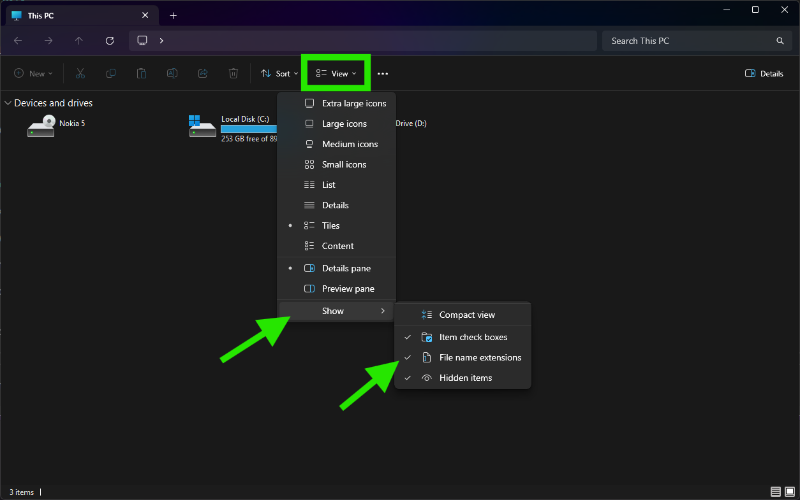

## Notes

<sup>1</sup> Clipboard history automatically clears after restarting your computer. Pinned items are not cleared, and do not count towards the 25-object limit.

<sup>2</sup> To open a command prompt window with Administrator privileges, you can either search for "Command Prompt" or "cmd" in the Start menu, right click on it and choose "Run as administrator" **or** you can right-click on the Start menu button and select "Terminal (Admin)".

\
\
\
_**More tips will be added to this page soon!**_