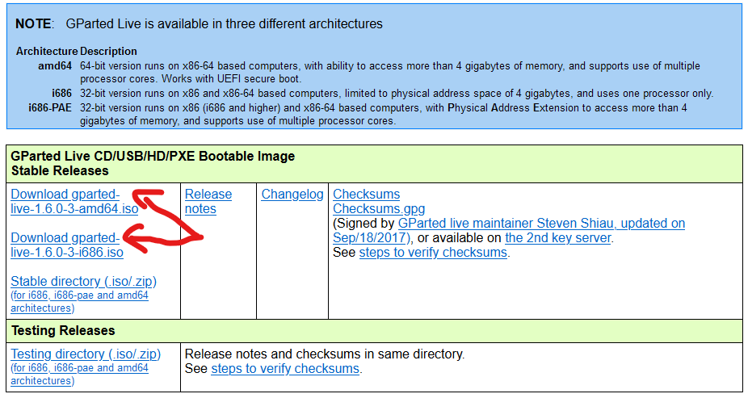
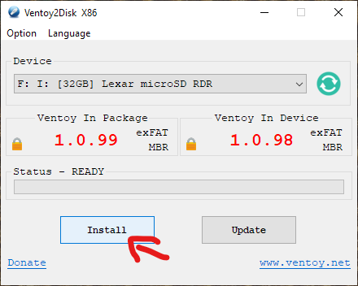
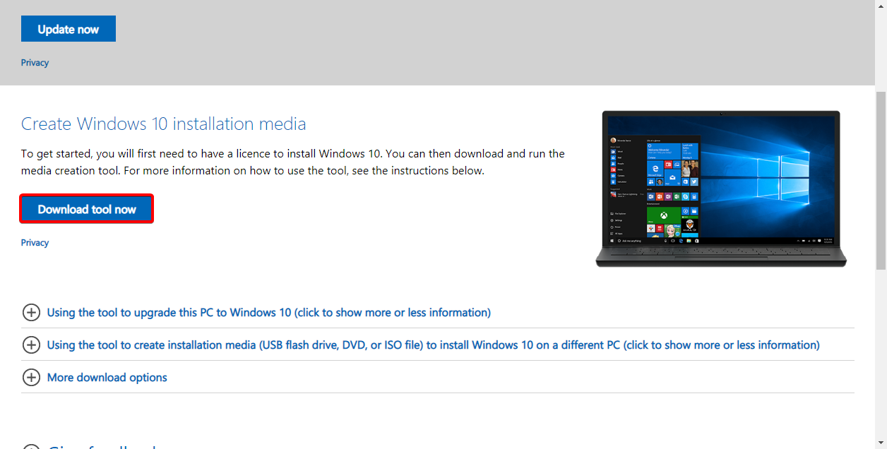
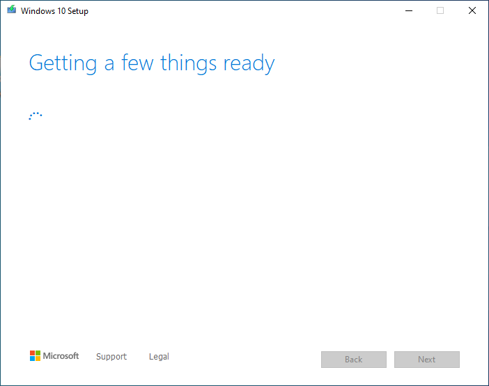
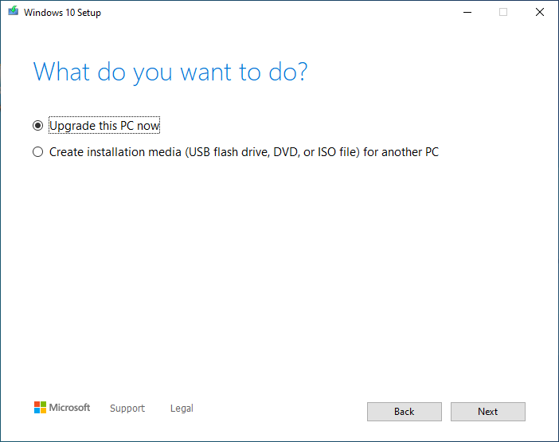
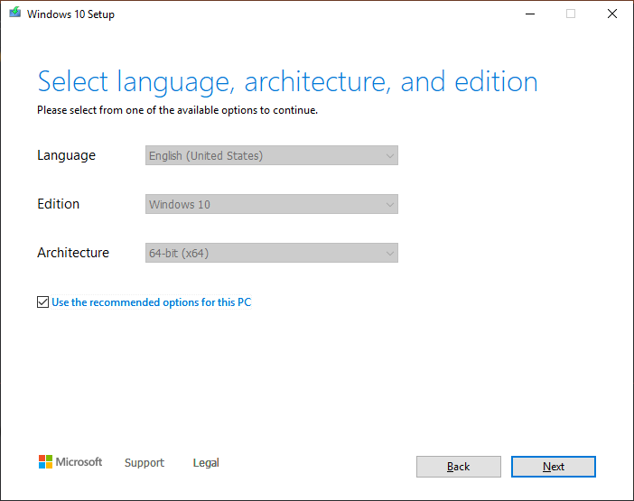
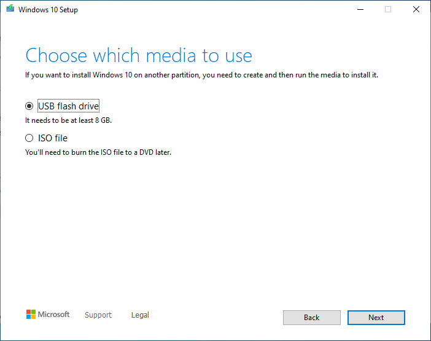

# Create your multi-tool USB
With this guild, you will discover how to create your Swiss Army Knife in your USB for various situations that will be too helpful.

## Creation of the USB
In this area, you will see how to create your USB for being bootable.
1. [Download the Ventoy application that will help us to make the USB being capable with various ISOs.](https://www.ventoy.net/en/download.html)

2. Grab a USB stick that is recommended to have more than 8gb and plug it into your PC.
3. For this time, we will use the Ventoy2Disk.exe, we click on it, and we click to “yes” in the UAC screen that pooped.
4. Then at devices section select your USB that you want to make a Ventoy or if you can't see it press the green button to refresh the list.

5. And the top right of the program click on options and get sure that the secure boot option is enabled and in partition stile select “GPT”.

6. At the last step, click on install and wait some seconds to get the job done.

## Downloading windows
### Downloading the tool for downloading the ISO

1. For Windows 10, go to [https://www.microsoft.com/software-download/windows10](https://www.microsoft.com/software-download/windows10)  
   For Windows 11, go to [https://www.microsoft.com/software-download/windows11](https://www.microsoft.com/software-download/windows11)

2. Click the **Download Tool Now** button.

   

3. After the tool has been downloaded, run it.

### Using the tool

1. The first thing you will see is this screen, click Accept.

   

2. The next screen you see will be this, wait for the installer to complete preparation.

   

3. This is where you select what you want to do.

   — You need to click on:**want to reinstall Windows on another computer** click **Create installation media**.

    

4. Select the correct Architecture, Edition, and Language of Windows, or use the recommended settings.

   ::: tip Note
   If you're planning on installing Windows on another PC and don't know what to select for the architecture, then choose both x86 and x64.
   :::

   

5. On the Media Creation Tool, select **ISO file**.

6. Select a path to save to.

After that, Windows will start downloading the ISO file.

Once is done, copy that file to your USB

::: tip Note
The instructions for installing or reinstalling Windows in your pc are here: [Installing Windows](installing-windows).
:::

## Download the AV
If you want to detect rootkits and malware that got infected in your computer, and you want to clean them, use you can use one you've here listed:
 - Kaspersky: https://www.kaspersky.com/downloads/free-rescue-disk (Not usable in US).
 - Microsoft Defender Offline: https://support.microsoft.com/en-us/windows/help-protect-my-pc-with-microsoft-defender-offline-9306d528-64bf-4668-5b80-ff533f183d6c (head into Windows 8.1 and 7 to know how to download your .iso).

With the ISO, send it to your Ventoy USB.

::: tip Note
The usage is very simple, just you click to update the antivirus databases and run the scan following the instructions on your screen.
:::

## Clonezilla
Clonezilla is great software for managing (backup and restore, clone)
Download the ISO here, selecting your architecture (amd64:  x86_64/
i686=32-bit) and selecting ISO as file type: https://clonezilla.org//downloads/download.php?branch=stable.

With the ISO, send it to your Ventoy USB.

::: tip Note
All the steps using will be covered at: https://clonezilla.org//clonezilla-live-doc.php
:::

## Gparted
Gparted is a powerful tool that helps you to manage partitions, and you can copy them to other disks or inside.
Download the ISO here, selecting your architecture (amd64:  x86_64/ i686=32-bit) and selecting ISO as file type: https://gparted.org/download.php.
With the ISO, send it to your Ventoy USB.

::: tip Note
All the steps using will be covered at: https://gparted.org/display-doc.php?name=help-manual
:::
