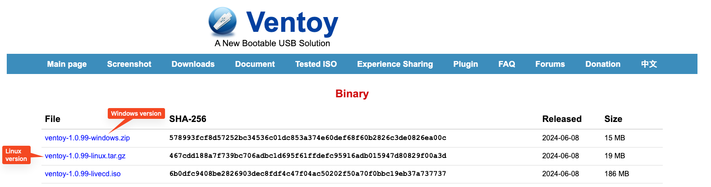

# Creating a Multi-OS Bootable Drive (with Ventoy)
In this article, you will learn how to create a multi-OS bootable USB drive. using Ventoy 

Having a bootable USB at all times can help you when you need to reinstall an OS, and a multi-OS bootable drive can allow you to install different OS without having to reformat a USB drive for using one ISO for USB.

## Creation of the USB
This section will teach you how to create a bootable USB drive for your needs.

::: danger
Installing Ventoy to create a bootable drive **will wipe all your data from that drive**. Back up your data on the USB drive before proceeding.
:::
1. Download Ventoy [here](https://www.ventoy.net/en/download.html). This is the tool that we will be using to create a bootable drive.

2. Plug in a USB drive that has at least 8GB.
3. Right click on the file that you have just downloaded and select extract. Then, enter the folder named `ventoy-1.0.xx` and open an application named `Ventoy2Disk.exe`. A UAC prompt will pop-up, click yes.
4. Select a USB drive in the device selection section. This will be your bootable drive. If you can't see the drive you want to use, press the green button to refresh the list.

5. Click install, and Ventoy will create a bootable drive for you. After it finishes, you will see a drive named as "Ventoy", this is where you will place your ISO files for the bootable USB drive.

## Downloading Windows to the Bootable Drive
### Downloading the ISO file
To download and/or a Windows ISO file, refer to the [Downloading Windows](./downloading-windows.md) page.

::: tip Note
For amd64 choose x86_64. For i686 choose 32-bit.
You also need to select ISO as the filetype.
:::

::: tip Note
You can read more about reinstalling Windows on the [Installing Windows](installing-windows) wiki page.
:::

If you want to detect and remove any malware or rootkits that your computer has been infected with, you can try the following options.
### Kaspersky
ISO File: https://www.kaspersky.com/downloads/free-rescue-disk (Not available in the US due to regulations).
 - Microsoft Defender Offline: [32-bit](https://go.microsoft.com/fwlink/?LinkID=234123), [64-bit](https://go.microsoft.com/fwlink/?LinkID=234124)

After you download the ISO file, copy it to your Ventoy USB drive.

::: tip Note
For amd64 choose x86_64. For i686 choose 32-bit.
You also need to select ISO as the filetype.
:::

::: tip Note
The usage should be simple, click to update the antivirus databases and run the scan following the instructions on your screen.
:::

## Clonezilla
Clonezilla is great software for managing (backup and restore, clone)
Download the ISO here: https://clonezilla.org//downloads/download.php?branch=stable.

::: tip Note
For amd64 choose x86_64. For i686 choose 32-bit.
You also need to select ISO as the filetype.
:::

After that, copy the ISO file to your Ventoy USB Drive.

::: tip Note
Instructions on using Clonezilla are available here: https://clonezilla.org//clonezilla-live-doc.php
:::

## Gparted
Gparted is a powerful tool that helps you to manage partitions, and you can copy them to other disks or inside.
Download the ISO here: https://gparted.org/download.php.
::: tip Note
For amd64 choose x86_64. For i686 choose 32-bit.
You also need to select ISO as the filetype.
:::

After that, copy the ISO file to your Ventoy USB Drive.

::: tip Note
Instructions on using Gparted are available [here](https://gparted.org/display-doc.php?name=help-manual).
:::
