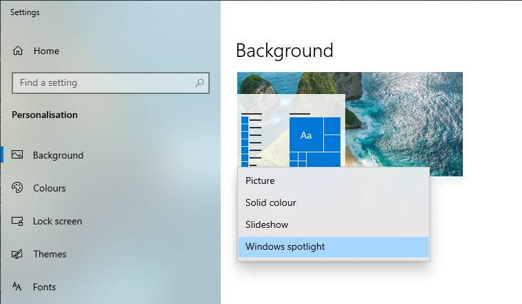
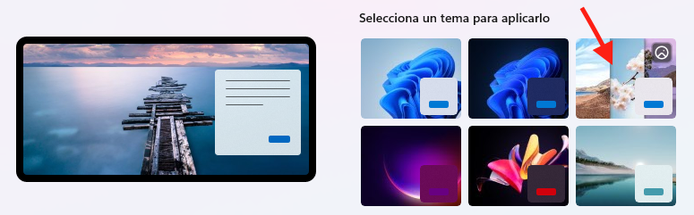
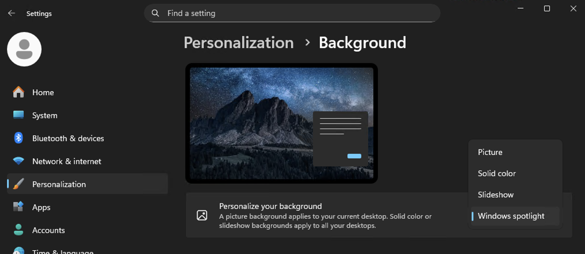

# Desktop and Mobile Wallpapers

For those looking to personalize their digital devices, you are in the right place. There are numerous websites offering a vast array of high quality wallpapers for both desktop and mobile screens.

### Wallpaper Design by Microsoft Design

Beautiful wallpapers by [Microsoft Design](https://wallpapers.microsoft.design/).

### WallpaperHub

This [website](https://www.wallpaperhub.app/) has every official Microsoft wallpaper.

### High Quality Stock Images

[Unsplash](https://unsplash.com/) provides free, high quality wallpapers.

### r/EarthPorn

A dedicated [subreddit](https://www.reddit.com/r/EarthPorn/) for nature enthusiasts.

### r/wallpapers

A dedicated [subreddit](https://www.reddit.com/r/wallpapers/) for all types of wallpapers.

### Microsoft Bing Wallpapers

[Bing Wallpapers](https://bingwallpaper.microsoft.com) — A desktop application that changes wallpapers daily.

### Built-in Windows spotlight

The latest versions of Windows 10 and Windows 11 include an option to use Spotlight, allowing you to enjoy daily wallpapers similar to Bing Wallpaper.

::: tip Note
When you first install Windows 10 (you need to update to the lastest for having it) or Windows 11, this option may already be enabled. Give the system a few days of normal use for daily wallpapers to start appearing.
:::

You can find this setting under Settings → Personalization → Themes. Then click on Windows Spotlight.

Windows 10:

Windows 11:

In themes

### Lively Wallpaper

An open-source app for setting animated background wallpapers. It can be downloaded in [GitHub](https://github.com/rocksdanister/lively) or [Microsoft Store](https://apps.microsoft.com/detail/9ntm2qc6qws7)