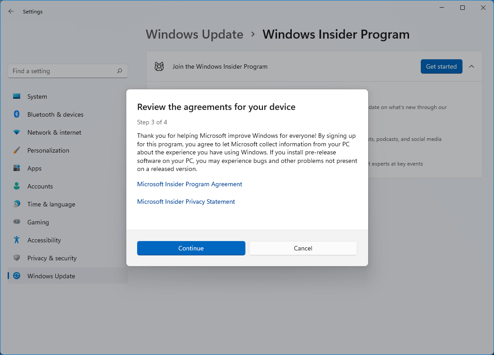
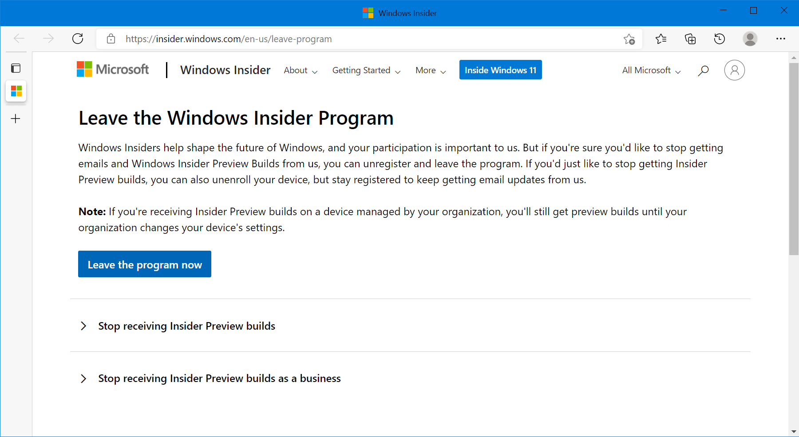

# Joining and Leaving the Windows Insider Program

This article covers how to join the Windows Insider Program to get builds that are unreleased to the public.

## Joining the Windows Insider Program

::: tip Note
You must be logged onto a Microsoft Account to be able to join the Windows Insider Program.
:::

### Joining the Windows Insider Program on Windows 11

1. Open the Settings app. You can do this by searching for it in the Start menu, clicking <kbd>Win</kbd> + <kbd>I</kbd>, or clicking the Settings button found above the Power button in Start. After that, open the **Windows Update** Section.

2. Click on **Windows Insider Program**, then navigate to the sign up page.

3. Click on the **Get Started** button to join the Windows Insider Program.

4. Click on **Link an account** to link a Microsoft Account.

5. Select an account or login with one by clicking **Microsoft Account**, then click **Continue**.

6. Read the [Microsoft Insider Program Agreement](https://insider.windows.com/program-agreement) and the [Microsoft Insider Privacy Agreement](https://privacy.microsoft.com/privacystatement). Click **Continue** when you finish reading and agree to the agreement.

::: tip
If this prompt appears more than one time, click **Continue** until it moves on to the next step.
:::

7. Now select a channel to receive insider builds, then click **Confirm**. Here are some details on the details of the 3 channels:  

| Channel                    | Description                                                                                                                                                                                                                                                               |
| -------------------------- | --------------------------------------------------------------------------------------------------------------------------------------------------------------------------------------------------------------------------------------------------------------------------|
| Canary Channel             | Ideal for highly technical users. Preview the latest platform changes early in the development cycle. These builds can be unstable and are released with limited to no documentation.                                                  |  
| Dev Channel                | Ideal for enthusiasts. Access the latest Windows 11 preview builds as we incubate new ideas and develop long lead features. There will be some rough edges and low stability.                                                          |
| Beta Channel (Recommended) | Ideal for early adopters. These Windows 11 builds will be more reliable than builds from our Dev Channel, with updates validated by Microsoft. Your feedback has the greatest impact here.                                             |
| Release Preview Channel    | Ideal if you want to preview and certain key features, plus get optional access to the next version of Windows before it's generally available to the world. This channel is also recommended for commercial users.                    |

::: tip Note
If you don't see all 4 channels, you might be limited by your hardware.
:::

8. Review the [Microsoft Insider Privacy Statement](https://privacy.microsoft.com/privacystatement) and the [Microsoft Insider Program Agreement](https://insider.windows.com/program-agreement), then click **Continue**.

9. Choose to *Restart Now* or *Restart Later*, then you will start receiving insider builds in *Settings> Updates & Security> Windows Update*. Have fun testing Windows Builds!

### Joining the Windows Insider Program on Windows 10

1. Open the Settings app. You can do this by searching for it in the Start menu, clicking <kbd>Win</kbd> + <kbd>I</kbd>, or clicking the Settings button found above the Power button in Start. After that, open the **Update & Security** Section.

2. Click on **Windows Insider Program** on the sidebar to navigate to the sign up page.

3. Click on the **Get Started** button to join the Windows Insider Program.

4. Click on **Register** to join the Windows Insider Program.

5. You will be prompted with a pop-up as shown below, click on **Sign Up**.

6. Read the [Windows Insider Program Agreement](https://insider.windows.com/program-agreement) and the [Microsoft Insider Privacy Agreement](https://privacy.microsoft.com/privacystatement), then check **I've read and accept the terms of this agreement** if you agree. Then click **Submit**.

Shortly after that you should see a pop-up saying that you have successfully singed up for the Windows Insider Program. You now have to choose an account to signup as a Windows Insider.

7. Link an account to join the Windows Insider Program, then click **Continue**.

::: tip
You can choose any account to signup, but your personal Microsoft Account is recommended.
:::

8. Now select a channel to receive insider builds, then click **Confirm**. Here are some details on the details of the 3 channels:

| Channel                    | Description                                                                                                                                                                                                                                                               |
| -------------------------- | --------------------------------------------------------------------------------------------------------------------------------------------------------------------------------------------------------------------------------------------------------------------------|
| Dev Channel                | Ideal for highly technical users. Be the first to access the latest Windows 11 builds earliest in the development cycle with the newest code. There will be some rough edges and low stability.                                       |
| Beta Channel (Recommended) | Ideal for early adopters. These Windows 11 builds will be more reliable than builds from our Dev Channel, with updates validated by Microsoft. Your feedback has the greatest impact here.                                             |
| Release Preview Channel    | Ideal if you want to preview and certain key features, plus get optional access to the next version of Windows before it's generally available to the world. This channel is also recommended for commercial users.                    |

::: tip Note
If you don't see all 3 channels, you may be limited to certain channels by your hardware.
:::

9. Read the [Microsoft Insider Privacy Statement](https://privacy.microsoft.com/privacystatement) and the [Microsoft Insider Program Agreement](https://insider.windows.com/program-agreement), then click **Confirm**.

10. Choose to **Restart Now** or **Restart Later**, then you will start receiving insider builds in **Settings> Updates & Security> Windows Update**. Have fun testing Windows Builds!

## Leaving the Windows Insider Program

If you don't want to participate in the Windows Insider Program anymore, you can leave the program. Your computer will stay on the build that you are currently on until an official build that is newer than the build you have. You can also revert to an older build if you haven't deleted the Windows build and if you installed the build less than 10 days ago.

### Leaving the Windows Insider Program on Windows 11

1. Open *Settings*, click on *Updates & Security*

2. Click on **Windows Insider Program**

3. Click on **Stop getting preview builds**.

4. Click on **Leaving the Insider Program**.

5. You will be redirected to an official website. Click on *Leave the Program now*.

::: tip
If you see **You must login to leave the program**, login on the top right corner of the website.
:::

6. Click on **Stop receiving Insider Preview Builds**.

7. You should see *"This email address is not registered as a Windows Insider"*.

You should now be unenrolled to the Windows Insider Program.

### Leaving the Windows Insider Program on Windows 10

1. Open *Settings*, click on *Updates & Security*

2. Click on **Windows Insider program**

3. Click on **Leave the Insider Program**.

4. You will be redirected to an official website. Click on *Leave the Program now*.

::: tip
If you see **You must login to leave the program**, login on the top right corner of the website.
:::

5. Click on **Stop receiving Insider Preview Builds**.

6. You should see *"This email address is not registered as a Windows Insider"*. If you don't see it, please re-complete step 3 and step 4.

You should now be unenrolled to the Windows Insider Program.

## Troubleshooting

### Optional Diagnostics Data is disabled

If you see *"To manage the Windows Insider program settings for your device and allow it to stay in the Windows Insider program, you'll need to turn on optional diagnostic data."*, click on *"Go to Diagnostics & Feedback settings to turn on optional diagnostic data."*.

> Image source: [Minitool](https://www.minitool.com/news/how-to-join-windows-insider-program.html)

Select **Optional diagnostic data** and return back the the Windows Insider Program page and continue with the procedure to join the program.

### Windows Insider Program Page not appearing

A registry key might be preventing the page from appearing in settings. Here is what you can do to fix it:

::: danger
Editing the registry incorrectly can cause major problems. Make sure you follow the instructions here exactly and don't proceed if anything is unusual.
:::

1. Press <kbd>Win</kbd> + <kbd>R</kbd> and type in `regedit`, then press <kbd>Enter</kbd>

::: tip
You might be prompted with the User Account Control popup, click yes or enter an administrator's username and password to continue.
:::

1. Go to the following registry key: `HKEY_LOCAL_MACHINE/SOFTWARE/Microsoft/WindowsSelfHost/UI/Visibility`

::: tip
If the registry key does not exist, right click the key `UI` on the side bar and click **New > Key** and name it `Visibility`.
:::

3. Right click and create a new 32-bit DWORD value named `HideInsiderPage` on the right hand side. Set the value to `0`.

You may now close the Registry Editor window and restart your computer. The Windows Insider Program page should appear after the restart.

### Error Code

You may see an error code while trying to register to be a Windows Insider. There are a lot of different error codes, so you should search it on the Internet or ask in [our Discord server](https://discord.gg/microsoft) for support in the `#insiders` channel.
