# Joining and Leaving the Windows Insider Program

This article covers how to join the Windows Insider Program to get builds that are unreleased to the public.

## Joining the Windows Insider Program

::: tip Note
You must be logged onto a Microsoft Account to be able to join the Windows Insider Program.
:::

### Joining the Windows Insider Program on Windows 11

1. Open the Settings app. You can do this by searching for it in the Start menu, clicking <kbd>Win</kbd> + <kbd>I</kbd>, or clicking the Settings button found above the Power button in Start. After that, open the **Windows Update** Section.

    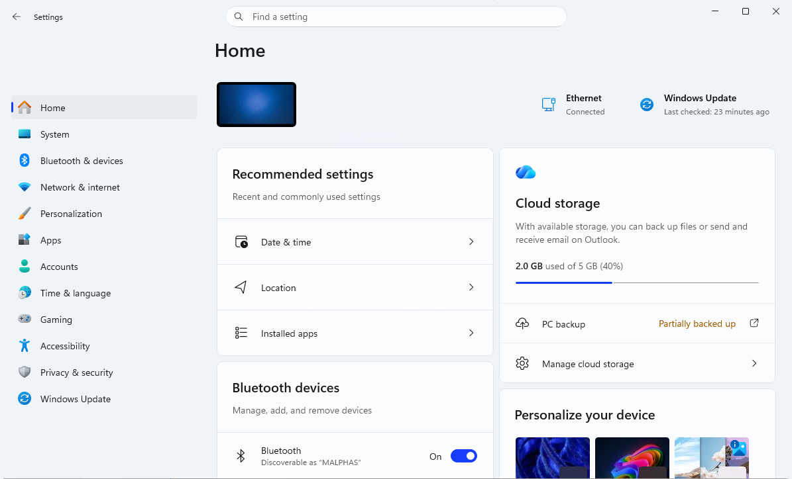

2. Click on **Windows Insider Program**, then navigate to the sign up page.

    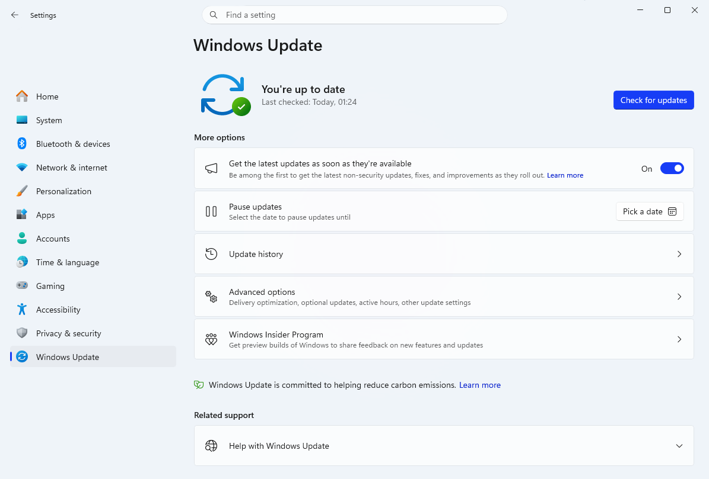

3. Click on the **Get Started** button to join the Windows Insider Program.

    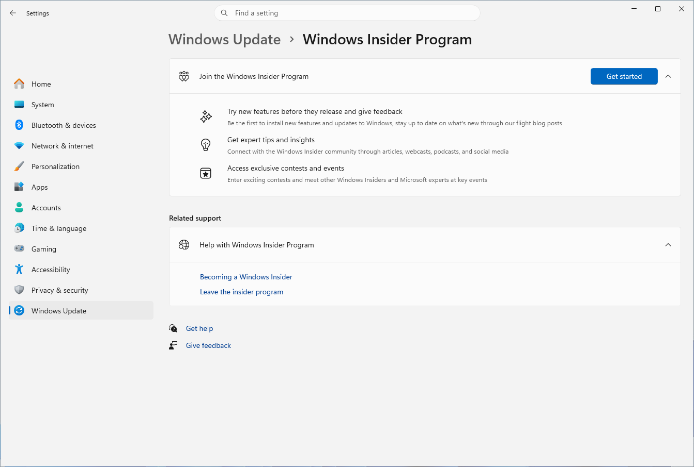

4. Click on **Link an account** to link a Microsoft Account.

    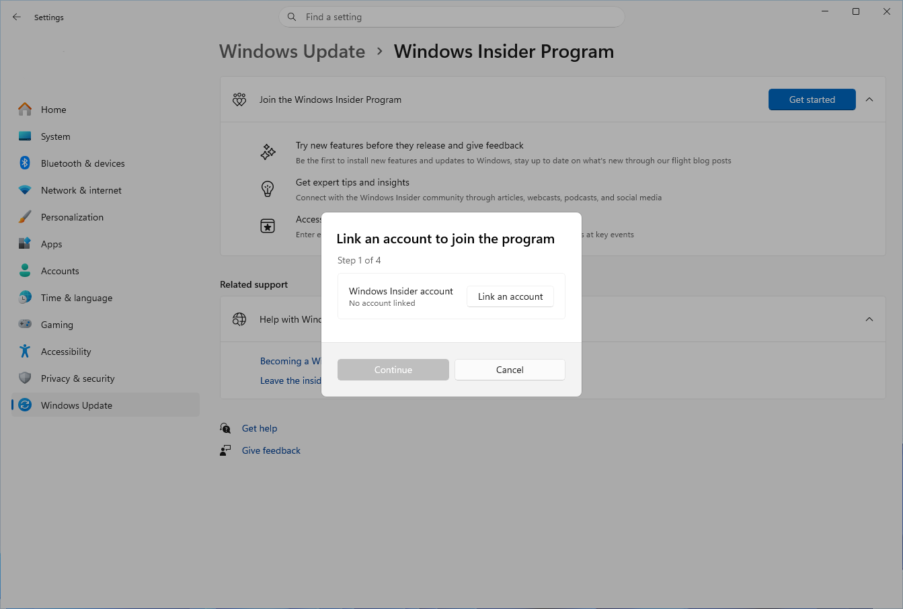

5. Select an account or login with one by clicking **Microsoft Account**, then click **Continue**.

    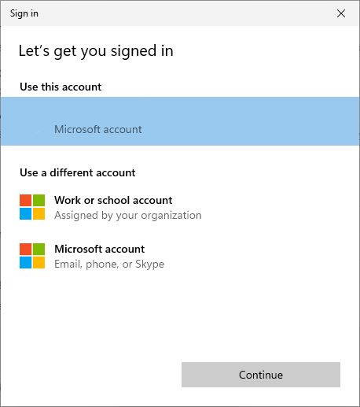

6. Read the [Microsoft Insider Program Agreement](https://insider.windows.com/program-agreement) and the [Microsoft Insider Privacy Agreement](https://privacy.microsoft.com/privacystatement). Click **Continue** when you finish reading and agree to the agreement.

    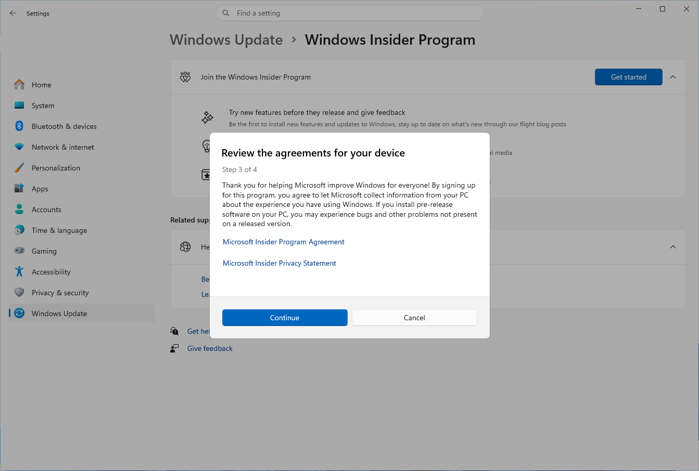

    ::: tip
    If this prompt appears more than one time, click **Continue** until it moves on to the next step.
    :::

7. Now select a channel to receive insider builds, then click **Confirm**. Here are some details on the details of the 4 channels: 
    
    | Channel | Description |
    | ------- | ----------- |
    | Canary | Ideal for highly technical users. Preview the latest platform changes early in the development cycle. These builds are released with limited documentation, without extensive validation, and can be unstable. | 
    | Dev | Ideal for enthusiasts. Access the latest Windows 11 preview builds as we incubate new ideas and develop long lead features. There will be some rough edges and low stability. |
    | Beta | Ideal for early adopters. Preview and provide feedback on pre-release features for Windows 11 in a stable environment. |
    | Release Preview Channel    | Ideal if you want to preview and certain key features, plus get optional access to the next version of Windows before it's generally available to the world. This channel is also recommended for commercial users.                    |

    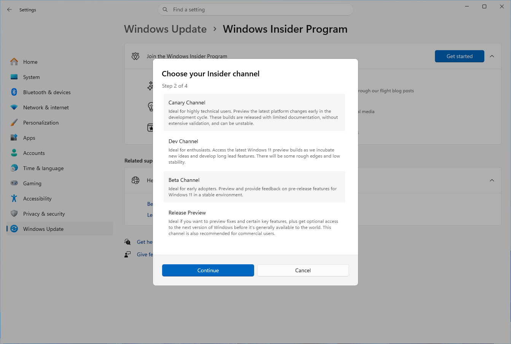

    ::: tip Note
    If you don't see all four channels, you might be limited by your hardware.
    :::

8. Review the [Microsoft Insider Privacy Statement](https://privacy.microsoft.com/privacystatement) and the [Microsoft Insider Program Agreement](https://insider.windows.com/program-agreement), then click **Continue**.

    

9. Choose to *Restart Now* or *Restart Later*, then you will start receiving insider builds in *Settings > Updates & Security > Windows Update*. Have fun testing Windows Builds!

    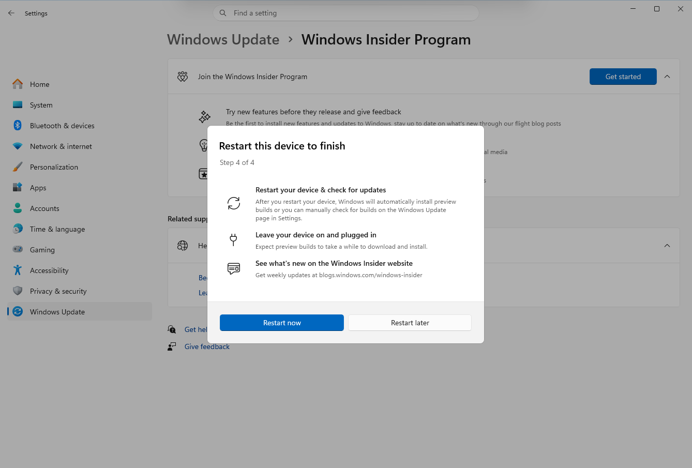

    ::: tip Note
    Please note that Windows Insider channels are evolving — the **Canary** and **Dev** channels will merge into a new **Experimental** Channel. You’ll also have the option to choose your preferred build number. As shown from the image below.
    :::

    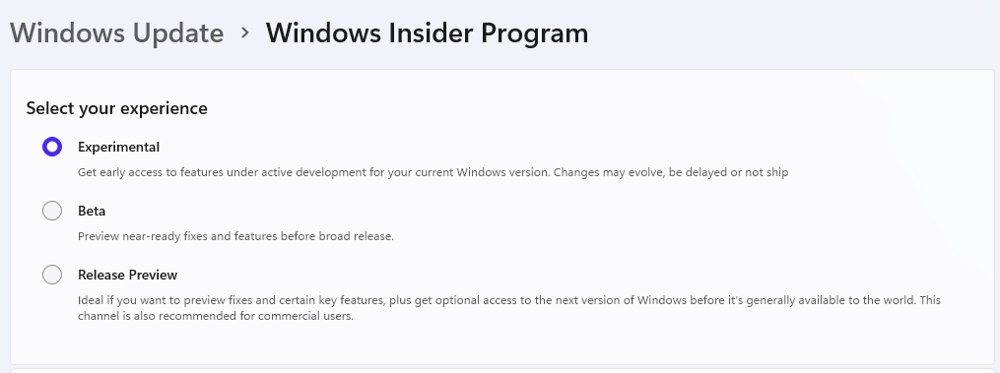

    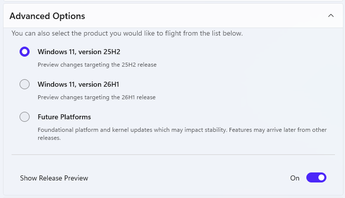

## Leaving the Windows Insider Program

If you don't want to participate in the Windows Insider Program anymore, you can leave the program. Your computer will stay on the build that you are currently on until an official build that is newer than the build you have. You can also revert to an older build if you haven't deleted the Windows build and if you installed the build less than 10 days ago.

### Leaving the Windows Insider Program on Windows 11

1. Open Settings and click on **Windows Update**.

    

2. Click on **Windows Insider Program**.

    

3. Turn on **Unenroll Device**.

    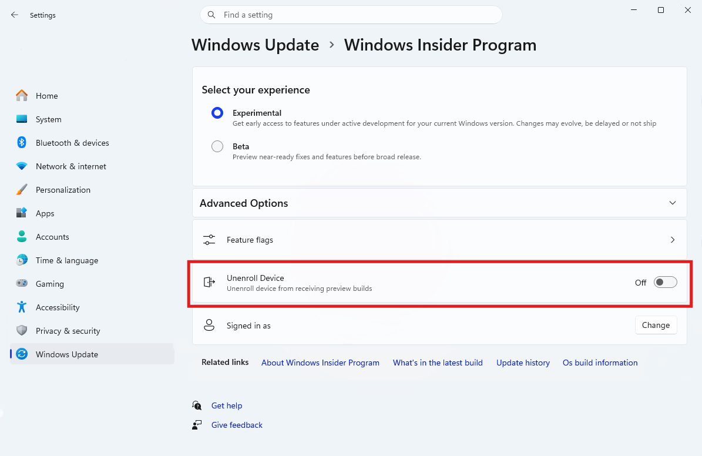

4. You will be redirected to an official website. Click on *Leave the Program now*.

    

    ::: tip
    If you see **You must login to leave the program**, login on the top right corner of the website.
    :::

5. Click on **Stop receiving Insider Preview Builds**.

    

6. You should see *"This email address is not registered as a Windows Insider"*.

    You should now be unenrolled from the Windows Insider Program.

## Troubleshooting

### Optional Diagnostics Data is disabled

If you see *"To join the Insider Program, turn on optional diagnostic data"*, click on *"Open Diagnostics & Feedback."*.

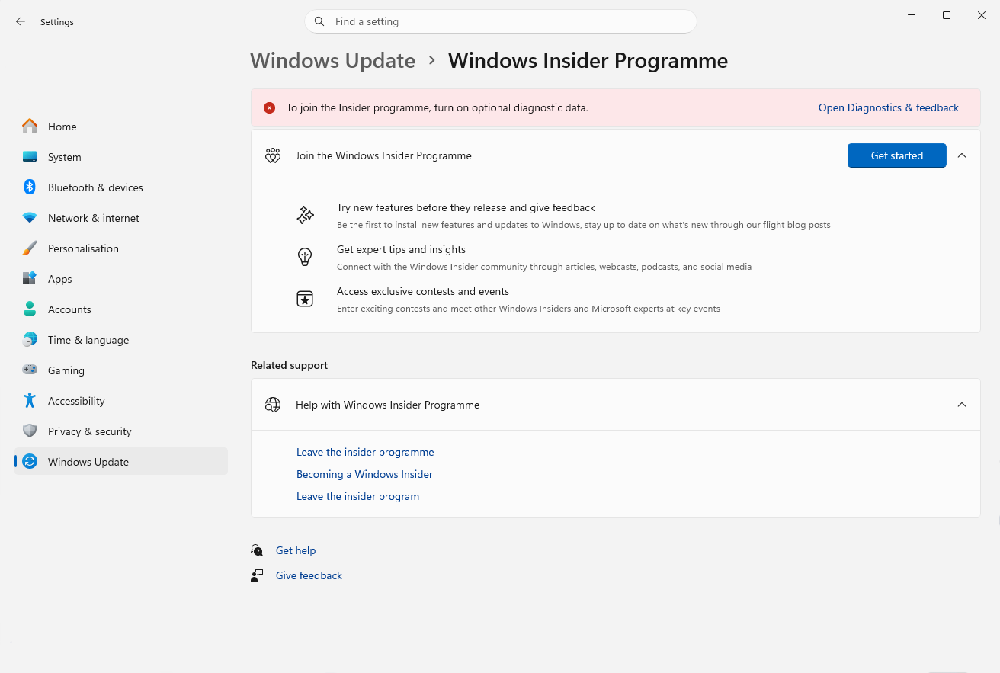

> Image source: [Minitool](https://www.minitool.com/news/how-to-join-windows-insider-program.html)

Select **Optional diagnostic data** and return back the the Windows Insider Program page and continue with the procedure to join the program.

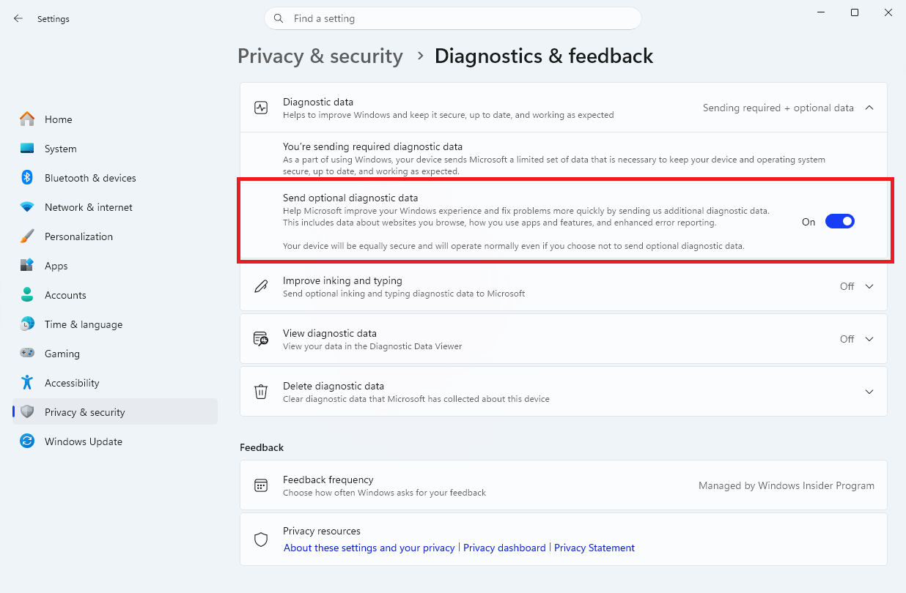

### Windows Insider Program Page not appearing

A registry key might be preventing the page from appearing in settings. Here is what you can do to fix it:

::: danger
Editing the registry incorrectly can cause major problems. Make sure you follow the instructions here exactly and don't proceed if anything is unusual.
:::

1. Press <kbd>Win</kbd> + <kbd>R</kbd> and type in `regedit`, then press <kbd>Enter</kbd>

    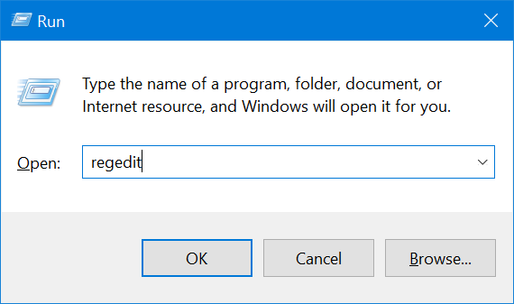

    ::: tip
    You might be prompted with the User Account Control popup, click yes or enter an administrator's username and password to continue.
    :::

2. Go to the following registry key: `HKEY_LOCAL_MACHINE/SOFTWARE/Microsoft/WindowsSelfHost/UI/Visibility`

    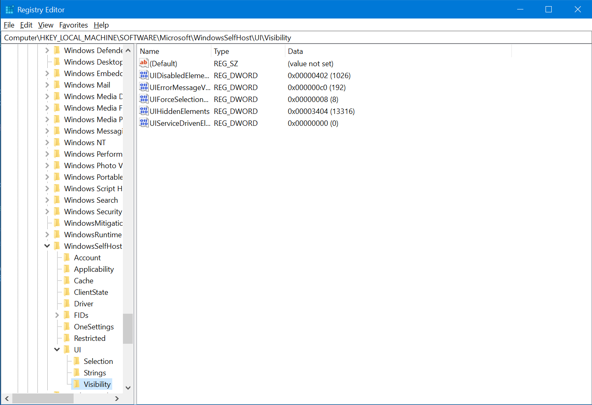

    ::: tip
    If the registry key does not exist, right click the key `UI` on the side bar and click **New > Key** and name it `Visibility`.
    :::

3. Right click and create a new 32-bit DWORD value named `HideInsiderPage` on the right hand side. Set the value to `0`.

    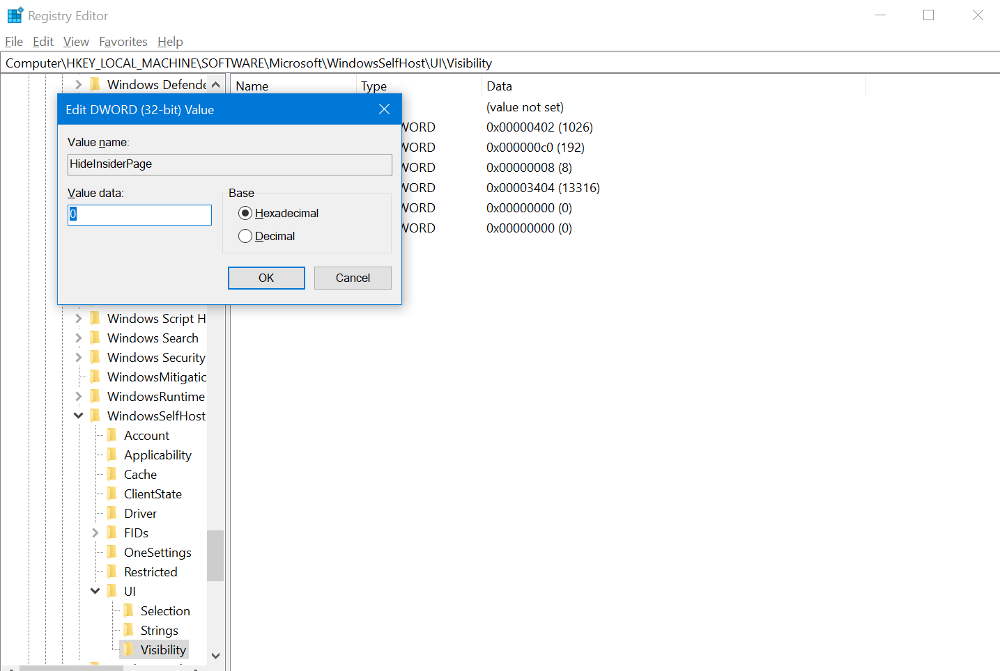

You may now close the Registry Editor window and restart your computer. The Windows Insider Program page should appear after the restart.

### Error Code

You may see an error code while trying to register to be a Windows Insider. There are a lot of different error codes, so you should search it on the Internet or ask in [our Discord server](https://discord.gg/microsoft) for support in the `#insiders` channel.
