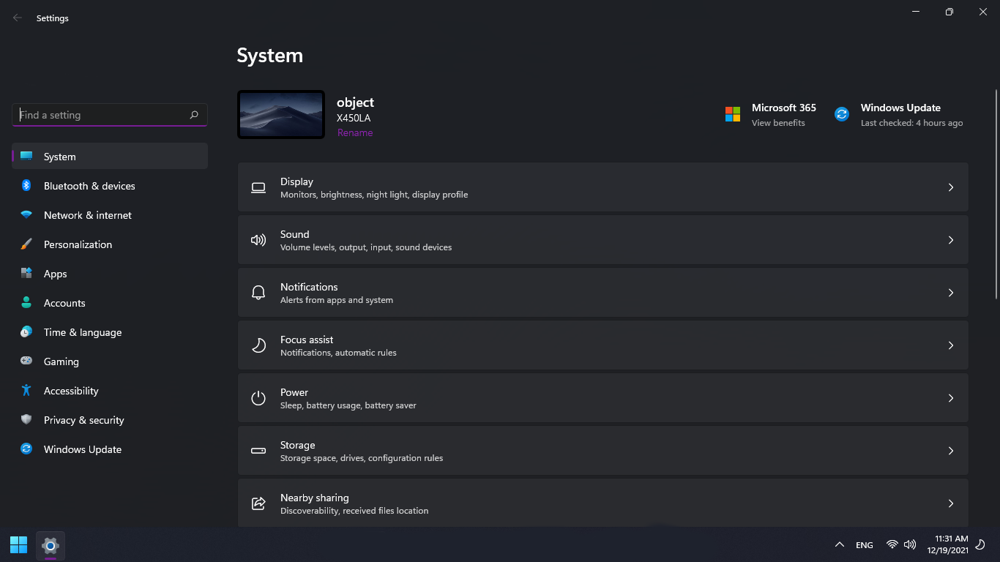
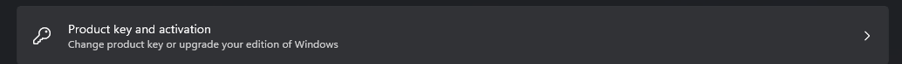
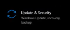
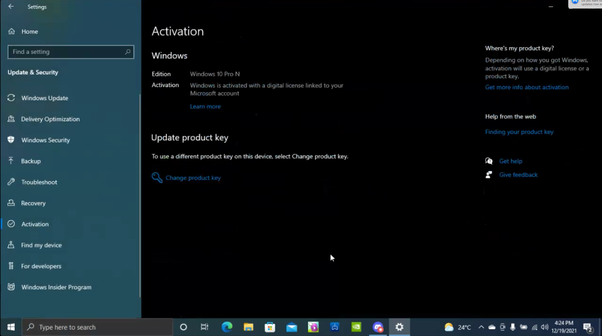

# Activating Windows

Want to finally stop sailing the seven seas on the SS UTorrent with your crew of .torrent files and get a legitimate version of Windows? Need help troubleshooting this vague error code with an even vaguer “answer” from the Microsoft Support forums? Don’t feel like getting scammed on a fake product key? Then you’ve come to the right place.

### Let us go over the easiest way to activate your copy of Windows 10 legitimately. 

Let's say you aren't like me and you are the most wealthiest person in the world. Just head on over to the Microsoft Store app and search for "Windows 10" and click on either "Windows 10 Home" or "Windows 10 Pro" and Windows will be automatically activated

### What if you are like me though and can't afford to leave your pirate ship and crew of .torrent files?

Usually there are other ways to get license keys. Sometimes they are legal, sometimes they are not. Best to just stick with the offical way to get a legal key straight from Microsoft. If you really do want to get it cheaper (or maybe even free if you are a student) then there are ways. 

Usually you shouldn't buy keys from 3rd parties but you can do so safely from retailers like Newegg, Scorptec, Amazon and Mwave for much much cheaper than the usual price, Sellers like Newegg also let you choose between 32-bit and 64-bit keys and Home and Professional keys. Still not cheap enough? If you are a student, consider checking if your school gives free Windows 10 Education keys or ask your IT department. Some schools also have a software store where you can get keys for products like Adobe Creative Cloud, Windows 10 Education and other things for discounted prices. 

### Grey markets and sketchy 3rd party sellers

If you still want to get a good deal on a key, go ahead and disregard all the information above (at your own risk) and say hello to sketchy 3rd party sellers and the grey market keys! Usually these keys are often not intended for resale, and are often stolen from enterprises that use volume licensing. Many times these keys are found out and eventually blacklisted and revoked by Microsoft. Sometimes they are even bought using stolen credit cards or different stolen payment methods. The keys may sometimes work but they probably won't work for much longer so you should avoid these keys. The same applies for activation scripts. 

### Using Windows unactivated

You cannot use Windows unactivated as it is a violation of the legally binding terms of service which pretty much just means if you use Windows without a license you are breaking the law and you are now considered a pirate and a criminal. Windows allows you to use it unactivated is if you are activating with an embedded firmware key, if you plan to purchase a license or if you need to access your key online (example, your emails or a receipt). 

### LTSB/LTSC activation

LTSB and LTSC versions of Windows are not meant to be used by average consumers and keys are therefore hard to get unless you have an enterprise agreement with Microsoft directly. Any keys you might find for sale are most likely stolen and shouldn't be purchased. You should just stick to normal Windows editions. 

### What if I am using a pirated version of Windows?

No need to panic, Microsoft and the police aren't gonna come kick your door down and put you in a maximum security prison for the rest of your life. Just purchase a legimate key using either a safe 3rd party retailer such as the ones I have spoken about above.

### How do I activate Windows using a product key?

### If you use Windows 11

1: Launch Settings 

2. Scroll down to About 

3. Open About and click "Product key and activation"

4. Click change and let Windows guide you from that point forwards.

### If you use Windows 10 

1. Open Settings and select Update & Security

2. Select Activation, then click Change product key and let Windows guide you from that point forwards.

