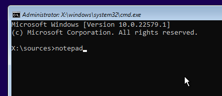
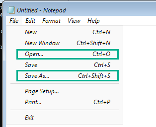
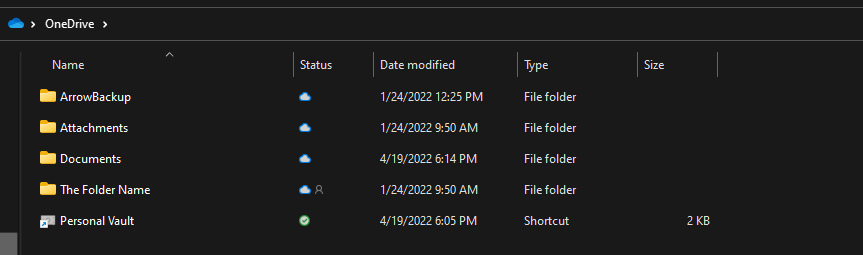
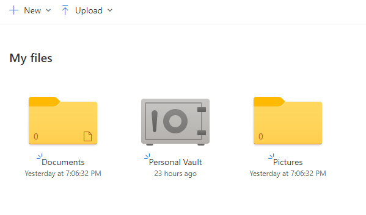

# Backup your data

There are many, variable ways to backup your data, this page aims to explain these methods and how to backup, in case your installation became broken or something happened.

## Backup locally

You could transfer files to an external storage media, or onto another disk.

- ### Using a Windows installation media
  - Boot into your installation media.
  - Press Shift+F10 to open Command Prompt.
  - 
  - Type `notepad` to open Notepad.
  - 
  - In Notepad, you could go to File > Open (or Save As)
  - There will be a dialog to browse your files, go to This PC.
  - Select the file format to be "All files" instead of text documents.
  - Plug in your storage media[¹](#notes)
  - Browse your PC, after you finished, click Cancel[²](#notes)

- ### Using File Explorer
  - Plug in your storage media[¹](#notes)
  - Copy/cut the files/folders you want.
  - Paste it into the storage media plugged in the first step.

## Backup to a cloud service

You can upload your data in a cloud service (for example: OneDrive, Google Drive etc...).

- ### OneDrive
  If you have the OneDrive desktop client installed, it will automatically sync.
  
  If you have the desktop client, **you can:**
  
  
  - Go to C:\Users\\[your username here]\OneDrive
  - Copy and paste files to that location, or any child directory you want to place the files in.
  
  If you don't have the desktop client installed, **follow these steps:**
  
  
  
  - Go to [onedrive.live.com](https://onedrive.live.com)
  - Click on "Upload".
  - Select your files that you want to upload.
  - Continue your upload.

- ### Google Drive
  You can access Google Drive by downloading and installing the Drive client, or by going to [drive.google.com](https://drive.google.com) and uploading your files.
  
There are more cloud services you can choose for uploading, but this is out of scope for this page.

## Notes

¹ Could be a USB flash drive, external hard disk etc...

² Closing the dialog or clicking Cancel won't undo what you did, it will just close the dialog.
