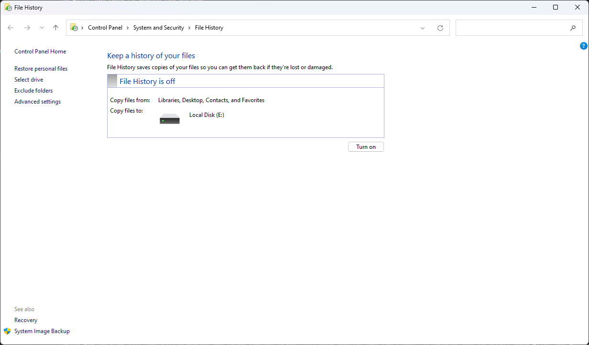
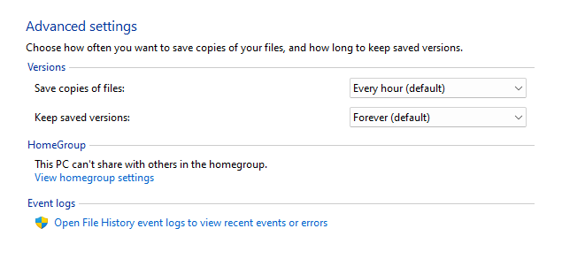
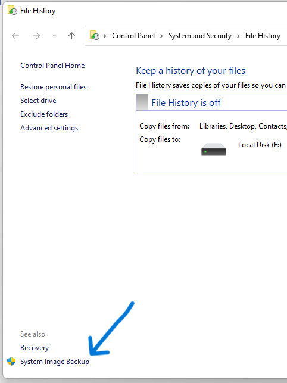
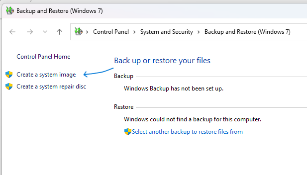
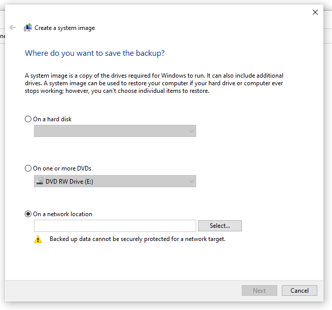
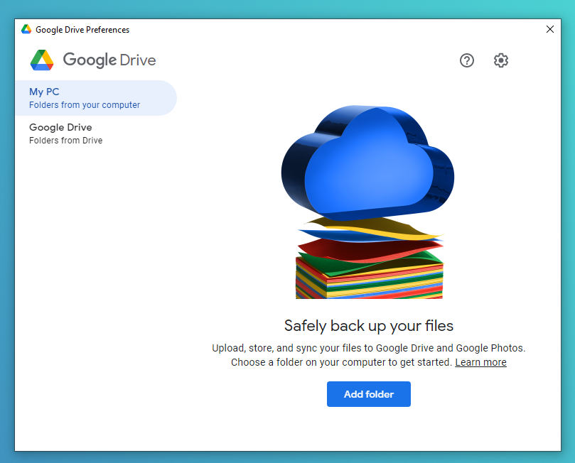
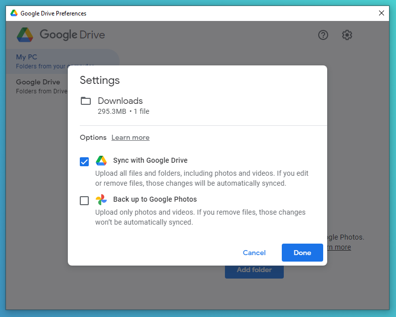

# Backing Up Data

Some updates, software bugs or malware could delete your data, your computer's drive could fail at some point, taking backups is useful when you regularly modify system files or when you format your disks frequently. It's also safer to store data in multiple places in case something happens to your computer's drive.

## The 3-2-1 Backup Rule

The 3-2-1 rule is keeping 3 copies of your data, two on different storage mediums (your computer's drive and a backup drive for example) and one on the cloud.

In other words, if you have a file called "image.jpg" on your computer's main drive, you have to create another copy to put on your backup drive and/or on the cloud. Now you have 3 copies of image.jpg.

## What do you need to back up?

It mostly depends on your preference, but you can start with your personal documents, photos, videos. These should be backed up regularly in case you lose them.

## Backing Up Locally

### Using an external drive

If you have an external drive, you could use it to backup your files by transferring your files to it. Your external drive could also include a backup software made by the drive's manufacturer, you can use that to back up your files.

### Using File History

File History is a tool which automatically makes backups of your files. You can keep track of each file's revision by using the Previous Versions tab in a file's properties window or by right clicking on a file then selecting "Restore previous versions", and you can also choose when to back up files and when to remove the backups.

#### Add a drive to File History

- Open Settings.
- Go to Update & Security > Backup.
- Add a drive to File History in order to use as a backup drive.

### Using System Image Backup

You can use System Image Backup to back up your system image. A system image is basically an image of the current state of the operating system stored in a file. You can use these system images to revert the system to a previous state.

- Search "File History" and then select it.
- On the Control Panel sidebar, click on "System Image Backup".

- Click on "Create a system image" and follow the instructions.

## Backing Up to a Cloud Service

You can also back up your data on a cloud service (for example: OneDrive, Google Drive etc...), this solution can be better in case you lose your backup drive.

Generally, cloud services have very limited backup options and storage so this might not be ideal if the data you want to backup is very large. Some cloud services provide subscriptions for additional storage space too.

### OneDrive

OneDrive can back up your desktop, documents and pictures so that they're available on other devices. You can also make OneDrive automatically back up your files automatically.

If you have OneDrive installed, you can continue with the below steps. If not, download it from [here](https://www.microsoft.com/en-us/microsoft-365/onedrive/download) and sign in with your account.

#### Sync Files and Folders

- Click the OneDrive icon in your system tray, that will open a panel.
- Click on the gear icon (Help & Settings) then click on Settings to open settings.
- Switch to the "Backup" tab and click on "Manage backup". This will open a new window where you can choose to back up your desktop, documents, and/or pictures folders.

- Click on "Start Backup" to run a backup. After this completes, OneDrive will continue to back up files in your chosen folders.

You will find your backed up files in your user folder (C:\Users\\[your user name here]\OneDrive) or on the website.

### Google Drive

Drive for Desktop lets you easily manage and share content across all your devices and the cloud. It enables you to access your files and folders in a familiar location and keeps your files in sync between the cloud and your computer.

#### Setting up Drive for Desktop

- [Download Drive for Desktop](https://www.google.com/drive/download/) if you didn't install it.
- After installing, open Drive for Desktop and log in.
- Click on "Add folder" to start syncing a folder to Drive.

You can use the [website](https://drive.google.com) to view your files after syncing, or on the file explorer.
