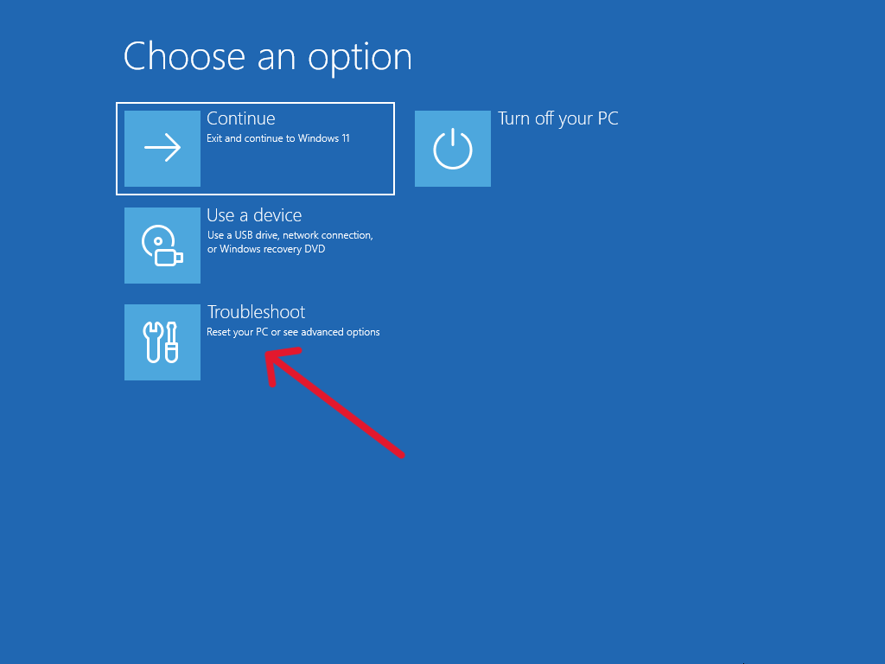
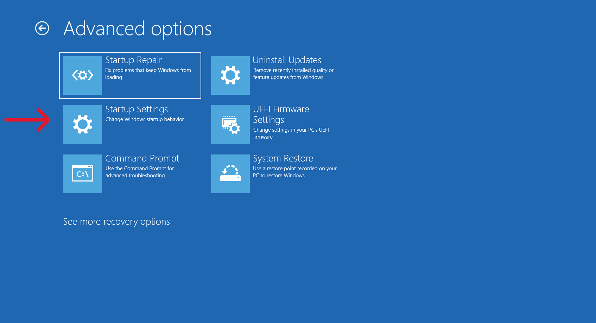
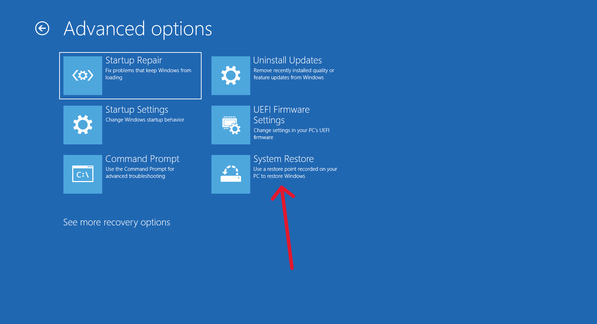

# Installing and Updating Drivers 
In this guide, you will learn how to download or update drivers on your computer.

::: warning Warning
It is highly recommended to avoid using third-party software to update or install your drivers.
:::
## Identifying Your Hardware
The first step in installing drivers is to correctly identify the hardware you need drivers for. This information can be found in your computer's manual or by using the Device Manager. You can access the device manager by right-clicking the Windows start button or by pressing <kbd>Win</kbd> + <kbd>X</kbd> and selecting Device Manager. In the Device Manager, look for the device you require drivers for, and expand its entry to see its model number. In System Information, navigate to the “Hardware” section and find the device you require drivers for.

## Method 1: Using Windows Update
You can usually find drivers for your devices in Windows Update, instead of having to manually download the file.

1. Open Settings through the start menu or by pressing <kbd>Win</kbd> + <kbd>I</kbd>.
 
2. Go to Update & security (on Windows 10) or Windows Update (on Windows 11).
 
3. Click on “Check for Updates” or "Download & Install Updates".
 

Windows Update might say that you are up-to-date, even if optional updates are available. You can check for additional optional updates in the 'Optional updates' section of Windows Update settings.

On Windows 11:

1. Click "Advanced options".


2. Click "Optional updates".


3. Click "Driver updates" to show the list of available driver updates, if there are any.


4. Select any optional updates you wish to install, then click "Download & install".


On Windows 10, a "View optional updates" link will appear under "Check for updates" if optional updates are available. Click on it to see the list of available driver updates.

## Method 2: Using your OEM company website (the manufacturer of an entire device)
::: tip Note
Using a laptop, or a pre-built desktop? You should probably download drivers from your OEM's website instead. See [Method 3](#method-3-download-using-the-oem-s-website).
:::
It is highly recommended to download or update your drivers through your manufacturer's website, as that will guarantee proper functionality, provided you've installed the correct drivers. This is especially a good idea for your Graphics Card (GPU) Drivers.

All you need to do is:
1. On the search engine of your choice (Google, Bing, etc…), search for "{device manufacturer} drivers".
2. Visit the manufacturer's website and enter the model of your device, then follow the instructions on the page.
3. When you select the product, you may be shown with 2 options:
	- Download the driver downloader (recommended).
	- Download this specific driver only and install manually.
### Well-known manufacturers' websites
- [Dell](https://www.dell.com/support/home/en-us?app=drivers)
 
- [HP](https://support.hp.com/us-en/drivers)
 
- [Lenovo](https://pcsupport.lenovo.com/us/en)
 
## Method 3: Using manufacturer's website (manufacturers of individual pieces of hardware)
If the manufacturer's website doesn't provide the drivers that you need for your hardware, you can download them from the OEM's (Original Equipment Manufacturer) website.

1. On the search engine of your choice (Google, Bing, etc…), search for "{the OEM's name} drivers".
 
2. Search for the model number of the piece of hardware you want to upgrade/install drivers for.
 
3. When you select the product, you may have two options:
 
    - Download the driver downloader (recommended).
    - Download this specific driver only and install manually.

See [Reinstalling GPU drivers from the OEM's website](/wiki/reinstalling-gpu-drivers.html#method-3-oem-website) for more information on installing GPU drivers.
## Troubleshooting 🔧
### If you can access Windows:
1. Open the Device Manager by pressing <kbd>Win</kbd> + <kbd>X</kbd> and then clicking the "Device Manager" option. You can also search for it in the Start Menu.


2. In Device Manager, find the device that is causing problems (you might have to expand a category), right-click on it, and click "Properties".


3. Go to the "Driver" tab at the top of the window, and then click "Roll Back Driver".


4. Windows will ask you why you're rolling back to a previous driver. Select a reason, and click "Yes". If you want to, you can leave a detailed response in the "Tell Us More" field, at the bottom of the window.


5. Windows will then restore your driver to the previous version, which could take up to 5-10 minutes.


### Safe Mode
Safe mode is a diagnostic tool, which loads Windows with only the essential drivers. This allows you to access Windows even if the problematic driver is causing issues during normal boot.
1. Enter Safe Mode:


On Windows 10 or 11:

- Open the Start menu, click on the power button, and hold <kbd>Shift</kbd> while clicking Restart. This will take you to the Windows Recovery Environment:


- Click:
 - Troubleshoot

 - Advanced options

 - Startup Settings > Restart. After your computer restarts, press <kbd>4</kbd> to boot into Safe Mode, or <kbd>5</kbd> to boot into Safe Mode with internet access.
 

On earlier versions of Windows:

- Restart your computer and repeatedly press F8 before the Windows logo appears.
- At the Advanced Boot Options menu, select “Safe Mode” to boot into Safe Mode, or “Safe Mode with Networking” to boot into Safe Mode with internet access.

2. Uninstall the Driver in Safe Mode:

Once in safe mode, you can uninstall the problematic driver:

1. Open the Device Manager (search for it in the Start Menu).

2. Expand the category for the device with the recently installed driver.


3. In Device Manager, find the device that is causing problems (you might have to expand a category), right-click on it, and click "Properties".


4. Go to the "Driver" tab at the top of the window, and then click "Roll Back Driver".


5. Windows will ask you why you're rolling back to a previous driver. Select a reason, and click "Yes". If you want to, you can leave a detailed response in the "Tell Us More" field, at the bottom of the window.


6. Windows will then restore your driver to the previous version, which could take up to 5-10 minutes.


Or if you can't access the normal safe mode, you may try and access Safe Mode with Command Prompt and execute the following commands in Command Prompt:

1. ```Dism /image:C:/ /Get-Drivers```

2. ```DISM /Image:C:/ /Remove-Driver /Driver:not_working_driver.inf``` (replace not_working_driver with the driver that isn't working).

3. You should see something like this:  
```
Found 1 driver package(s) to remove.
Removing 1 of 1 – not_working_driver.inf: The driver package was successfully removed.
The operation completed successfully.
```

### System Restore

If you recently created a system restore point before installing the driver, you can restore Windows to that point:

1. At startup options, click Troubleshoot.


2. Click Advanced options.


3. Click System Restore and follow the instructions.<hr>



### Startup Repair

If Safe Mode isn't accessible, you can try Startup Repair, a built-in tool on Windows that will attempt to fix boot issues:

1. Create a Windows Recovery USB drive using another computer. See: [Downloading Windows](/wiki/downloading-windows.html).
 
2. Boot your computer using the recovery drive and pick “Fix computer problems"
    Troubleshoot
    
    
    
    Advanced options
    
    
    
    Startup Repair
    
    

### Reinstall Windows

If none of the solutions above work, you may need to reinstall Windows. This will erase all your data and applications, so make sure you have a backup. You may learn how to backup your data [here](/wiki/backup.html).

1. Download Windows using a working computer: [Downloading Windows](/wiki/downloading-windows.html)
 
2. Next, to install Windows, follow this guide: [Installing Windows](/wiki/installing-windows.html) 

::: tip Note
During the installation process, you may be asked to enter a licence key. If you don't have one, you can click Skip or "I don't have a product key" and Windows will be automatically reactivated (if your Windows installation was already activated). If you were previously signed in with a Microsoft account, you may need to sign in with the same account again.
:::