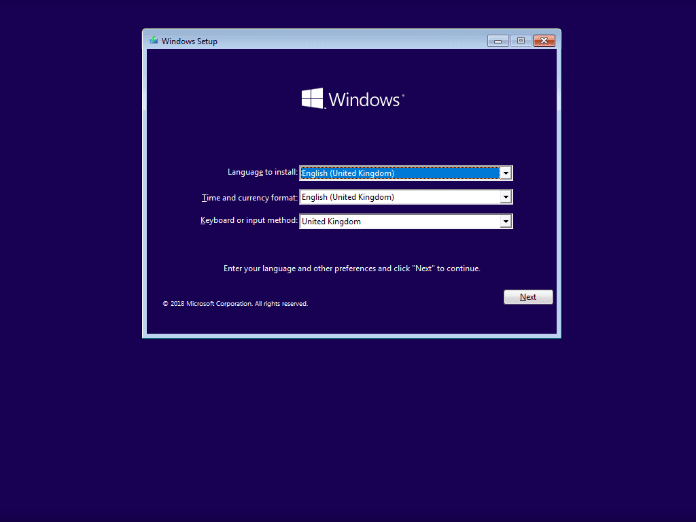
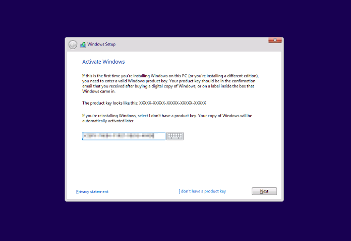

# Installing Windows

This article covers the steps of re-installing, or fresh installing Windows 10 or Windows 11 from a USB.

## Installing

> The disk that you are trying to install Windows on must be a GPT disk if you are on a UEFI system or MBR if you are on a BIOS system, otherwise it will not let you install. Use `diskpart` to change the partition scheme. ***THIS DELETES ALL DATA ON THE DISK***

1. Select the correct regional settings then press Next.

   

2. Click Install Now.

   

3. Enter your product key if you know it, otherwise click I don't have a product key. Note that this screen may not always come up, based on the computer.

   > If you click I don't have a product key, you may be prompted with a screen to select a version of Windows to install. Select the edition you have a key or digital license for, or the edition of Windows that was previously installed.

   

4. Accept the agreement.

   

5. On the next screen, click Custom.

   

## Method 1: Re-installing and keeping your data

> The drive that you are installing Windows to requires enough space to move the contents of the drive to a folder called `Windows.old` for this method.

1. On the next screen, you will see a list of partitions for each disk you have, you want to select the partition marked "Primary" on the disk that you have Windows installed on, and that has a similar amount of space as the drive you have Windows installed on. In this example, Windows is installed on a 256 GB SSD, so we select the partition with approximately 256 GB of storage. Leave the other partitions untouched.

   

2. After this, click Next.

Windows will now start re-installing on the partition that you selected. It will move any data from that partition to a folder located at `C:\Windows.old` if there is enough space.

## Method 2: Clean install without keeping data

1. On the next screen, you will see a list of partitions for each disk you have. Now, you can choose to do one of two things:

   - Click the "Format" button at the bottom with your current Windows partition selected. ***THIS WILL ERASE ALL DATA ON THE SELECTED PARTITION***

   - Delete all of the partitions on the drive you want to install Windows on and then select the unallocated space on that drive to let Windows redo its partition setup. This is useful for brand new drives or if your partition setup is broken. ***THIS DELETES ALL DATA ON THE DISK***

     

2. After this, click Next.

Windows will now start installing on the partition that you selected.

