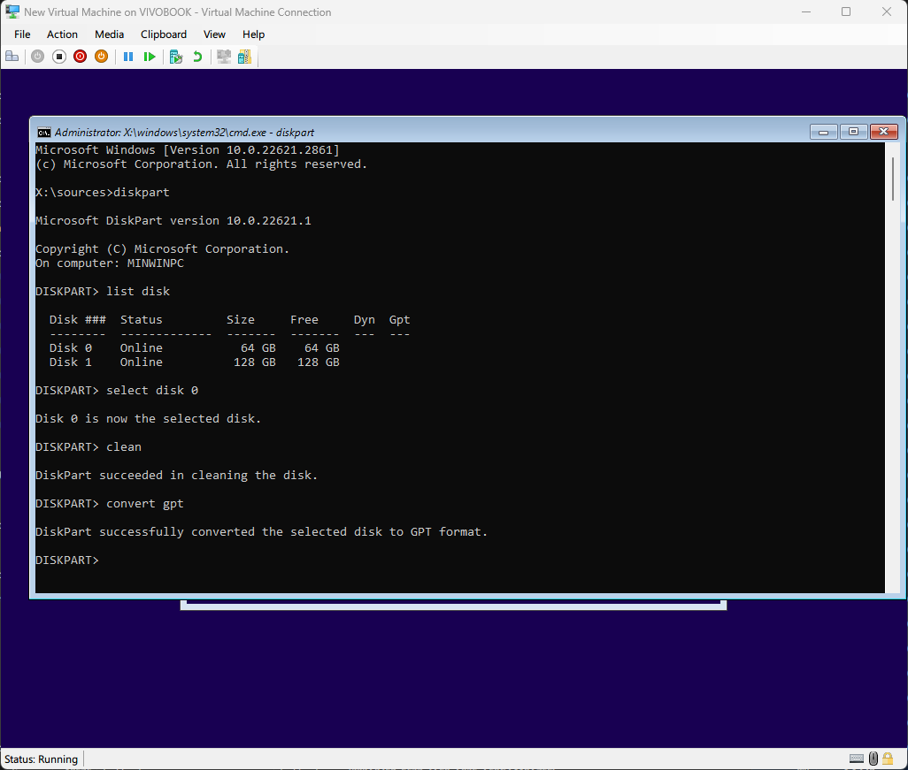

# Installing Windows

This article covers the steps of re-installing, or fresh installing Windows 10 or Windows 11 from a USB.

## Booting with USB

Turn on the computer that is not working, and repeatedly press the boot menu key. Usually the boot menu key is either one of <kbd>F10</kbd>, <kbd>F12</kbd>, <kbd>ESC</kbd>, or <kbd>F2</kbd> keys. This depends on the manufacturer of your device. The boot menu key for your device can be found out by searching up your computer's motherboard/model.

Once the boot menu is open, move the cursor using the arrow keys to the name of the USB¹ you have inserted and then press Enter.

¹ Can be usually USB HDD or your USB drive model. Your mileage may vary.

## Disk Conversion (if needed)

The disk that you are trying to install Windows on, must be a GPT disk if you are on a UEFI system, or MBR if you are on a BIOS system, otherwise you will get an error.

Use DiskPart to change the partition scheme.

::: danger CAUTION
This may **DELETE ALL DATA** on the disk! Make sure you have a backup before you proceed.
1. Press Shift + F10 to open a command prompt. From there, type `diskpart`.

2. At the DiskPart prompt, type `list disk` to list all physical disks in your computer. Note the number of the disk you're installing Windows to, and check if there is an asterisk under the GPT column. (An asterisk means that your system disk is a GPT disk and vice versa.) If you've just switched to UEFI and do not want to delete your data on your MBR system disk, then do not proceed with DiskPart. Instead, exit the DiskPart prompt and type `mbr2gpt /convert /disk:<disk number>`.
   
  
   
   Otherwise, proceed to the next step.

3. Select the target disk. For example, if your system disk has the number 0, type `select disk 0`. After that, type `clean` to wipe the disk.

4. Convert the disk to the corresponding partition scheme, with either `convert mbr` or `convert gpt` to convert the disk to MBR and GPT respectively.
   
  

   Exit the command prompt and proceed with the next steps.

## Installing

1. Select the correct regional settings then press Next.

   

2. Click Install Now.

   

3. Enter your product key if you know it, otherwise click I don't have a product key. Note that this screen may not always come up, based on the computer.

   ::: tip Note
   If you click "I don't have a product key", you may be prompted with a screen to select a version of Windows to install. Select the edition you have a key or digital license for, or the edition of Windows that was previously installed.
   :::

   

4. Accept the agreement.

   

5. On the next screen, click Custom.

   

## Method 1: Re-installing and keeping your data

::: tip Note
The drive that you are installing Windows to requires enough space to move the contents of the drive to a folder called `Windows.old` for this method.
:::

1. On the next screen, you will see a list of partitions for each disk you have, you want to select the partition marked "Primary" on the disk that you have Windows installed on, and that has a similar amount of space as the drive you have Windows installed on. In this example, Windows is installed on a 256 GB SSD, so we select the partition with approximately 256 GB of storage. Leave the other partitions untouched.

   

2. After this, click Next.

Windows will now start re-installing on the partition that you selected. It will move any data from that partition to a folder located at `C:\Windows.old` if there is enough space.

## Method 2: Clean install without keeping data

1. On the next screen, you will see a list of partitions for each disk you have. Now, you can choose to do one of two things:

   - Click the "Format" button at the bottom with your current Windows partition selected. ***THIS WILL ERASE ALL DATA ON THE SELECTED PARTITION***

   - Delete all of the partitions on the drive you want to install Windows on and then select the unallocated space on that drive to let Windows redo its partition setup. This is useful for brand new drives or if your partition setup is broken. ***THIS DELETES ALL DATA ON THE DISK***

     

2. After this, click Next.

Windows will now start installing on the partition that you selected.

