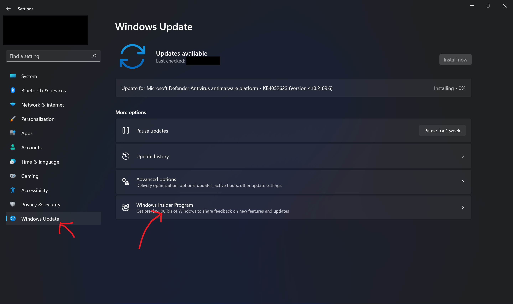
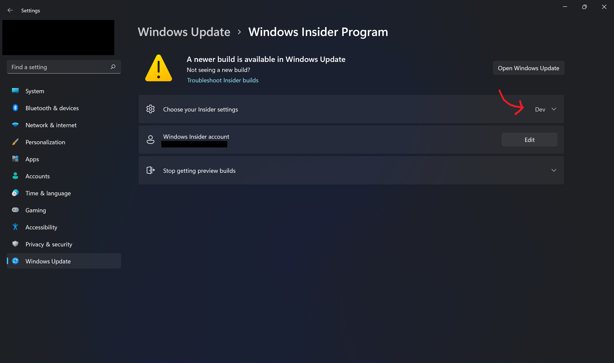
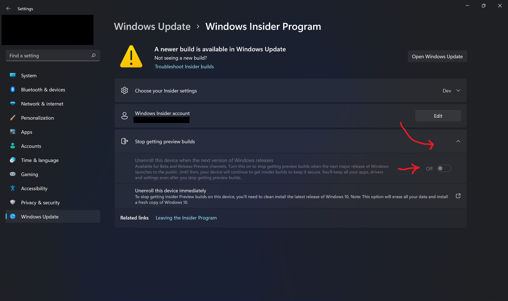
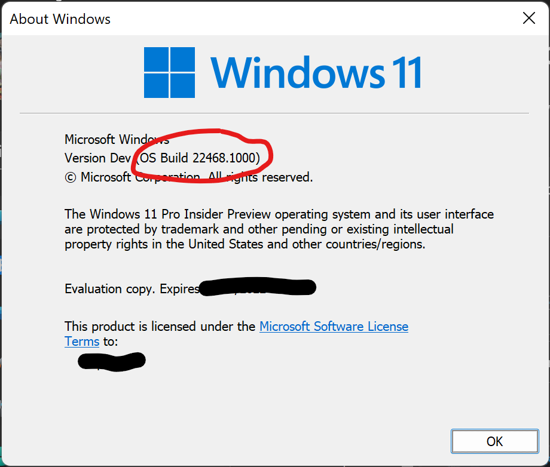
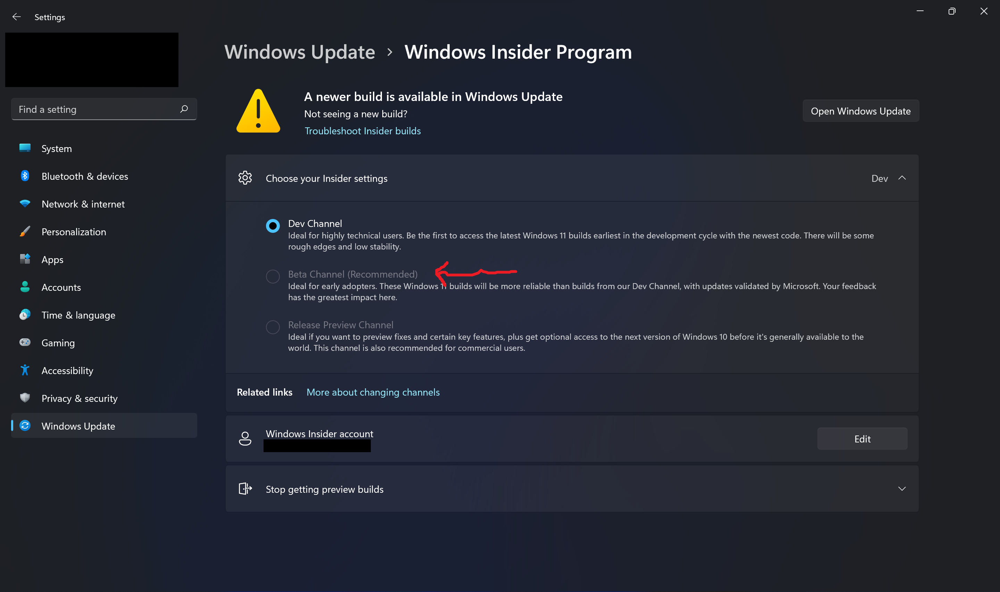
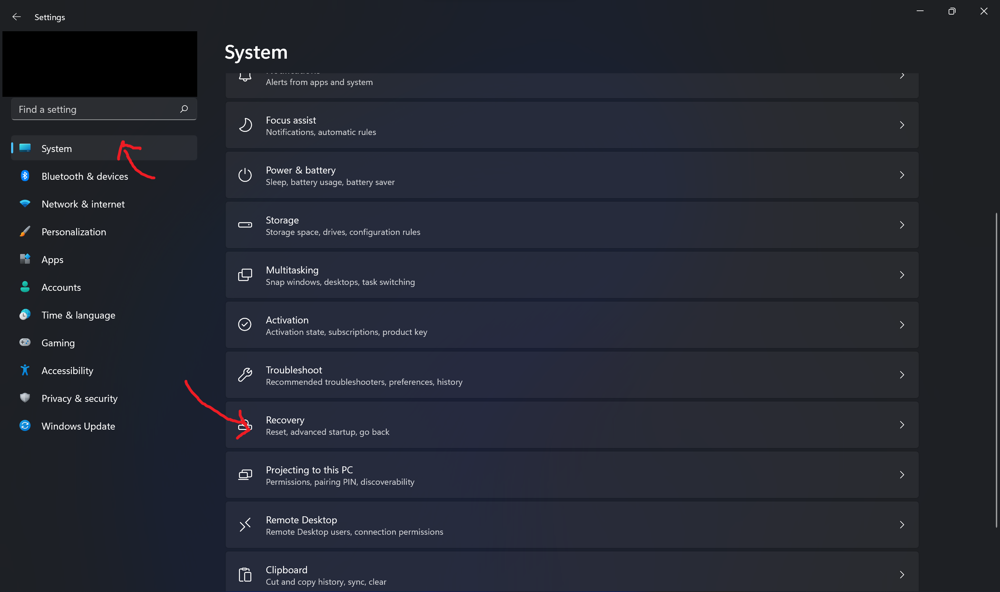
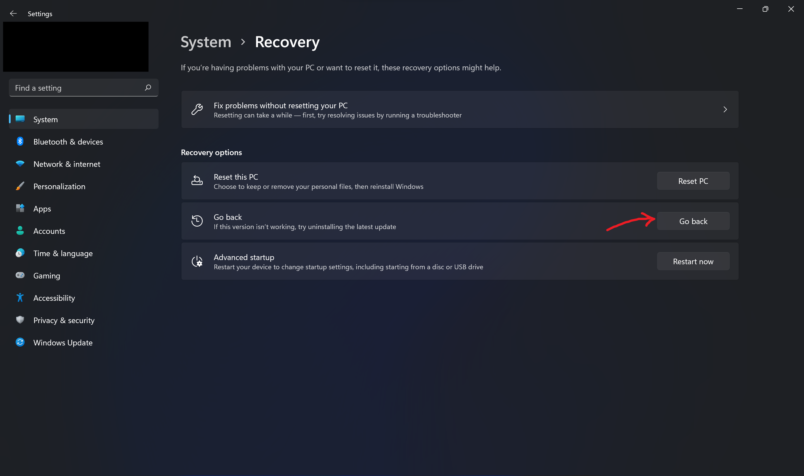

# Opting out of Windows 11 Insider updates

If your machine is enrolled into the Windows Insider Program and you wish to stop receiving Insider updates, follow the steps below.

## Determine your current channel

Open Settings, go to the **Windows Updates** category and then click **Windows Insider Program**.

Once there, look to the right side of *"Choose your Insider settings"* to see your Insider channel, It can be Dev, Beta or Release Preview.

## For Beta/Release Preview

If you found your channel was Beta or Release Preview, opting out of Insider updates should be as easy as turning on a switch.

Open the **Stop getting preview builds** section and turn on *"Unenroll this device when the next version of Windows releases"*.

Restart your PC and you should be opted out.

## For Dev

If you are in Dev channel, you need to pay attention to the build number, as it will affect whether you can leave Insiders without a clean install.

### Determine your current build

Press the "Windows" and "R" key simultaneously on the keyboard, type `winver` and press Enter, an "About Windows" window will appear.

Look closely at the "OS Build" field, this field will tell you which build you have.

### If the build is 22000.xxx

1. On the Windows Insider Program page in Settings, open the "Choose your Insider settings" section and choose **Beta channel**.

   

2. Restart your PC and now you should be in the Beta channel. Follow the Beta/Release Preview instructions to opt out of Insiders.

### If the build is higher than 22000.xxx

1. Choose **System** on the left side of the Settings app and open **Recovery**.

    

2. Click on "Go back" in the Recovery page.

   

>   **NOTE:** If the **Go back** option is disabled, a clean install is required, see [Installing Windows 10](installing-windows-10.md) for instructions to do so.

3. Follow the instructions on-screen to go back to a previous build.

4. Check your build again.

   If `winver` reports a build number starting with `22000`, follow the instructions for 22000.xxx above.

   If not, then unfortunately a clean install is required, see [Installing Windows 10](installing-windows-10.md) for instructions to do so.
