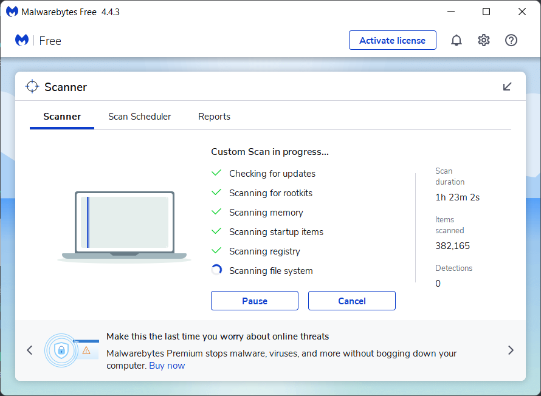
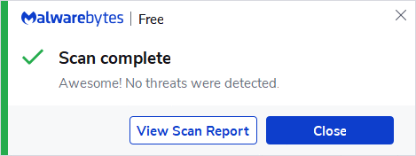
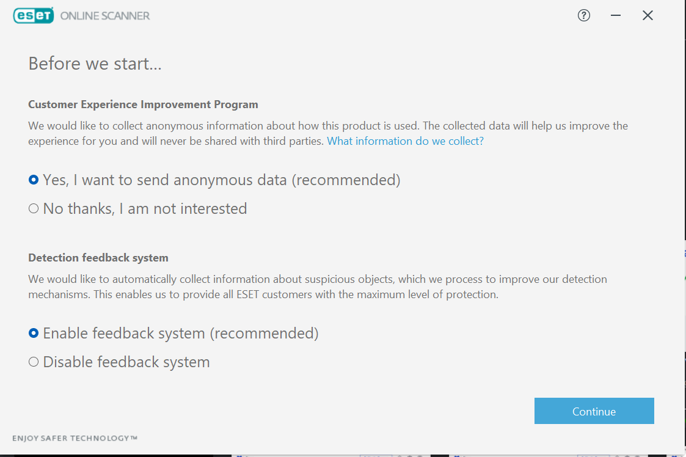
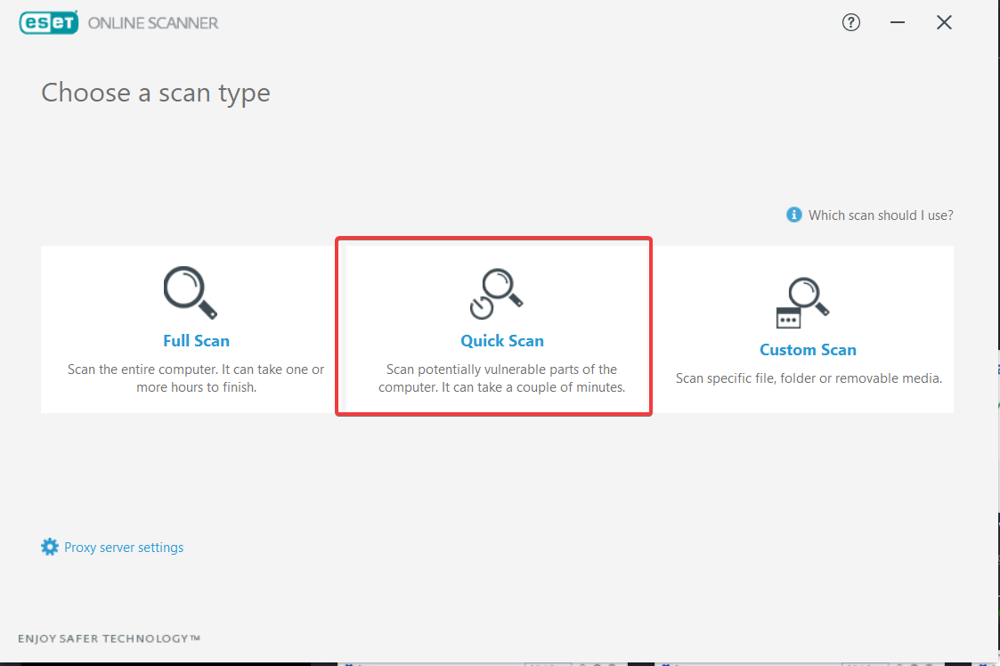
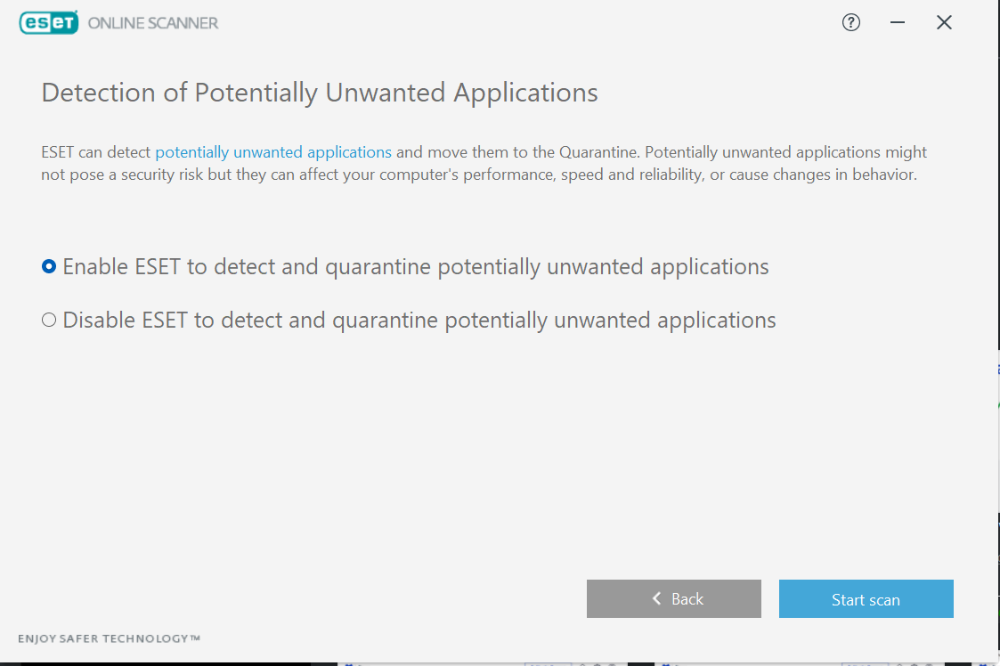
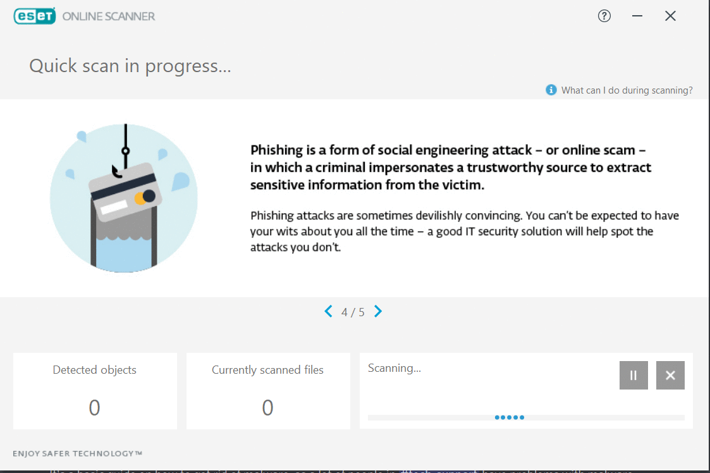
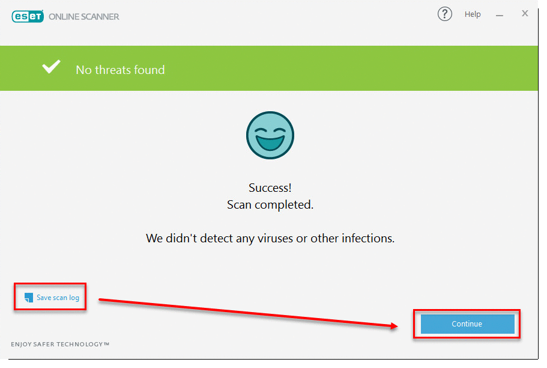

# Malware Removal
Getting infected with malware can be annoying and your data can be at risk. Removing malware can be a lot of work and sometimes more advanced programs are needed in order to remove everything.
Trained experts of BleepingComputer offer free help to remove malware with one on one steps, see [here](https://www.bleepingcomputer.com/forums/t/34773/preparation-guide-for-use-before-using-malware-removal-tools-and-requesting-help/) for more information.

## Using Malwarebytes
You can download Malwarebytes from [here](http://www.malwarebytes.com/mwb-download/)
Install the program as you install a program normally and start it.
*For this guide, I'll use the free version. When you install the program you'll have a trial version of the premium version.*
### Starting a scan with Malwarebytes
Once **Malwarebytes** is open, you click on the **Scan** button and a scan will start.

When a scan is running you can see details about the scan such as how much time has elapsed, what is being scanned and the detected threats.

Once a scan is complete it will tell you if there were any threats found.

When **nothing** has been found you can assume that your device is clean. If there is something found **place it in quarantine** and **export** the logfile.

## Using ESET Online Scanner
The **ESET Online Scanner** is a scanner from ESET which can be used to scan your device automatically from time to time and it can be used if Malwarebytes found any threats.
You can download the scanner from [here](https://www.eset.com/int/home/online-scanner/).
### Starting a scan with the ESET Online Scanner
When you've downloaded the online scanner start the program as any normal program. Accept the terms and choose if you want to join the **Customer Experience Program**.

Once you've done this you will see options to choose a scan, choose for a **Quick Scan** here.

On the next page you have the ption to enable PUP detection, I suggest you to enable this.

Click on **Start Scan** and the program will get the latest updates and start a scan.

When a scan is completed and detections have been found, they'll be placed in quarantine automatically, make sure that you **save the logfile**. If no detections are found it will be told to you.

