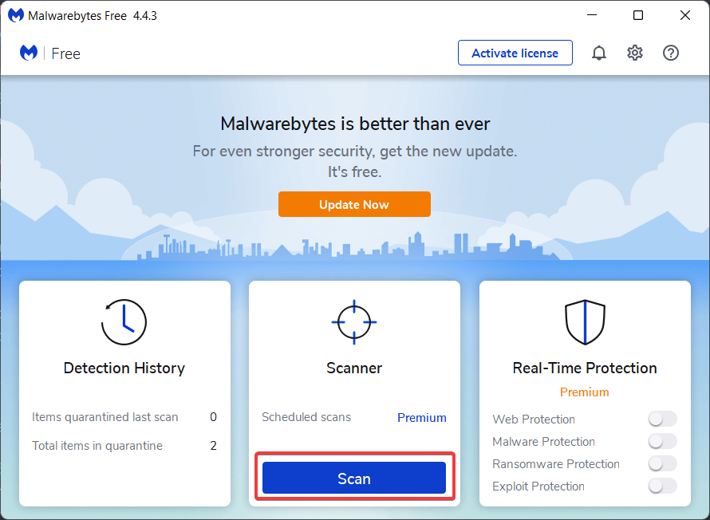
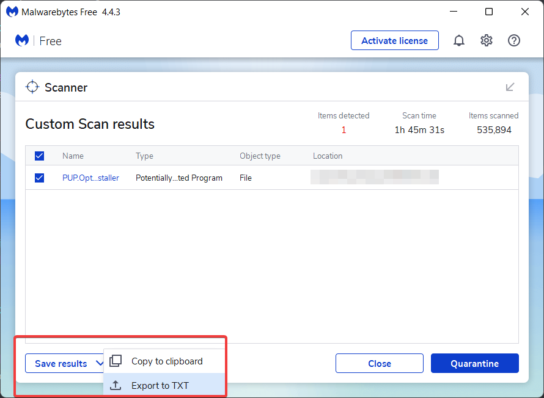

# Malware Removal #
Getting infected with malware can be annoying and your data can be at risk. Removing malware can be a lot of work and sometimes more advanced programs are needed in order to remove everything.
Trained experts of BleepingComputer offer free help to remove malware with one on one steps, see [here](https://www.bleepingcomputer.com/forums/t/34773/preparation-guide-for-use-before-using-malware-removal-tools-and-requesting-help/) for more information.

## Using Malwarebytes ##
You can download Malwarebytes from [here](http://www.malwarebytes.com/mwb-download/)
Install the program as you install a program normally and start it.
*For this guide, I'll use the free version. When you install the program you'll have a trial version of the premium version.*
### Starting a scan with Malwarebytes ###
Once **Malwarebytes** is open, you click on the **Scan** button and a scan will start.

When a scan is running you can see details about the scan such as how much time it's busy what is scanning and the detected objects.

Once a scan is complet it will tell you if there are any threads are found or not.

When **nothing** has been found you can assume that your device is clean. If there is something found **place it in quarantine** and **export** the logfile.

## Using ESET Online Scanner ##
The **ESET Online Scanner** is an scanner from ESET which can be used to scan your device automatic from time to time and it can be used if Malwarebytes found any objects.
You can download the scanner frm [here](https://www.eset.com/int/home/online-scanner/).
### Starting a scan with the ESET Online Scanner ###
When you've downloaded the online scanner start the program as any normal program. Accept the terms and choose if you want to join the **Customer Experience Program**.

Once you've done this you will see options to choose a scan, choose for a **Quick Scan** here. 
On the nextt age you have the ption to enable PUP detection, I suggest you to enale this.

Click on **Start Scan** and the program will get the last updates and start a scan.

When a scan is completed and detections has been found, they'll be placed automatic in quarantine, make sure that you **save the lofile**. If no detections are found it will be told to you.

