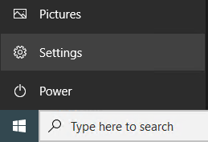
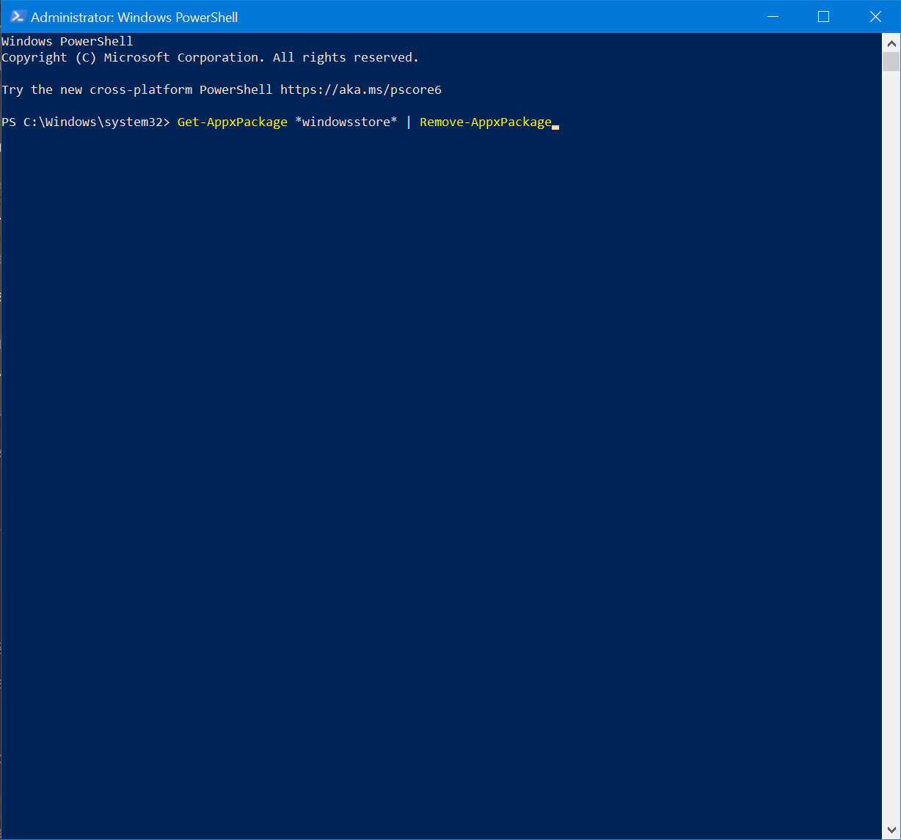
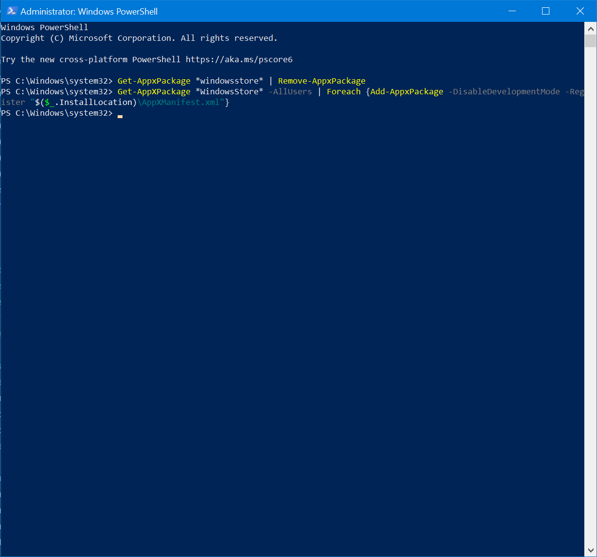

# Reinstalling Microsoft Store

Microsoft Store is used to download applications. But ist may sometimes glitch out and disappear. This article will cover the steps of reinstalling it.

## Method 1: Resetting the Microsoft Store Cache

There are two methods to clear out the Microsoft Store Cache. 

### Method 1 to Reset Microsoft Store Cache

1. Open the Settings app. You can do this by searching for it in the Start menu, pressing <kbd>Win</kbd> + <kbd>I</kbd>, or pressing the Settings icon above the power button.

    

2. Select "Apps".

    

3. Find "Microsoft Store" and click advanced options.

    

> If you can't find Microsoft Store here, you wll have to reinstall Microsoft Store completely. Follow Method 2 to reinstall Microsoft Store

4. Scroll down and click the reset button. Then wait for a check mark to appear.

    

### Method 2 to Resset Microsoft Store cache

1. Open the Run dialog. You can do this by searching for it in the start menu, or by pressing <kbd>Win</kbd> + <kbd>R</kbd>.

    

2. Enter `wsreset` and hit <kbd>Enter</kbd> or press "OK".

    

3. A black window will pop up and when it's finished, restart your computer and it should be fixed.

>If this does not fix your rpblem, try the Method 2: Reinstalling Microsoft Store instead.

## Method 2: Reinstalling Microsoft Store

1. Launch Powershell as administrator by pressing <kbd>Win</kbd> + <kbd>X</kbd> and press "Powershell (Admin)" or by searching it up in the Start Menu then right click and hit "Run as Administrator". Either way you will be prompted with **U**ser **A**ccount **C**ontrol (UAC). Hit yes or enter an administrator's password to continue.

    

2. Enter the command `Get-AppxPackage *windowsstore* | Remove-AppxPackage` and hit <kbd>Enter</kbd>.

    

3. After the command finished, enter the command `Get-AppXPackage *WindowsStore* -AllUsers | Foreach {Add-AppxPackage -DisableDevelopmentMode -Register "$($_.InstallLocation)\AppXManifest.xml"}` and hit <kbd>Enter</kbd>.

    

4. After everything your Powershell should look like this. If it looks anything else rather than this, you have encountered an error and should run the [SFC and DISM tool](troubleshooting.md) to check your system files and then run the command again.

    

After that, you want to restart your computer to apply changes that were made and your Microsoft Store should be working again.