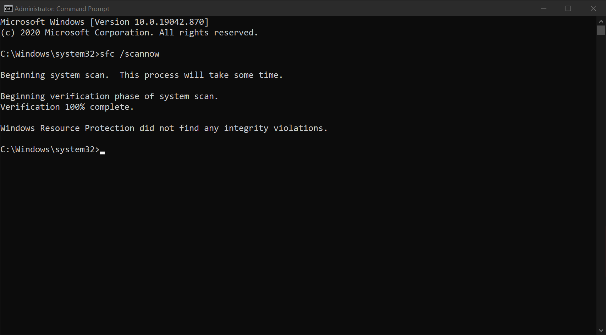

# Fixing Corrupted System Files using SFC and DISM

SFC, as known as System Files Checker, helps out to fix corrupted system files on your computer. DISM, as known as Deployment Image Servicing and Management, will fix files that sfc could not fix through the Windows Update service.

## Using SFC to fix corrupted system files

1. Launch Command Prompt as Administrator.

2. Type in `sfc /scannow` and hit enter.

    

3. After the tool finished, it should say "Windows Resource Protection did not find any integrity violations." But if it says something else rather than this, you want to run the DISM tool. If it say "Windows Resource Protection did not find any integrity violations.", restart to make sure nothing goes wrong.

## Using DISM to fix corrupted system files

1. Launch Command Prompt as Administrator.

2. Type in `DISM.exe /Online /Cleanup-image /Restorehealth` and hit enter.

    

3. When it's finished, it will say "The operation completed successfully". Restart to apply changes.