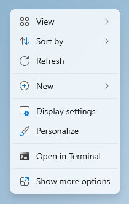
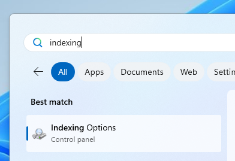
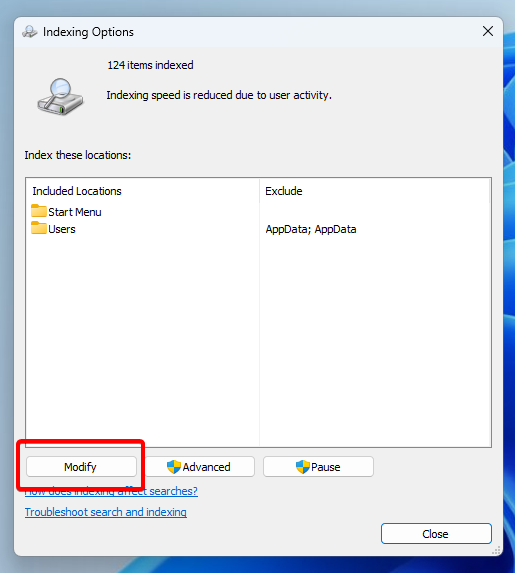
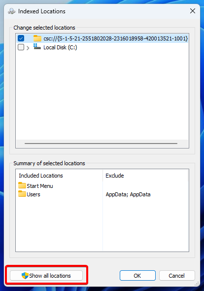
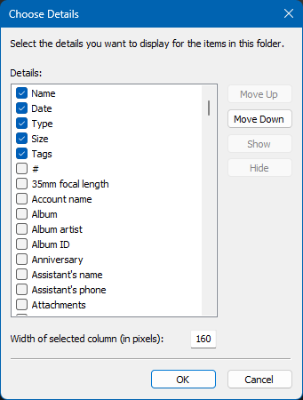
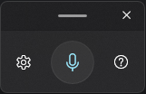
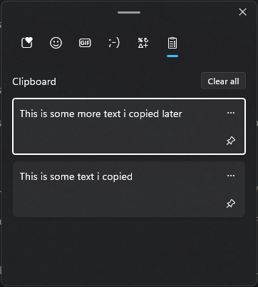

# Useful tips and "hacks" for Windows

### Get more options when right-clicking

When right-clicking on a file or folder, you can hold <kbd>Shift</kbd> to get more options, such as "Copy as path", which lets you copy the full path to the file or folder.

### Enable the legacy context menu

The context menu is the pop-up menu that appears when you right-click on a file or folder.

In Windows 11, the new context menu was introduced which has fewer options and some of them are replaced with icons. At the bottom, there is an option to "Show more options" which will show the legacy menu.



However, if you prefer the legacy menu, and you don't want to click "Show more options" every time, you can modify a registry key to disable the new context menu. To do that, open Powershell and run the following command

```powershell
reg.exe add "HKCU\Software\Classes\CLSID\{86ca1aa0-34aa-4e8b-a509-50c905bae2a2}\InprocServer32" /f /ve
```


Then, open the Task Manager, and search for _Windows Explorer_, then right-click on the process and click Restart. If you right-click a file or folder, you should now see the legacy context menu.


::: tip Note
When holding down <kbd>Shift</kbd> when right-clicking, the legacy context menu will always appear (and with the extra options as described in the previous tip), even without modifying this registry key.
:::


### Windows Master Control Panel shortcut

The Windows Master Control Panel shortcut, often referred to as "God Mode", is a shortcut to access all control panel settings in one place.

To create the shortcut, create a folder and name it `allSettings.{ED7BA470-8E54-465E-825C-99712043E01C}`

The text in front of the dot has no effect. You may change it to whatever you want, but the shortcut will appear to have no name.

You can now open the folder to find all control panel settings.

### Make Windows search faster

You can make the Windows Search way faster by enabling Indexing, which indexes the locations you select. In simple words, it essentially creates a list of all files, so that when you search for a file, Windows searches in that list instead.

Although indexing is enabled by default, it only indexes important folders, such as the Desktop or the user's Documents. However, it can be configured to index all drives and folders on the computer.

First, search for "Indexing Options" in the Start menu.



Then, in the window that appears, click "Modify".



Then, click "Show All Locations".



Now, check all the locations that you want Windows to index. Finally, click Ok to confirm.


Your files will now be indexed.

::: tip Note
Indexing can take a long time depending on how many files it has to go through, and it may consume some system resources while indexing is in-progress. Indexing will pause however if it detects that you are using your computer. The indexing process only needs to run once.
:::

### Restart GPU drivers

If your screen glitches sometimes, or your graphics are lagging, try restarting your GPU drivers using the shortcut <kbd>Win</kbd> + <kbd>Ctrl</kbd> + <kbd>Shift</kbd> + <kbd>B</kbd>. You will hear a beep sound, and your screen will go black for a few seconds.

You can always try a restart if that doesn't fix it.

### View more columns in the Details view in File Explorer

In the details view in File Explorer, you can show more columns in addition to the default ones, such as Focal Length for images, or Rating for media files.

To do that, right-click on the columns in the Details view, and then choose More. You can then enable the columns you want to see by checking them.



### Voice typing

Voice Typing is a feature built-into Windows that allows you to "type"
without actually typing, but by speaking into your microphone instead.

To use Voice Typing, press <kbd>Win</kbd> + <kbd>H</kbd>, and a small window will appear.



If it does not turn on automatically, simply click on the microphone button. Now, you can speak into your microphone to enter text, instead of typing!

### Keep calculator always on top
You can keep the calculator window always on top, so that it stays pinned on your screen while you interact with other windows.

To do that, press the icon next to "Standard" that looks like a box with an arrow. Calculator will now stay on top of all windows.


### Additional clocks
By default, the clock on the right side of the taskbar shows the local time. But you can add two additional clocks that show the time in a chosen timezone.

To do that, right-click on the clock on the taskbar, and click "Adjust date and time".
Then, scroll down to the bottom of the page, and click "Additional Clocks".

In the window that appears, you can check one or both clocks, select their timezone, and add a name.


Click Ok to save the settings you changed.

If you hover over the taskbar clock, you should now see your additional clocks.


### Clipboard history

You can view your clipboard history, which is a list of the last 25 objects that you've copied.

To do that, press <kbd>Win</kbd> + <kbd>V</kbd>, and a small window will appear. If it's the first time you are using the Clipboard History feature, you will see a button that says "Turn On"
as it's disabled by default.


After clicking on it, everything you copy will be logged there. You can then "go back in history" and paste something you copied earlier.



You can click "Clear all" to empty the list. You can also click the pin icon next to an entry to keep it pinned forever<sup>1</sup>.

You can also click the three dots next to an entry for more options.

At the top of the window, you can also enter Emojis, GIFs, Analog Emojis, and other symbols.

## Note

<sup>1</sup>: Clipboard history automatically clears after restarting your computer. Pinned items are not cleared, and do not count towards the 25-object limit.

\
\
\
_**More tips will be added to this page soon!**_
